Chapter 11: Administration
==========================

As a tranSMART User Administrator, your responsibilities include the
following tasks:

-  Adding new users to the tranSMART access list

-  Granting permissions to users through role assignments and access
   rights to private Analyze studies

-  Creating user groups, and assigning these groups access rights to
   private Analyze studies

-  Creating and mapping user roles

-  Setting up security for private Analyze studies

.. important::
    This chapter is intended for tranSMART User Administrators only. Other users will not be able to 
    see the controls or perform the tasks described in this chapter.

Administrator Privileges
------------------------

In addition to performing administration tasks, you, as a tranSMART User
Administrator, are a tranSMART super-user with access privileges to all
tranSMART data sources, including all Analyze studies and both public
and private gene signatures. You also have access to the tranSMART
access log.

tranSMART user administrators are assigned the role ``ROLE_ADMIN``.

The Administrator’s Console
---------------------------

To access the console where you perform administrator tasks, click the
**Admin** menu:

|image238|

On initialization, the administrator’s console displays the tranSMART
access log:

|image239|

Tasks in the Administrator’s Console
~~~~~~~~~~~~~~~~~~~~~~~~~~~~~~~~~~~~

The tasks you can perform as administrator are listed vertically along
the left edge of the administrator’s console. The following table
summarizes these tasks.

.. note::
    The **Secure Object Paths** and **Add Study** tasks are no longer used. While these
    tasks remain on the Administrator’s console at this time, they are not available for 
    use nor are they addressed in any way.

+-----------------------+------------------------------+---------------------------------------------------------------------------------------------------------------------------------+
| Category              | Task                         | Description                                                                                                                     |
+=======================+==============================+=================================================================================================================================+
| Access Log            | View Access Log              | Display the tranSMART access log.                                                                                               |
+-----------------------+------------------------------+---------------------------------------------------------------------------------------------------------------------------------+
| Groups                | Group Lis t                  | List all user groups and edit or delete groups.                                                                                 |
+-----------------------+------------------------------+---------------------------------------------------------------------------------------------------------------------------------+
|                       | Create Group                 | Create a user group.                                                                                                            |
+-----------------------+------------------------------+---------------------------------------------------------------------------------------------------------------------------------+
|                       | Group Membership             | Add users to a group or remove users from a group.                                                                              |
+-----------------------+------------------------------+---------------------------------------------------------------------------------------------------------------------------------+
| Users                 | User List                    | List all tranSMART users or edit or delete users.                                                                               |
+-----------------------+------------------------------+---------------------------------------------------------------------------------------------------------------------------------+
|                       | Create User                  | Create a tranSMART user.                                                                                                        |
+-----------------------+------------------------------+---------------------------------------------------------------------------------------------------------------------------------+
| Galaxy Users          | User List                    | List of tranSMART users who can export data to Galaxy via the Galaxy Export tab.                                                |
+-----------------------+------------------------------+---------------------------------------------------------------------------------------------------------------------------------+
|                       | Create User                  | Associate a tranSMART user ID with a Galaxy key.                                                                                |
+-----------------------+------------------------------+---------------------------------------------------------------------------------------------------------------------------------+
| Access Control        | Access Control by Group      | Grant users and groups access privileges to private Analyze studies, or remove access privileges for users and groups.          |
+-----------------------+------------------------------+---------------------------------------------------------------------------------------------------------------------------------+
|                       | Access Control by Study      | Grant users and groups access privileges to private Analyze studies, or remove access privileges for users and groups.          |
+-----------------------+------------------------------+---------------------------------------------------------------------------------------------------------------------------------+
| Study                 | Study List                   | List the Analyze studies that are protected by access control.                                                                  |
+-----------------------+------------------------------+---------------------------------------------------------------------------------------------------------------------------------+
|                       | Add Study                    | Not used                                                                                                                        |
+-----------------------+------------------------------+---------------------------------------------------------------------------------------------------------------------------------+
| Secure Object Paths   | SecureObjectPath List        | Not used                                                                                                                        |
+-----------------------+------------------------------+---------------------------------------------------------------------------------------------------------------------------------+
|                       | Add SecureObjectPath         | Not used                                                                                                                        |
+-----------------------+------------------------------+---------------------------------------------------------------------------------------------------------------------------------+
| Roles                 | Role List                    | List all tranSMART roles and edit or delete roles.                                                                              |
+-----------------------+------------------------------+---------------------------------------------------------------------------------------------------------------------------------+
|                       | Create Role                  | Create a tranSMART role.                                                                                                        |
+-----------------------+------------------------------+---------------------------------------------------------------------------------------------------------------------------------+
| RequestMap Setup      | Requestmap List              | Display mappings between tranSMART roles and the tranSMART URLs that each role grants access to, and edit or delete mappings.   |
+-----------------------+------------------------------+---------------------------------------------------------------------------------------------------------------------------------+
|                       | Requestmap Create            | Create a mapping between a role and a tranSMART URL.                                                                            |
+-----------------------+------------------------------+---------------------------------------------------------------------------------------------------------------------------------+
| Package               | Build Information            | View details about the current tranSMART build.                                                                                 |
+-----------------------+------------------------------+---------------------------------------------------------------------------------------------------------------------------------+

Managing tranSMART Users
------------------------

Managing users involves the following tasks:

-  Creating user accounts

-  Editing and deleting user accounts

-  Assigning users roles

-  Assigning users and groups access rights to private Analyze studies

Understanding User Roles and Access Rights
~~~~~~~~~~~~~~~~~~~~~~~~~~~~~~~~~~~~~~~~~~

Users are granted permissions to access private Analyze studies in two
ways:

-  Through roles

-  Through the access level assigned to the user or group for a private study

For information about access levels, see `Access Levels`_.

User Roles
^^^^^^^^^^

When you create or edit a user account, you can assign the user one or
more of the roles in the following table.

For information on creating or editing a user account, see `Managing User Accounts`_.

+----------------------------------+------------------------------------------------------------------------------------------------------------------------------------------------------------------------------------------+
| Role                             | Permissions                                                                                                                                                                              |
+==================================+==========================================================================================================================================================================================+
| ``ROLE_SPECTATOR``               | **tranSMART Search**                                                                                                                                                                     |
|                                  |                                                                                                                                                                                          |
|                                  | -  All functions                                                                                                                                                                         |
|                                  |                                                                                                                                                                                          |
|                                  | **Analyze**                                                                                                                                                                              |
|                                  |                                                                                                                                                                                          |
|                                  | -  Access to a private study if the user is assigned a VIEW or EXPORT access level for the study.                                                                                        |
|                                  |                                                                                                                                                                                          |
|                                  | -  Export ability for a private study if the user is assigned an EXPORT access level for the study.                                                                                      |
|                                  |                                                                                                                                                                                          |
|                                  | -  Access to all studies in the Public Studies folder. No access level is required.                                                                                                      |
|                                  |                                                                                                                                                                                          |
|                                  | **Notes:**                                                                                                                                                                               |
|                                  |                                                                                                                                                                                          |
|                                  | -  Users with this role cannot be assigned the OWN access level for a study.                                                                                                             |
|                                  |                                                                                                                                                                                          |
|                                  | -  Assign this role to the user.                                                                                                                                                         |
+----------------------------------+------------------------------------------------------------------------------------------------------------------------------------------------------------------------------------------+
| ``ROLE_STUDY_OWNER``             | **tranSMART Search**                                                                                                                                                                     |
|                                  |                                                                                                                                                                                          |
|                                  | -  All functions                                                                                                                                                                         |
|                                  |                                                                                                                                                                                          |
|                                  | **Analyze**                                                                                                                                                                              |
|                                  |                                                                                                                                                                                          |
|                                  | -  Access to a private study if the user is assigned a VIEW, EXPORT, or OWN access level for the study.                                                                                  |
|                                  |                                                                                                                                                                                          |
|                                  | -  Export ability for a private study if the user is assigned an EXPORT or OWN access level for the study.                                                                               |
|                                  |                                                                                                                                                                                          |
|                                  | -  Access to all studies in the Public Studies folder. No access level is required.                                                                                                      |
|                                  |                                                                                                                                                                                          |
|                                  | **Note:** Private studies are categorized by Centers (CBER, CDER, and CDRH). The role STUDY\_OWNER applies at the Center level. For more information, see *Access Levels* on page 153.   |
+----------------------------------+------------------------------------------------------------------------------------------------------------------------------------------------------------------------------------------+
| ``ROLE_DATASET_EXPLORER_ADMIN``  | **tranSMART Search**                                                                                                                                                                     |
|                                  |                                                                                                                                                                                          |
|                                  | -  All functions                                                                                                                                                                         |
|                                  |                                                                                                                                                                                          |
|                                  | **Analyze**                                                                                                                                                                              |
|                                  |                                                                                                                                                                                          |
|                                  | -  Access to all studies                                                                                                                                                                 |
|                                  |                                                                                                                                                                                          |
|                                  | -  Export ability for all studies                                                                                                                                                        |
|                                  |                                                                                                                                                                                          |
|                                  | **Note:** The Analyze administrator has no user administration permissions.                                                                                                              |
+----------------------------------+------------------------------------------------------------------------------------------------------------------------------------------------------------------------------------------+
| ``ROLE_ADMIN``                   | **tranSMART Search**                                                                                                                                                                     |
|                                  |                                                                                                                                                                                          |
|                                  | -  All functions                                                                                                                                                                         |
|                                  |                                                                                                                                                                                          |
|                                  | **Analyze**                                                                                                                                                                              |
|                                  |                                                                                                                                                                                          |
|                                  | -  Access to all studies                                                                                                                                                                 |
|                                  |                                                                                                                                                                                          |
|                                  | -  Export ability for all studies                                                                                                                                                        |
|                                  |                                                                                                                                                                                          |
|                                  | **User Administration**                                                                                                                                                                  |
|                                  |                                                                                                                                                                                          |
|                                  | -  Full user administration functions                                                                                                                                                    |
+----------------------------------+------------------------------------------------------------------------------------------------------------------------------------------------------------------------------------------+
| ``ROLE_PUBLIC_USER``             | **tranSMART Search**                                                                                                                                                                     |
|                                  |                                                                                                                                                                                          |
|                                  | -  Search functions against public data only.                                                                                                                                            |
|                                  |                                                                                                                                                                                          |
|                                  |    **Analyze**                                                                                                                                                                           |
|                                  |                                                                                                                                                                                          |
|                                  | -  Access to studies in the Public Studies folder only.                                                                                                                                  |
|                                  |                                                                                                                                                                                          |
|                                  | -  Export ability for all public studies.                                                                                                                                                |
|                                  |                                                                                                                                                                                          |
|                                  | **Note:** This is a limited access role used for trainee accounts.                                                                                                                       |
+----------------------------------+------------------------------------------------------------------------------------------------------------------------------------------------------------------------------------------+

.. note::
    For information about creating new roles that you can assign to users, see *User Roles* on page 138.

Access Rights to Analyze Studies
^^^^^^^^^^^^^^^^^^^^^^^^^^^^^^^^

Analyze studies can be either public or private. Public studies are in
the **Public Studies** folder of the Analyze navigation tree. All other
studies are private.

Access rights to public and private studies are as follows:

-  **Public studies:** All tranSMART users have full access to the
   studies in the Public Studies folder. No access level is required for
   these studies.

-  **Private studies:** By default, tranSMART users cannot access
   private studies. To allow a user to make comparisons between cohorts
   in a private study, you must grant the user access rights to that
   particular study.

If a user does not have access rights to a particular private study, the
study is grayed out when the user displays the list of studies in the
Analyze navigation tree.

.. note::
      Even if the user does not have access rights to a private study, he/she can see 
      a description of the study by right-clicking the study name in the navigation 
      tree and then clicking **Show Definition**. 

Managing User Accounts
~~~~~~~~~~~~~~~~~~~~~~

Creating a User Account
^^^^^^^^^^^^^^^^^^^^^^^

To create a user account:

#.  Click the **Admin** menu to display the administrator’s console.

#.  Under **Users**, click **Create User**.

#.  The Create User window appears:

    |image243|

#.  Provide values for the fields in the Create User window, as follows:

    +----------------+-----------------------------------------------------------------------------------------------------------------------------------------------------------------------------------------------------+------------+
    | Field          | Description                                                                                                                                                                                         | Required   |
    +================+=====================================================================================================================================================================================================+============+
    | WWID           | Unique database identifier.                                                                                                                                                                         | Yes        |
    +----------------+-----------------------------------------------------------------------------------------------------------------------------------------------------------------------------------------------------+------------+
    | Login Name     | The user’s login ID.                                                                                                                                                                                | Yes        |
    +----------------+-----------------------------------------------------------------------------------------------------------------------------------------------------------------------------------------------------+------------+
    | Full Name      | The name to display in the tranSMART window for this user.                                                                                                                                          | Yes        |
    +----------------+-----------------------------------------------------------------------------------------------------------------------------------------------------------------------------------------------------+------------+
    | Password       | The user’s password.                                                                                                                                                                                | Yes        |
    +----------------+-----------------------------------------------------------------------------------------------------------------------------------------------------------------------------------------------------+------------+
    | Email          | The user’s email address.                                                                                                                                                                           | No         |
    +----------------+-----------------------------------------------------------------------------------------------------------------------------------------------------------------------------------------------------+------------+
    | Enabled        | Check this box to enable the user to log into tranSMART. If you leave the box blank, the user’s account is disabled, and the user will not be able to log into tranSMART.                           | No         |
    +----------------+-----------------------------------------------------------------------------------------------------------------------------------------------------------------------------------------------------+------------+
    | Description    | An optional description of the user.                                                                                                                                                                | No         |
    |                |                                                                                                                                                                                                     |            |
    |                | The description appears in the user list (displayed with the **User List** task in the administrator’s console).                                                                                    |            |
    +----------------+-----------------------------------------------------------------------------------------------------------------------------------------------------------------------------------------------------+------------+
    | Show Email     | Check this box to display the user’s email address.                                                                                                                                                 | No         |
    |                |                                                                                                                                                                                                     |            |
    |                | **Note:** The email display functionality is reserved for future use. Currently, the user’s email address is displayed only when you or another User Administrator view or edit a user’s account.   |            |
    +----------------+-----------------------------------------------------------------------------------------------------------------------------------------------------------------------------------------------------+------------+
    | Assign Roles   | Assign one or more roles to the user by checking the boxes next to the names of the roles to assign.                                                                                                | Yes        |
    |                |                                                                                                                                                                                                     |            |
    |                | If you do not check any of the boxes, the user will not be able to log into tranSMART.                                                                                                              |            |
    |                |                                                                                                                                                                                                     |            |
    |                | **Note:** For information about the roles you can assign to the user, see the section *User Roles* on page 138.                                                                                     |            |
    +----------------+-----------------------------------------------------------------------------------------------------------------------------------------------------------------------------------------------------+------------+

#.  When you are finished defining the user account, click **Create**.

Editing or Deleting a User Account
^^^^^^^^^^^^^^^^^^^^^^^^^^^^^^^^^^

To edit or delete a user account:

#.  Click the **Admin** menu to display the administrator’s console.

#.  Under **Users**, click **User List**.

#.  The AuthUser List window appears.

#.  Click the column heading **Full Name** to sort the list of user names
    alphabetically.

    Sorting the list may help you find the name in the list of users.

    .. note::
        You can sort any of the columns in the AuthUser List by clicking the column heading.

#.  Locate the name of the user whose account you want to edit or delete.

#.  Click **Show** for the account to edit or delete.

    The User window appears.

#.  Take one of the following actions:

    -   To delete the account, click **Delete**. Then click **OK** to confirm
        the deletion.

    .. important::
        Deleting a user account does not delete the user’s records in the access log.                                                                                                                                                                                                                                                                                                                                                                                                                                |
        
        Records of Analyze studies are independent of any associated user account.
        For example, if a user is the owner of a particular study, the study remains in Analyze after 
        the user is deleted, even if no other user has access privileges for the study.

    -   To edit the account, click **Edit**. After making the edits, click **Update**.

Managing Galaxy Users
---------------------

tranSMART users who have the Dalliance Galaxy data analysis tool
installed and configured for use with tranSMART can export data from
tranSMART directly into Galaxy. To enable this feature for Galaxy users,
you must associate their tranSMART user ID with their Galaxy key.

#.  Click the **Admin** menu to display the administrator’s console.

#.  Under **Galaxy Users**, click **Create User**.

#.  The Create User window appears.

#.  Provide values for all the fields in the Create User window, as shown below:

    +--------------------+---------------------------------+
    | Field              | Description                     |
    +====================+=================================+
    | Username of User   | The user’s tranSMART user ID.   |
    +--------------------+---------------------------------+
    | Galaxy Key         | The user’s Galaxy key.          |
    +--------------------+---------------------------------+
    | Email              | The user’s email address.       |
    +--------------------+---------------------------------+

#.  Click **Create**.

View or Delete Galaxy Users
~~~~~~~~~~~~~~~~~~~~~~~~~~~

To view the list of Galaxy users or to delete a Galaxy user:

#.  Click the **Admin** menu to display the administrator’s console.

#.  Under **Galaxy Users**, click **User List**.

    The Galaxy User List window appears.

#.  To delete a user as a Galaxy user, click **Delete** to the right of
    the user’s row.

Managing tranSMART Roles
------------------------

A role is mapped to one or more tranSMART URLs. Each URL provides access
to a tranSMART resource.

If a user is assigned a particular role, the user is able to access the
URL mapped to the role, and therefore, to the resource available through
the URL.

For example, the role ``ROLE_ADMIN`` is mapped to the URL pattern
/authUser/\*\* on the tranSMART site. At this location, users assigned
``ROLE_ADMIN`` (that is, administrators like yourself) can view, create,
edit, and delete tranSMART user accounts.

A URL pattern can be mapped to one or more roles. Since /authUser/\*\*
is mapped to no other role than ``ROLE_ADMIN``, only users assigned this
role can perform tasks on user accounts.

Understanding Role / URL Mappings
~~~~~~~~~~~~~~~~~~~~~~~~~~~~~~~~~

Roles are mapped to URLs on the Requestmap List window of the
administrator’s console:

|image246|

URLs in this window are expressed as fragments of URLs called URL
patterns. tranSMART determines the full URL to associate with a role by
adding the URL pattern to the root URL for the tranSMART site. For
example, if the tranSMART root URL is
https://transmart.mysite.com/transmart and the URL pattern is
/authUser/\*\*, the complete URL mapped to the role ``ROLE_ADMIN`` is the
following:

https://transmart.mysite.com/transmart/authUser/\*\*

The request map supports the \*\* pattern-matching characters. For
example, in the above URL, the URL pattern /authUser/\*\* matches both
of the following URLs:

+----------------------------------------------------------+-------------------------------------------+
| URL                                                      | Purpose                                   |
+==========================================================+===========================================+
| https://transmart.mysite.com/transmart/authUser/list     | View, edit, and delete tranSMART users.   |
+----------------------------------------------------------+-------------------------------------------+
| https://transmart.mysite.com/transmart/authUser/create   | Create tranSMART users.                   |
+----------------------------------------------------------+-------------------------------------------+

Default Role / URL Mappings
^^^^^^^^^^^^^^^^^^^^^^^^^^^

The following table describes the pre-defined mappings between tranSMART
roles and URL patterns:

+------------------------------+----------------------------------+---------------------------------------------------------------------------------------------------------------------------------------+
| URL Pattern                  | Mapped Role                      | Purpose                                                                                                                               |
+==============================+==================================+=======================================================================================================================================+
| /accessLog/\*\*              | ``ROLE_ADMIN``                   | View the tranSMART access log.                                                                                                        |
|                              |                                  |                                                                                                                                       |
|                              |                                  | When you click the **Admin** menu to access the administrator’s console, the log is displayed by default.                             |
+------------------------------+----------------------------------+---------------------------------------------------------------------------------------------------------------------------------------+
| /authUser/\*\*               | ``ROLE_ADMIN``                   | Create, view, edit, and delete tranSMART users.                                                                                       |
|                              |                                  |                                                                                                                                       |
|                              |                                  | Currently, only tranSMART administrators can perform these tasks.                                                                     |
+------------------------------+----------------------------------+---------------------------------------------------------------------------------------------------------------------------------------+
| /role/\*\*                   | ``ROLE_ADMIN``                   | Create, view, edit, and delete tranSMART roles.                                                                                       |
|                              |                                  |                                                                                                                                       |
|                              |                                  | Currently, only tranSMART administrators can perform these tasks.                                                                     |
+------------------------------+----------------------------------+---------------------------------------------------------------------------------------------------------------------------------------+
| /requestmap/\*\*             | ``ROLE_ADMIN``                   | Create, view, edit, and delete mappings between roles and URLs.                                                                       |
|                              |                                  |                                                                                                                                       |
|                              |                                  | Currently, only tranSMART administrators can perform these tasks.                                                                     |
+------------------------------+----------------------------------+---------------------------------------------------------------------------------------------------------------------------------------+
| /authUserSecureAccess/\*\*   | ``ROLE_ADMIN``                   | Create, view, edit, and delete a user’s access rights to specific clinical trials.                                                    |
+------------------------------+----------------------------------+---------------------------------------------------------------------------------------------------------------------------------------+
| /secureObject/\*\*           | ``ROLE_ADMIN``                   | Create, view, edit, and delete IDs and other attributes of a clinical trial.                                                          |
+------------------------------+----------------------------------+---------------------------------------------------------------------------------------------------------------------------------------+
| /secureObjectPath/\*\*       | ``ROLE_ADMIN``                   | No longer used.                                                                                                                       |
+------------------------------+----------------------------------+---------------------------------------------------------------------------------------------------------------------------------------+
| /\*\*                        | ``IS_AUTHENTICATED_REMEMBERED``  | Attempt to access any tranSMART URL.                                                                                                  |
|                              |                                  |                                                                                                                                       |
|                              |                                  | Note that:                                                                                                                            |
|                              |                                  |                                                                                                                                       |
|                              |                                  | -  If the user has not yet logged into tranSMART, the tranSMART login screen appears.                                                 |
|                              |                                  |                                                                                                                                       |
|                              |                                  | -  If the user successfully logs in, or if the user is already logged in, access to the specified URL depends upon the user’s role.   |
+------------------------------+----------------------------------+---------------------------------------------------------------------------------------------------------------------------------------+
| /login/\*\*                  | ``IS_AUTHENTICATED_ANONYMOUSLY`` | These URLs can be accessed by anyone.                                                                                                 |
+------------------------------+----------------------------------+---------------------------------------------------------------------------------------------------------------------------------------+
| /css/\*\*                    | ``IS_AUTHENTICATED_ANONYMOUSLY`` |                                                                                                                                       |
+------------------------------+----------------------------------+---------------------------------------------------------------------------------------------------------------------------------------+
| /js/\*\*                     | ``IS_AUTHENTICATED_ANONYMOUSLY`` |                                                                                                                                       |
+------------------------------+----------------------------------+---------------------------------------------------------------------------------------------------------------------------------------+
| /images/\*\*                 | ``IS_AUTHENTICATED_ANONYMOUSLY`` |                                                                                                                                       |
+------------------------------+----------------------------------+---------------------------------------------------------------------------------------------------------------------------------------+
| /search/loadAJAX\*\*         | ``IS_AUTHENTICATED_ANONYMOUSLY`` |                                                                                                                                       |
+------------------------------+----------------------------------+---------------------------------------------------------------------------------------------------------------------------------------+

.. note::
      The roles  ``IS_AUTHENTICATED_REMEMBERED``  and  ``IS_AUTHENTICATED_ANONYMOUSLY``  cannot be 
      edited, deleted, or explicitly assigned to users.

Managing User Roles 
~~~~~~~~~~~~~~~~~~~~

.. note::
      In some cases, application development may be required to support role-based functionality.

Creating a Role
^^^^^^^^^^^^^^^

To create a tranSMART user role:

#.  Click the **Admin** menu to display the administrator’s console.

#.  Click **Create Role**.

#.  The Create Role window appears.

#.  In **Role Name**, type a name for the role.

    Role names must be upper case and must be prefixed with ``ROLE_`` — for
    example:

    |image249|

.. note::
    In this example, a user assigned the role ``ROLE_VIEW_LOG`` can view 
    the access log on the administrator’s console but cannot perform any 
    of the other tasks on the console.

#.  In **Description**, type a description for the role.

    A description is required.

#.  Click **Create**.

You must now map the role to a URL. Choose one of the following actions:

-  `Adding a Role to an Existing Request Map`_, or:

-  `Creating a New Request Map`_.

Adding a Role to an Existing Request Map 
^^^^^^^^^^^^^^^^^^^^^^^^^^^^^^^^^^^^^^^^^

#.  If the administrator’s console isn’t already displayed, click the
    **Admin** menu to display it.

#.  Click **Requestmap List**.

#.  Click **Show** for the mapping to which you want to add a new
    role:

    |image251|

#.  Click **Edit**.

#.  In **Roles (comma-delimited),** type a comma and a space character
    after the rightmost role in the field, then type the name of the role
    to add to the map.

    |image252|

#.  Click **Update**.

Creating a New Request Map
^^^^^^^^^^^^^^^^^^^^^^^^^^

#.  If the administrator’s console isn’t already displayed, click the
    **Admin** menu to display it.

#.  Click **Requestmap Create**.

#.  In **URL Pattern**, type the URL pattern to map to a role.

.. note::
    Double-check your entry to ensure that the URL exists. tranSMART does not validate the entry.

#.  In **role (comma-delimited)**, type the role name in upper case.

    If you are mapping multiple roles to the URL, separate the role names
    with a comma.

#.  Click **Create**.

Assigning a Role to a User
^^^^^^^^^^^^^^^^^^^^^^^^^^

You assign a role to a user when you create or edit the user’s account.
For instructions, see *Managing User Accounts* on page 140.

Editing or Deleting a Role
^^^^^^^^^^^^^^^^^^^^^^^^^^

To edit or delete a role:

#.  If the administrator’s console isn’t already displayed, click the
    **Admin** menu to display it.

#.  Click **Role List**.

#.  Click **Show** for the role to edit or delete.

#.  Take one of the following actions:

    -   To delete the role, click **Delete**. Then click **OK** to confirm
        the deletion.

    -   To edit the role, click **Edit**. After making the edits, click
        **Update**.

Editing or Deleting a Request Map
^^^^^^^^^^^^^^^^^^^^^^^^^^^^^^^^^

To edit or delete a mapping between a role and a URL:

#.  If the administrator’s console isn’t already displayed, click the
    **Admin** menu to display it.

#.  Click **Requestmap List**.

#.  Click **Show** for the map to edit or delete.

#.  Take one of the following actions:

    -   To delete the map, click **Delete** and then click **OK** to
        confirm the deletion.

    -   To edit the map, click **Edit**. After making the edits, click
        **Update**.

Accessing the Administrator’s Console
~~~~~~~~~~~~~~~~~~~~~~~~~~~~~~~~~~~~~

There are two ways for a user to attempt to access the administrator’s
console:

-   Click the **Admin** menu on the tranSMART window (see `The
    Administrator’s Console`_).

    The **Admin** menu is displayed only for users who are assigned the role
    ``ROLE_ADMIN``.

-   Enter the complete URL for the administrator’s console:

https://transmart.mysite.com/transmart/accessLog/list

Partial Administrator Rights
^^^^^^^^^^^^^^^^^^^^^^^^^^^^

If a user is assigned a role that is mapped to one of the tasks on the
administrator’s console, that user can access the console and click on
all of the links to administrator tasks. However, the only task the user
will be allowed to perform is the one authorized through a role.

For example, suppose you create the role ``ROLE_VIEW_LOG`` to allow a user
to view the tranSMART access log. A user with this role can view the log
by entering the full URL for this administrator task — for example:

https://transmart.mysite.com/transmart/accessLog/list

However, if the user clicks on any of the other links on the
administrator’s console, the access-denied message is displayed.

Managing Security for Analyze Studies
-------------------------------------

Users are able to perform operations with private Analyze studies only
if you or another administrator grant the user (or a group that the user
belongs to) access rights to do so.

Before you can assign a user or a user group access rights to a
protected study, the following tasks must be performed:

#.  The study must be loaded into a database server.

#.  You must protect the study by defining it as a secure object,
    using the tranSMART administrator’s console.

If tranSMART is deployed on multiple servers, this step must be
performed on each server separately, after the study has been loaded to
the corresponding database server.

Securing a Study
~~~~~~~~~~~~~~~~

When a study is loaded, the data loader indicates whether the study is
to be secured. Depending on its status, the study is created (secured)
in or removed (not secured) from ``BIOMART.BIO_EXPERIMENT`` as well as
these security concepts:

-   ``SEARCHAPP.SEARCH_SECURE_OBJECT``

-   ``I2B2DEMODATA.PATIENT_TRIAL``

-   ``I2B2DEMODATA.OBSERVATION_FACT``

If the **Add Study** option doesn’t perform this step, the application
should be changed to do so or the **Add Study** option should be
removed.

You can also run the stored procedure ``I2B2_SECURE_STUDY``, after a study
is loaded, to add or remove security.

Managing Groups
~~~~~~~~~~~~~~~

Access privileges for a study can be assigned to users individually or
to a group of users. Assigning access privileges to a group of users can
be more convenient than assigning privileges individually.

Creating a Group
^^^^^^^^^^^^^^^^

To create a group:

#.  Click the **Admin** menu to display the administrator’s console.

#.  Click **Create Group**.

#.  The following window appears:

    |image254|

#.  In **Name**, assign a name to the group.

#.  Optionally, in **Description**, type an optional description of the
    group.

#.  To enable the group’s privileges, select **Enabled**.

#.  Leave **Unique ID** blank. A unique ID will be assigned to the group.

#.  Click **Create**.

In the following figure, the group Test Group has been created. Note
that it currently has no members or privileges to access any studies.

|image255|

Managing a Group’s Users
^^^^^^^^^^^^^^^^^^^^^^^^

To add users to a group, or remove users from a group:

#.  Click the **Admin** menu to display the administrator’s console.

#.  Click **Group Membership**.

#.  The following window appears:

    |image256|

#.  In **Search User**, type part or all of a user name, then select the
    name from the autotype dropdown.

#.  Next you will specify the group that the user is being added to or
    removed from.

#.  Click **Search Groups**.

    The list of the available groups appears in the **Available groups** box.

#.  Click the group name, then click **Add** to add the user to the
    group, or **Remove** to remove the user from the group.

    In the figure below, the specified user has been added to the group Test
    Group:

    |image257|

#.  Click another administrative task, or leave the administrator’s
    console. No Save action is required.

Editing or Deleting a Group
^^^^^^^^^^^^^^^^^^^^^^^^^^^

To edit or delete a group:

#.  Click the **Admin** menu to display the administrator’s console.

#.  Click **Group List**.

#.  Click the ID of the group to edit or delete.

#.  In the User Group window, click **Edit** or **Delete**:

    -   If editing, make the changes and click **Update**.

    You may need to scroll down to the bottom of the window to see the edit
    fields.

    -   If deleting, click **Delete**, then click **OK** to confirm the
        deletion.

Managing Access Privileges
~~~~~~~~~~~~~~~~~~~~~~~~~~

You assign a user or group access privileges to a study by assigning the
user or group a particular access level for the study. Access levels
determine the kinds of operations that the user can perform when
accessing the study.

Access Levels 
^^^^^^^^^^^^^^

Individual users and groups of users can be assigned the following
access levels for a study:

+----------------+--------------------------------------------------------------------------------------------------------------------------------------------------------------------------------------------------------------------------------+
| Access Level   | Description                                                                                                                                                                                                                    |
+================+================================================================================================================================================================================================================================+
| OWN            | User is the owner of the study with full access privileges.                                                                                                                                                                    |
+----------------+--------------------------------------------------------------------------------------------------------------------------------------------------------------------------------------------------------------------------------+
| EXPORT         | User is not the owner of the study, but the user can define cohorts and points of comparison from the study. The user can also export all generated summary statistics and comparison data to a Microsoft Excel spreadsheet.   |
+----------------+--------------------------------------------------------------------------------------------------------------------------------------------------------------------------------------------------------------------------------+
| VIEW           | User is not the owner of the study, but the user can define cohorts and points of comparison from the study. However, the user cannot export any data.                                                                         |
+----------------+--------------------------------------------------------------------------------------------------------------------------------------------------------------------------------------------------------------------------------+

Managing Access Privileges for a User or Group
^^^^^^^^^^^^^^^^^^^^^^^^^^^^^^^^^^^^^^^^^^^^^^

In the Manage Study Access for User/Group window, you can perform the
following tasks:

-   Assign or remove access privileges to one or more studies for a user
    or group.

-   Assign the access level for the access privileges.

To assign a user or group access privileges for a study:

#.  Click the **Admin** menu to display the administrator’s console.

#.  Click **Access Control by** **Group**.

#.  The following window appears:

    |image258|

#.  In **Search User/Group**, type part or all of a user or group name,
    then select the name from the autotype dropdown.

#.  In the **Available studies** box, select one or more studies that the
    members of the group can access, then click **Add**.

#.  In **Access Level**, select the access level (VIEW, EXPORT, OWN), to
    give to the members of the group for the selected studies.

    For descriptions of these access levels, see `Access Levels`_.

#.  Click another administrative task, or leave the administrator’s
    console. No Save action is required.

If you now click **Groups > Group List**, and then click the ID of the
new group you created in `Creating a Group`_, you will see
the members of the groups the studies to which the members have access
privileges, and the access level for each study.

Managing Access Privileges for a Study
^^^^^^^^^^^^^^^^^^^^^^^^^^^^^^^^^^^^^^

In the Manage Study Access window, you can perform the following tasks:

-   Assign or remove access privileges to one or more users or groups for
    a secure object (such as a study or an entire study category).

-   Assign the access level for the access privileges.

To grant access privileges to a study:

#.  Click the **Admin** menu to display the administrator’s console.

#.  Click **Access Control by** **Study**.

#.  The following window appears:

    |image259|

#.  In **Secure Object**, select the study or study category to which
    access is being granted.

#.  In the **User/Group Without Access** box, select the users and/or
    groups who can access the secure object, then click **Add**.

#.  In **Access Level**, select the access level (VIEW, EXPORT, OWN) for
    accessing this secure object by the selected users/ groups.

    For descriptions of these access levels, see `Access Levels`_.

#.  Click another administrative task, or leave the administrator’s
    console. No Save action is required.

Viewing the tranSMART Access Log
--------------------------------

The Access Log lets you view tranSMART events such as logins, logouts,
searches, and Analyze analyses. For each event, the log notes the time
and date of the event and the user who performed the operation.

The access log displays events beginning with the most recent.

Displaying the Access Log
~~~~~~~~~~~~~~~~~~~~~~~~~

When you open the administrator’s console, the log is displayed by
default.

If you are in a different window of the administrator’s console and want
to display the access log, click **View Access Log**.

Exporting the Access Log to a Spreadsheet
~~~~~~~~~~~~~~~~~~~~~~~~~~~~~~~~~~~~~~~~~

To export the access log to a Microsoft Excel spreadsheet:

#.  With the access log displayed, click **Export to Excel**.

#.  Specify whether you want to display the access log within a
    spreadsheet, or immediately save the spreadsheet to a file.

Specifying the Timeframe for the Access Log
~~~~~~~~~~~~~~~~~~~~~~~~~~~~~~~~~~~~~~~~~~~

By default, the log shows all events, starting with the most recent
event and extending back to show one week before the end date.

You can specify a particular timeframe for the events you want to
display or export.

To specify a timeframe:

#.  With the access log displayed, type the date of the earliest
    events to display in the **Start Date** text box.

    Date format is dd/mm/yyyy.

    Alternatively, select the start date from the calendar that appears when
    you place the mouse pointer inside the Start Date or End Date text box.

    |image260|

#.  Repeat Step 1 for the **End Date** field.

#.  Click **Filter**.

All events within the specified timeframe display.

.. note::
    If the **End Date** is before the **Start Date**, the event list contains no entries.

Browse Tool Administration
--------------------------

This section describes how to create and modify the following objects in
the Browse Program Explorer:

-  Programs

-  Studies

-  Analyses

-  Assays

-  Folders

For descriptions of these objects, see :ref:`viewing-studies-in-the-program-explorer-tree-label`.

Creating Program Explorer Objects
~~~~~~~~~~~~~~~~~~~~~~~~~~~~~~~~~

A program is the highest-level object in the Program Explorer tree. The
procedure for creating a program is different than for creating all
other objects.

Creating a Program
^^^^^^^^^^^^^^^^^^

To create a program in the Program Explorer:

#.  Click **Browse** in the tranSMART menu bar.

#.  Click **Add new program** under the Welcome to tranSMART box:

    |image262|

#.  Define the fields in the Create Program dialog box, then click
    **Save**.

Creating Other Program Explorer Objects
^^^^^^^^^^^^^^^^^^^^^^^^^^^^^^^^^^^^^^^

Studies, analyses, assays, and folders are child objects of some other
object. For example, you can create a study under a program, an analysis
under a study, or a folder under an analysis or another folder.

To create a child object:

#.  Select its parent object in the Program Explorer.

    The child objects that can be created under the parent appear as buttons
    in the upper-right corner of the Browse window; for example:

    |image263|

#.  Click the appropriate button to open the Create… dialog box.

#.  Define the fields in the Create… dialog box, then click **Save**.

    The following table shows the objects you can create for a selected
    object in the Program Explorer:

+---------------------------------------+--------------------------------+
| Selected Object in Program Explorer   | Child Objects You Can Create   |
+=======================================+================================+
| Program                               | -  Study                       |
|                                       |                                |
|                                       | -  Folder                      |
+---------------------------------------+--------------------------------+
| Study                                 | -  Analysis                    |
|                                       |                                |
|                                       | -  Assay                       |
|                                       |                                |
|                                       | -  Folder                      |
+---------------------------------------+--------------------------------+
| Analysis                              | -  Folder                      |
+---------------------------------------+--------------------------------+
| Assay                                 | -  Folder                      |
+---------------------------------------+--------------------------------+
| Folder                                | -  Sub-Folder                  |
+---------------------------------------+--------------------------------+

Editing and Deleting Objects
~~~~~~~~~~~~~~~~~~~~~~~~~~~~

The following table describes how to edit and delete Program Explorer
objects:

+------------------------------------------+-----------------------------------------------------------------------------------------------------------------------------------------------------------------------------------+
| Task                                     | Description                                                                                                                                                                       |
+==========================================+===================================================================================================================================================================================+
| Editing an object                        | To edit an object, click the object in the Program Explorer, then click the pencil icon that appears in the Browse window:                                                        |
|                                          |                                                                                                                                                                                   |
|                                          | |image264|                                                                                                                                                                        |
|                                          |                                                                                                                                                                                   |
|                                          | Define the fields in the Edit… dialog box, then click **Save**.                                                                                                                   |
+------------------------------------------+-----------------------------------------------------------------------------------------------------------------------------------------------------------------------------------+
| Deleting analyses, assays, and folders   | To delete an analysis, assay, or folder, click the object in the Program Explorer, then click the **Delete this…** button in the upper right corner of the window; for example:   |
|                                          |                                                                                                                                                                                   |
|                                          | |image265|                                                                                                                                                                        |
|                                          |                                                                                                                                                                                   |
|                                          | **Note:** Only analyses, assays, and folders can be deleted from within the Browse window. Programs and studies must be deleted from the database directly.                       |
+------------------------------------------+-----------------------------------------------------------------------------------------------------------------------------------------------------------------------------------+
| Deleting files                           | To delete a file from a folder, click the folder in the Program Explorer, then click the **Delete** button at the right:                                                          |
|                                          |                                                                                                                                                                                   |
|                                          | |image266|                                                                                                                                                                        |
+------------------------------------------+-----------------------------------------------------------------------------------------------------------------------------------------------------------------------------------+

Common Features for Creating and Editing Objects
~~~~~~~~~~~~~~~~~~~~~~~~~~~~~~~~~~~~~~~~~~~~~~~~

The following table shows the features that apply to all Program
Explorer objects when you are creating or editing an object in a Create…
or Edit… dialog box:

+---------------------------------------------+------------------------------------------------------------------------------------------------------------------------------------------------------------------------------------------------------------------------------------------------------------------------------------+
| Feature                                     | Description                                                                                                                                                                                                                                                                        |
+=============================================+====================================================================================================================================================================================================================================================================================+
| Required fields                             | Fields whose names are followed by a red asterisk are required:                                                                                                                                                                                                                    |
|                                             |                                                                                                                                                                                                                                                                                    |
|                                             | |image267|                                                                                                                                                                                                                                                                         |
+---------------------------------------------+------------------------------------------------------------------------------------------------------------------------------------------------------------------------------------------------------------------------------------------------------------------------------------+
| Autocomplete fields                         | Shaded fields are autocomplete fields. Type one or more characters at the beginning of the value that you want to assign to the field, and tranSMART will display a list of text strings that begin with those characters. Select the value to assign from the displayed list.     |
|                                             |                                                                                                                                                                                                                                                                                    |
|                                             | |image268|                                                                                                                                                                                                                                                                         |
|                                             |                                                                                                                                                                                                                                                                                    |
|                                             | Alternatively, insert the cursor in the field and press the Down arrow key to select from an alphabetical list of suggested field values.                                                                                                                                          |
+---------------------------------------------+------------------------------------------------------------------------------------------------------------------------------------------------------------------------------------------------------------------------------------------------------------------------------------+
| Multiple-value fields                       | Some autocomplete fields allow multiple values to be assigned. These fields contain the label **Add new** next to the field.                                                                                                                                                       |
|                                             |                                                                                                                                                                                                                                                                                    |
|                                             | |image269|                                                                                                                                                                                                                                                                         |
+---------------------------------------------+------------------------------------------------------------------------------------------------------------------------------------------------------------------------------------------------------------------------------------------------------------------------------------+
| Removing a value from a multi-value field   | To remove a value from a multi-value field, click the blue **x** icon next to the value:                                                                                                                                                                                           |
|                                             |                                                                                                                                                                                                                                                                                    |
|                                             | |image270|                                                                                                                                                                                                                                                                         |
+---------------------------------------------+------------------------------------------------------------------------------------------------------------------------------------------------------------------------------------------------------------------------------------------------------------------------------------+
| Close vs. Cancel buttons                    | Both buttons close the Create… or Edit… dialog box, and any changes you made in the dialog box are abandoned. However, with **Cancel**, a warning message appears before the dialog box is closed. With **Close**, the dialog box is closed immediately with no warning message.   |
+---------------------------------------------+------------------------------------------------------------------------------------------------------------------------------------------------------------------------------------------------------------------------------------------------------------------------------------+

Uploading Files to Folders
~~~~~~~~~~~~~~~~~~~~~~~~~~

Folders allow you to attach files to an object. For example, you might
add a folder to contain files pertaining to the analysis of a study, or
a gene list for an analysis.

You can upload any type of file to a folder. However, the free-text
search feature will only search files in a format that can be
text-indexed, such as Microsoft Word documents, text files, and
electronically generated PDFs.

Files can be uploaded to a folder via FTP and can be stored on the
application server.

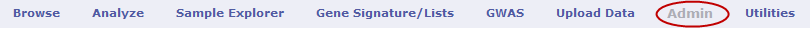
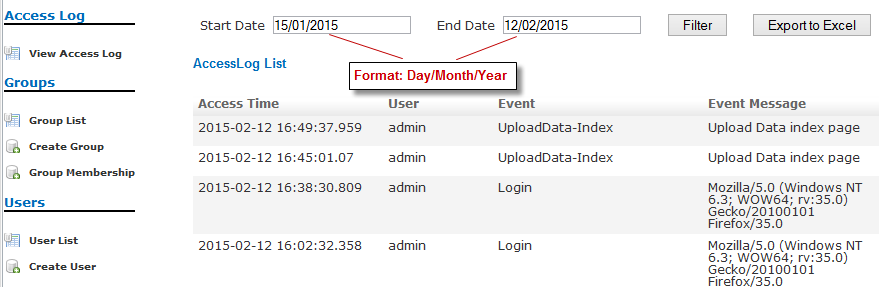
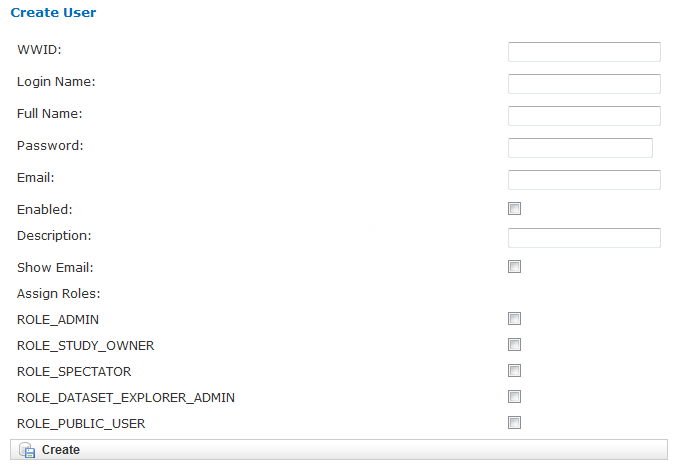
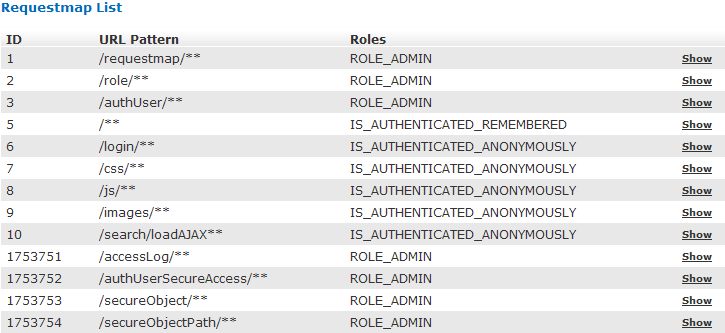
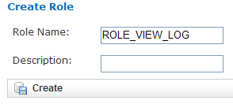
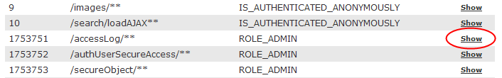
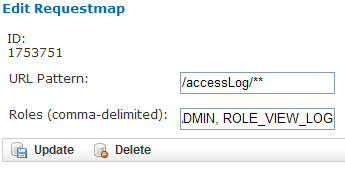
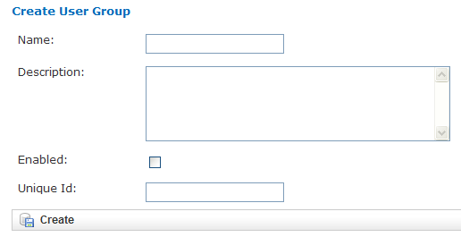
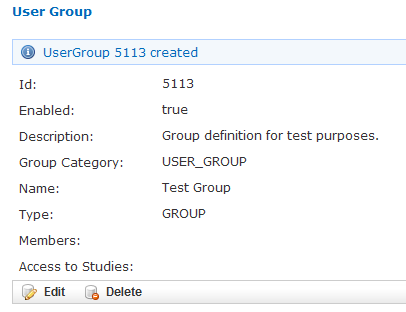
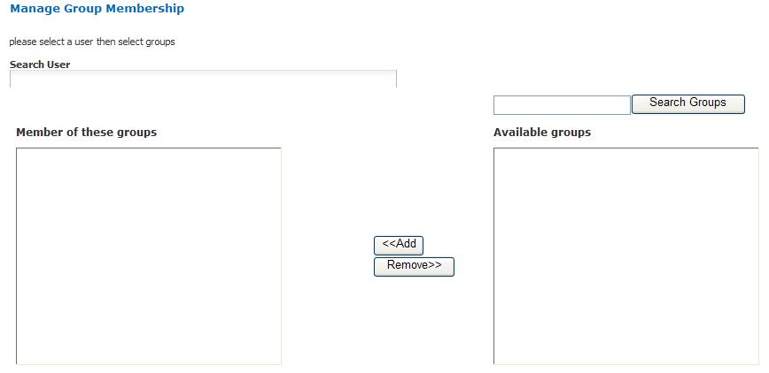
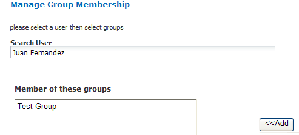
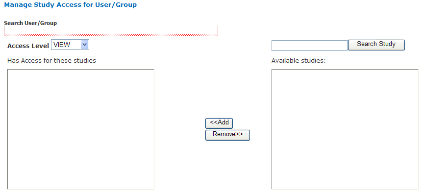
.. |image259| image:: media/image192.png
   :width: 6.00000in
   :height: 2.80765in
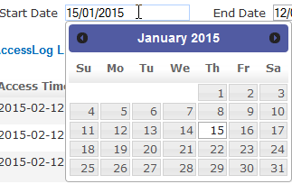
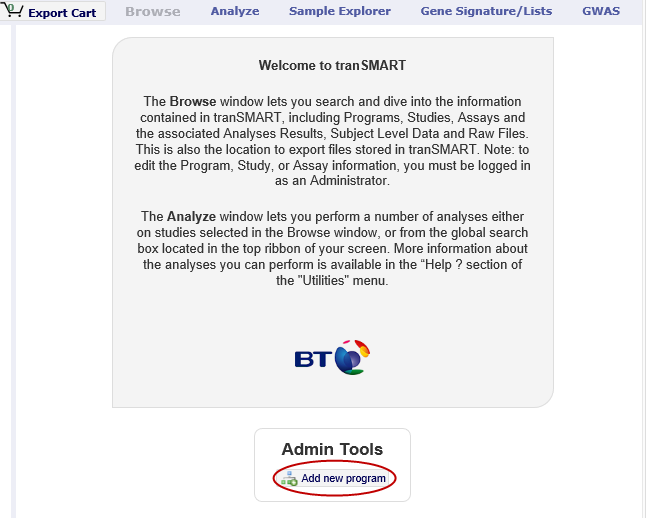
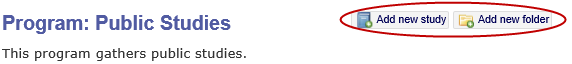
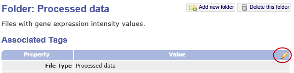
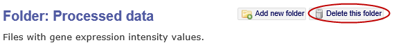
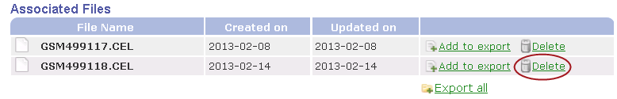
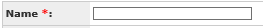
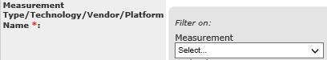
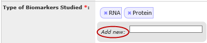
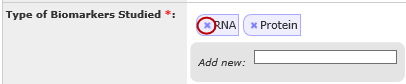