Chapter 3: Analyze
==================

Analyze lets you compare data generated for test subjects in two
different cohorts, based on criteria and points of comparison that you
specify. Analyze is useful to help you test a hypothesis that involves
the criteria and points of comparison that you select.

Overview of the UI
------------------

The following figure shows key areas of the Analyze interface:

|image27|

The page is divided into two panes:

**Left pane**

The Left pane provides a Microsoft Windows Explorer-like navigation tree
where you select the criteria for membership in the cohorts and the
points of comparison between the cohorts.

In this pane, select the study of interest and the concepts for defining
cohorts for analysis.

**Right pane**

The Right pane lets you define the criteria that test subjects must
satisfy to become members of one of the two cohorts being compared. Each
of these cohorts is called a *subset* because it typically contains only
some of the subjects involved in the study.

You define the criteria for the subsets in the subset definition boxes.
Subjects who do not satisfy the criteria you define are excluded from
the subsets and therefore, from the analysis.

The following table describes the tabs and buttons in the right pane of
Analyze:

+------------------------------------+----------------------------------------------------------------------------------------------------------------------------------------------------------------------------------------------------------------------------------------------+
| Tab or Button                      | Use this Tab or Button To…                                                                                                                                                                                                                   |
+====================================+==============================================================================================================================================================================================================================================+
| Comparison tab                     | Display the subset definition boxes.                                                                                                                                                                                                         |
|                                    |                                                                                                                                                                                                                                              |
|                                    | Click this tab from any other view to remove the currently displayed view (for example, Summary Statistics view or Grid view) and redisplay the subset definition boxes. This allows you to further refine the subsets for the comparison.   |
|                                    |                                                                                                                                                                                                                                              |
|                                    | See *Selecting Criteria* on page 21.                                                                                                                                                                                                         |
+------------------------------------+----------------------------------------------------------------------------------------------------------------------------------------------------------------------------------------------------------------------------------------------+
| Summary Statistics tab             | Generate the following:                                                                                                                                                                                                                      |
|                                    |                                                                                                                                                                                                                                              |
|                                    | -  Tables and charts that provide information about the subjects in the subsets.                                                                                                                                                             |
|                                    |                                                                                                                                                                                                                                              |
|                                    | -  Analyses of criteria included in the subset definitions.                                                                                                                                                                                  |
|                                    |                                                                                                                                                                                                                                              |
|                                    | The tables and charts are displayed in Summary Statistics view.                                                                                                                                                                              |
|                                    |                                                                                                                                                                                                                                              |
|                                    | See *Generating Summary Statistics* on page 35.                                                                                                                                                                                              |
+------------------------------------+----------------------------------------------------------------------------------------------------------------------------------------------------------------------------------------------------------------------------------------------+
| Grid View tab                      | Display the comparison and analysis data in grid format.                                                                                                                                                                                     |
|                                    |                                                                                                                                                                                                                                              |
|                                    | See *Viewing Analysis Data in Grid View* on page 43.                                                                                                                                                                                         |
+------------------------------------+----------------------------------------------------------------------------------------------------------------------------------------------------------------------------------------------------------------------------------------------+
| Advanced Workflow tab              | Display advanced analyses and visualizations of the data — for example, heatmaps, scatter plots, survival analyses, and many others.                                                                                                         |
|                                    |                                                                                                                                                                                                                                              |
|                                    | See Chapter 5: *Advanced Workflow Analyses*.                                                                                                                                                                                                 |
+------------------------------------+----------------------------------------------------------------------------------------------------------------------------------------------------------------------------------------------------------------------------------------------+
| Data Export tab                    | Select data to export for further analysis in an external tool.                                                                                                                                                                              |
|                                    |                                                                                                                                                                                                                                              |
|                                    | See *Exporting Cohort Data* on page 30.                                                                                                                                                                                                      |
+------------------------------------+----------------------------------------------------------------------------------------------------------------------------------------------------------------------------------------------------------------------------------------------+
| Export Jobs tab                    | Display previously exported jobs.                                                                                                                                                                                                            |
|                                    |                                                                                                                                                                                                                                              |
|                                    | See *The Export Jobs List* on page 31.                                                                                                                                                                                                       |
+------------------------------------+----------------------------------------------------------------------------------------------------------------------------------------------------------------------------------------------------------------------------------------------+
| Analysis Jobs tab                  | Review analyses you have run previously and view the status of analyses you have chosen to run in the background.                                                                                                                            |
|                                    |                                                                                                                                                                                                                                              |
|                                    | See *Viewing Recent Analysis Jobs* on page 90.                                                                                                                                                                                               |
+------------------------------------+----------------------------------------------------------------------------------------------------------------------------------------------------------------------------------------------------------------------------------------------+
| Workspace tab                      | Perform actions related to a saved cohort definition for an analysis, including restoring the saved cohort definition back into the subset definition boxes.                                                                                 |
|                                    |                                                                                                                                                                                                                                              |
|                                    | See *Retrieving Saved Subset Definitions* on page 28.                                                                                                                                                                                        |
+------------------------------------+----------------------------------------------------------------------------------------------------------------------------------------------------------------------------------------------------------------------------------------------+
| Sample Details tab                 | View information about the selected data in the Sample Explorer.                                                                                                                                                                             |
|                                    |                                                                                                                                                                                                                                              |
|                                    | See *Viewing Sample Data* on page 34.                                                                                                                                                                                                        |
+------------------------------------+----------------------------------------------------------------------------------------------------------------------------------------------------------------------------------------------------------------------------------------------+
| Galaxy Export tab                  | Export data directly to the Galaxy platform.                                                                                                                                                                                                 |
|                                    |                                                                                                                                                                                                                                              |
|                                    | See *Exporting Data Directly into Galaxy* on page 32.                                                                                                                                                                                        |
+------------------------------------+----------------------------------------------------------------------------------------------------------------------------------------------------------------------------------------------------------------------------------------------+
| Genome Browser tab                 | View data in the Dalliance Genome Browser.                                                                                                                                                                                                   |
|                                    |                                                                                                                                                                                                                                              |
|                                    | See *Dalliance Genome Browser* on page 93.                                                                                                                                                                                                   |
+------------------------------------+----------------------------------------------------------------------------------------------------------------------------------------------------------------------------------------------------------------------------------------------+
| MetaCore Enrichment Analysis tab   | Provide enrichment of a gene list to evaluate the significance of the genes to the studied phenotype and/or patient cohort.                                                                                                                  |
|                                    |                                                                                                                                                                                                                                              |
|                                    | See *MetaCore Enrichment Analysis* on page 95Chapter 6: .                                                                                                                                                                                    |
+------------------------------------+----------------------------------------------------------------------------------------------------------------------------------------------------------------------------------------------------------------------------------------------+
| Save Subset button                 | Save the subset definition. This allows you to regenerate the comparison at a later time without having to reconstruct the criteria used in the comparison.                                                                                  |
|                                    |                                                                                                                                                                                                                                              |
|                                    | See *Saving Subset Definitions* on page 26.                                                                                                                                                                                                  |
+------------------------------------+----------------------------------------------------------------------------------------------------------------------------------------------------------------------------------------------------------------------------------------------+
| Clear button                       | Clear all data that has been specified by the user, including the data in the subset definition boxes and in the Advanced Workflow variable input boxes.                                                                                     |
+------------------------------------+----------------------------------------------------------------------------------------------------------------------------------------------------------------------------------------------------------------------------------------------+

..note
    If the tabs at the rightmost end of the tab bar are not visible, try shrinking 
    the left pane by dragging the vertical border to the left:                                                                                                                 |
    |image29|                                                                                                                                   |

Using Analyze — Basics
----------------------

Three basic tasks are involved in using Analyze:

-  Identify the study to include in the comparison. Using the Across
   Trials folder, multiple studies can be included in the comparison.

-  Specify the criteria for membership in the two cohorts. Note that
   some analyses in Advanced Workflow only allow for the specification
   of one cohort at this time.

-  Select the function to perform, such as Summary Statistics, Grid
   View, or Advanced Workflow, from the tab bar.

.. note::
	 You may see the notations **NA** and **Unknown** in the study data. **NA** indicates not applicable and **Unknown** indicates not available.   

The Navigation Tree
-------------------

The Analyze navigation tree is located in the Navigate Terms pane:

|image31|

The navigation tree looks and works much like Microsoft Windows
Explorer. Windows Explorer is a hierarchy of folders, sub-folders, and
files. The navigation tree is a hierarchy of folders and sub-folders
(the branches) and values (the leaves) that reflect aspects of the
trial, such as research metrics, compounds used, and patient
demographics.

In Analyze, all levels of the tree, including branches and leaves, are
referred to as nodes.

The following figure shows typical top-level nodes of a study. Some
studies may not require all of these nodes, and others may require
additional nodes:

|image32|

.. note::
	 The nodes you see on your screen may differ from those listed here. Only those domains present in your data will appear in your navigation tree.   

Visual Cues in the Navigation Tree
~~~~~~~~~~~~~~~~~~~~~~~~~~~~~~~~~~

Each concept node in the navigation tree displays the following
information about the concept:

-  The numbers in parentheses at nodes of the tree indicate the number
   of subjects to whom that node applies. For example, in the figure
   below, there are a total of 167 subjects in the study:

|image34|

Nodes within the Across Trials folder do not indicate the number of
subjects associated with the node.

-  In tranSMART, data values are represented in one of three ways: by
   number, by text, or by high dimensional data (SNP, gene expression,
   etc.) stored as arrays.

   The three types of data values and their associated icons are
   illustrated below:

   |image35|

Selecting Studies for Analysis
~~~~~~~~~~~~~~~~~~~~~~~~~~~~~~

Select studies for analysis in the navigation tree, located in the
Navigate Terms section of the left pane of the Analyze window.

You can select data from a single study, or you can select data from
multiple studies located in the Across Trials folder.

|image36|

To select a study, click the **+** icon (|image37|) next the study name:

|image38|

You can then drill down into the study to find the data to use to define
the cohorts for the analysis.

Searching for a Study
^^^^^^^^^^^^^^^^^^^^^

You define search filters with the Analyze tool as you do with the
Browse tool. For information, see *Defining Search Filters* on page 4.

Selecting Data from Multiple Studies in the Across Trials Folder
^^^^^^^^^^^^^^^^^^^^^^^^^^^^^^^^^^^^^^^^^^^^^^^^^^^^^^^^^^^^^^^^

The Across Trials folder is a special folder that contains data from
multiple studies. You defined cohorts from this folder in the same way
that you define cohorts from a single-study folder.

Common categories of data from the multiple studies are loaded into the
same nodes of the tree; for example, the Female node contains female
subjects across all the studies that are loaded into the Across Trials
folder.

Use the Across Trials folder to include data from multiple studies in
your analysis. For example, you may want to determine whether age at
diagnosis is correlated with survival in breast cancer patients,
regardless of which study the subjects participated in.

Structure of the Across Trials Tree
^^^^^^^^^^^^^^^^^^^^^^^^^^^^^^^^^^^

The data in the Across Trials folder needs to be curated so that each
study has the same hierarchical folder structure and naming conventions.
Only those folders and values with the same names will be displayed in
the Across Trials folder.

Public and Private Studies
~~~~~~~~~~~~~~~~~~~~~~~~~~

Analyze studies can be either public or private. Public studies can be
found in both the **Public Studies** folder of the Analyze navigation
tree and in the research-specific folders.

You can perform all the operations described in this chapter on public
studies. No special privileges are required.

To perform operations described in this chapter on a private study, a
tranSMART Administrator must assign you access rights to the study.
Access rights are based on the following access levels:

+----------------+------------------------------------------------------------------------------------------------------------------------------------------------------+
| Access Level   | Privileges                                                                                                                                           |
+================+======================================================================================================================================================+
| VIEW           | Define the criteria for the cohorts to be compared, generate summary statistics for the cohorts, and specify points of comparison for the cohorts.   |
+----------------+------------------------------------------------------------------------------------------------------------------------------------------------------+
| EXPORT         | All privileges of the VIEW access level, plus the ability to export comparison data or expression data to a Microsoft Excel spreadsheet.             |
+----------------+------------------------------------------------------------------------------------------------------------------------------------------------------+
| OWN            | All VIEW and EXPORT privileges.                                                                                                                      |
|                |                                                                                                                                                      |
|                | This access level can only be assigned to the owner of the study.                                                                                    |
+----------------+------------------------------------------------------------------------------------------------------------------------------------------------------+

If you do not have access rights to the study you want (that is, if the
study is grayed out), contact a tranSMART Administrator. The
administrator will contact the study owner to find out if you should be
granted VIEW access, EXPORT access, or no access.

.. note::
	 Even if you have no access rights to a private study, you can read a description of the study. For information, see *Viewing a Study Description* on page 19.   

Viewing a Study Description
~~~~~~~~~~~~~~~~~~~~~~~~~~~

You can view a description of any Analyze study, whether or not you have
access rights to the study.

#. To view a description of a study:

   1. In Analyze, open the top level node for the list of studies you
      are interested in; for example, click the **+** icon (|image40|)
      next to Public Studies to open the list of public studies:

|image41|

1. Right-click the particular study you are interested in.

2. Click the **Show Definition** popup:

|image42|

The Show Concept Definition dialog box appears, showing the title,
description, and other information about the study.

Serial Numeric Data
~~~~~~~~~~~~~~~~~~~

tranSMART supports serial numeric data (high or low dimensional); that
is, a numeric variable that has been measured in a series of conditions
for each subject (for example, several timepoints). The conditions
cannot be specific to each subject but are shared by all subjects; for
example, a measurement performed at 0, 7, 48, and 96 hours for the
various subjects.

In the Analyze navigation tree, serial data is represented by several
leaves of the same type in a folder, with each leaf representing a
condition with a label; for example:

|image43|

In the tranSMART database, each condition can be described by a numeric
value (such as for time series or dose response) or by a categorical
value (such as in the case of a series of tissues derived from each
subject).

When the value characterizing each sample is numeric, it is also
associated with a unit. In the case of time series, for example, the
value associated with each sample will be time duration, and the unit
can be hours (a single unit is used for the complete series).

In Analyze, serial data specificities can be best exploited using Line
Graph and Heatmap.

Defining the Cohorts
--------------------

You define the cohorts for an analysis by selecting criteria that
members of each cohort must satisfy. For example, cohort members might
be required to satisfy a weight or age requirement. Analyze lets you
build a set of criteria for each cohort that can be as simple or as
complex as you need.

The cohorts you define are called *subsets*. Typically, after your
criteria are applied, the members of a resulting cohort are a subset of
all the subjects that participated in the study.

Selecting Criteria 
~~~~~~~~~~~~~~~~~~~

To define a cohort, select criteria (called *concepts*) from a study in
the navigation tree and drag them into the subset definition boxes. With
studies in the Across Trials folder, concepts include data from multiple
studies.

Linked event data, non-linked event data, and NGS data can all be used
to populate the cohorts.

Single Study Example
^^^^^^^^^^^^^^^^^^^^

In the following example from a single asthma study, female patients
have been dragged into Subset 1 and male patients into Subset 2:

|image44|

Across Trials Example
^^^^^^^^^^^^^^^^^^^^^

In the following example, males and females from the studies loaded into
the Across Trials folder have been dragged into Subsets 1 and 2.
However, because the concept Asthma has also been dragged into both
Subset 1 and Subset 2, the cohorts include only males and females from
the asthma studies in the Across Trials folder, not males and females
from any of the other studies in the Across Trials folder.

|image45|

Specifying a Numeric Value
~~~~~~~~~~~~~~~~~~~~~~~~~~

When you drag a numeric concept into a subset definition box, the Set
Value dialog box appears:

|image46|

Use the Set Value dialog to specify how you want to constrain the
numeric values to use in the subset definition. To do so, first select
one of the following choices:

+--------------------+------------------------------------------------------------------------------------------------------------------------------------------------------------------------------+
| Selection          | Description                                                                                                                                                                  |
+====================+==============================================================================================================================================================================+
| No Value           | Values are not constrained. All the numeric data associated with the concept are factored into the subset definition.                                                        |
|                    |                                                                                                                                                                              |
|                    | If you select **No Value**, no other information is required. Click **OK** to add the concept with all its associated numeric data to the subset.                            |
+--------------------+------------------------------------------------------------------------------------------------------------------------------------------------------------------------------+
| By high/low flag   | If the data was grouped into high/low/normal ranges during curation and loading, it is possible to select the range to factor into the subset definition.                    |
|                    |                                                                                                                                                                              |
|                    | When you select **By high/low flag**, the **Please select range** field appears. Select the range you want and click **OK**.                                                 |
+--------------------+------------------------------------------------------------------------------------------------------------------------------------------------------------------------------+
| By numeric value   | Values are constrained by an exact value or a range of values.                                                                                                               |
|                    |                                                                                                                                                                              |
|                    | After you select **By numeric value**:                                                                                                                                       |
|                    |                                                                                                                                                                              |
|                    | -  Select one of the following numeric operators in the **Please select operator dropdown**:                                                                                 |
|                    |                                                                                                                                                                              |
|                    | |image47|                                                                                                                                                                    |
|                    |                                                                                                                                                                              |
|                    | -  In **Please enter value**, type the numeric value that the operator applies to.                                                                                           |
|                    |                                                                                                                                                                              |
|                    | For example, to constrain the ages of subjects to 50 years or younger, select LESS THAN OR EQUAL TO(<=) in the dropdown, then type 50 in the **Please enter value** field.   |
|                    |                                                                                                                                                                              |
|                    | -  Click **OK.**                                                                                                                                                             |
|                    |                                                                                                                                                                              |
|                    | See the next section for information on viewing the numeric values associated with the concept and that you can select from.                                                 |
+--------------------+------------------------------------------------------------------------------------------------------------------------------------------------------------------------------+

.. note::
    When finished defining the numeric constraint on the Set Value dialog,
    be sure to click **OK** and not press the **Enter** key. Pressing **Enter** will 
    activate the subset button that has focus — the **Exclude** button in the example below:
    |image49|                                                                                                                                                                                                                                          |

Viewing the Numeric Values Associated with a Concept
^^^^^^^^^^^^^^^^^^^^^^^^^^^^^^^^^^^^^^^^^^^^^^^^^^^^

Note the buttons **Show Histogram** and **Show Histogram for subset** in
the Set Value dialog. The histograms show how the numeric values
associated with the concept that you placed in the subset box are
distributed among the subjects across both subsets, or in the particular
subset you are currently defining, respectively.

A histogram may be helpful in determining the number to set as the
constraining factor for a concept. For example, suppose you drag a
Weight concept into a subset box, then click **Show Histogram for
subset**. In the following histogram of the weights of test subjects,
the weights range from about 25 kg to just under 125 kg. The largest bin
represents fewer than 50 subjects. You may want to use these weight
parameters to help you determine the value to set for the weight
concept.

|image50|

You can get more specific information about the number of subjects
represented by a particular bin and the average of the values in the bin
by hovering the mouse cursor over the bin you are interested in. For
example, in the following figure, the largest bin represents 49 subjects
with an average weight of 68.7 kg:

|image51|

Joining Multiple Criteria for a Subset Definition
~~~~~~~~~~~~~~~~~~~~~~~~~~~~~~~~~~~~~~~~~~~~~~~~~

Multiple criteria for a subset definition are joined by one of the
following logical operators: AND, OR, or AND NOT.

The rules for joining multiple criteria are as follows:

-  Criteria in separate subset definition boxes are joined by an AND
   operator.

For example, the following definition boxes select only male subjects,
AND males whose weights are between 65 kg and 90 kg:

|image52|

-  Criteria within the same subset definition box are joined by an OR
   operator.

For example, to use the extreme ends of the weight scale for your weight
criterion, you might add the following to a definition box:

|image53|

These criteria select subjects whose weight is either 50 kg or less, OR
100 kg or greater.

-  To join a definition box with an AND NOT operator, click the
   **Exclude** button above the definition box.

| The figure below selects only male subjects, but not those who weigh
  between
| 50 kg and 100 kg:

|image54|

Note that when you click the **Exclude** button, the button label
changes to **Include**, allowing you to join the criteria in the box
with an AND operator later if you choose.

Modifying or Deleting Criteria
~~~~~~~~~~~~~~~~~~~~~~~~~~~~~~

To delete or modify a criterion in a subset definition box, right-click
the criterion and select either **Delete** or **Set Value**.

.. note::
	 Set value displays only when the criterion is a numeric value.   

**Show Definition** displays for any type of criterion. Use this option
to review the node before modifying or deleting it.

To remove the entire contents of a subset definition box from the subset
definition, click the **X** icon (|image56|) above the box:

|image57|

Saving Subset Definitions
~~~~~~~~~~~~~~~~~~~~~~~~~

You can save your subset criteria in order to regenerate the subsets at
a later time without having to define the criteria again.

#. To save a subset definition:

   1. In **Analyze**, select a study of interest.

   2. Define the cohorts whose data points will be represented.

   3. Click the **Save Subset** button to save the criteria:

|image58|

The Save Subsets dialog box appears:

|image59|

1. Enter a description of the subsets in the **Description** field.

1. Optionally, clear **Make Subset Public** to make this subset
   available only to yourself:

-  **If the subset is public,** all others are able to view it.

-  **If the subset is not public,** only the user who created it can
   view it.

1. Click **Save Subsets.**

The subset information displays immediately in the Workspace tab in the
**Subset** Manager portion of the Workspace page:

|image60|

For information about the Workspace tab, including retrieving saved
subsets, see *Retrieving Saved Subset Definitions* on page 28.

Retrieving Saved Subset Definitions
~~~~~~~~~~~~~~~~~~~~~~~~~~~~~~~~~~~

The **Workspace** tab of the Analyze window is where a saved subset
definition can be retrieved.

To retrieve a saved subset definition, click the corresponding radio
button in the **Use **\ column:

|image61|

The retrieved subset definition remains in the Subset Manager until you
explicitly delete it.

For information on saving a subset definition, see *Saving Subset
Definitions* on page 26.

Subset Manager Overview
^^^^^^^^^^^^^^^^^^^^^^^

The following table describes the features of the Subset Manager:

+--------------------+--------------------------------------------------------------------------------------------------------------------------------------------------------------------------------------------------------------------------------------------------------------------------------------------------+
| Column             | Description                                                                                                                                                                                                                                                                                      |
+====================+==================================================================================================================================================================================================================================================================================================+
| Search             | In this field, type one or more characters of a subset definition description. As you type, tranSMART refines the list to include only the studies that match what you type.                                                                                                                     |
+--------------------+--------------------------------------------------------------------------------------------------------------------------------------------------------------------------------------------------------------------------------------------------------------------------------------------------+
| Show *n* entries   | Specify the maximum number of studies to include in a single page of the list.                                                                                                                                                                                                                   |
+--------------------+--------------------------------------------------------------------------------------------------------------------------------------------------------------------------------------------------------------------------------------------------------------------------------------------------+
| Description        | The description provided for the subset when saved. Also:                                                                                                                                                                                                                                        |
|                    |                                                                                                                                                                                                                                                                                                  |
|                    | -  Click the pencil icon to edit the subset definition description. Only the user who created the subset definition can edit the description.                                                                                                                                                    |
|                    |                                                                                                                                                                                                                                                                                                  |
|                    | -  Click the arrow icon next to **Description** to sort the list alphabetically by the descriptions.                                                                                                                                                                                             |
+--------------------+--------------------------------------------------------------------------------------------------------------------------------------------------------------------------------------------------------------------------------------------------------------------------------------------------+
| Study              | The study ID.                                                                                                                                                                                                                                                                                    |
|                    |                                                                                                                                                                                                                                                                                                  |
|                    | Click the arrow icon next to **Study** to sort the list by study IDs.                                                                                                                                                                                                                            |
+--------------------+--------------------------------------------------------------------------------------------------------------------------------------------------------------------------------------------------------------------------------------------------------------------------------------------------+
| Query              | Hover the mouse pointer over to review a saved subset definition without returning to the Comparison tab.                                                                                                                                                                                        |
+--------------------+--------------------------------------------------------------------------------------------------------------------------------------------------------------------------------------------------------------------------------------------------------------------------------------------------+
| Use                | Click the **Use** radio button to populate the subset definition boxes on the Comparison tab with the saved criteria, then click **OK** to acknowledge the message that any existing criteria in the subset definition boxes will be overridden.                                                 |
|                    |                                                                                                                                                                                                                                                                                                  |
|                    | After you click OK, the Comparison tab appears with the subset boxes populated with the saved criteria.                                                                                                                                                                                          |
+--------------------+--------------------------------------------------------------------------------------------------------------------------------------------------------------------------------------------------------------------------------------------------------------------------------------------------+
| Email              | Click the **Email** icon to email the saved subset definition to yourself and colleagues, as appropriate.                                                                                                                                                                                        |
+--------------------+--------------------------------------------------------------------------------------------------------------------------------------------------------------------------------------------------------------------------------------------------------------------------------------------------+
| Link               | Click the **Link** icon to see the URL of a subset definition.                                                                                                                                                                                                                                   |
+--------------------+--------------------------------------------------------------------------------------------------------------------------------------------------------------------------------------------------------------------------------------------------------------------------------------------------+
| Created by         | The username of the person who created the subset definition.                                                                                                                                                                                                                                    |
|                    |                                                                                                                                                                                                                                                                                                  |
|                    | Click the arrow icon next to **Created by** to sort the list by usernames.                                                                                                                                                                                                                       |
+--------------------+--------------------------------------------------------------------------------------------------------------------------------------------------------------------------------------------------------------------------------------------------------------------------------------------------+
| Delete             | Click the **Delete** icon to delete this subset definition from the Subset Manager list and tranSMART.                                                                                                                                                                                           |
|                    |                                                                                                                                                                                                                                                                                                  |
|                    | **Note:** Only the user who created the subset definition can delete it.                                                                                                                                                                                                                         |
+--------------------+--------------------------------------------------------------------------------------------------------------------------------------------------------------------------------------------------------------------------------------------------------------------------------------------------+
| Public             | Indicates whether the subset definition will be accessible by others or only by the person who created and saved the subset definition or by an administrator. The Public setting is the default when the subset definition is saved.                                                            |
|                    |                                                                                                                                                                                                                                                                                                  |
|                    | -  **Public** (|image62| ): Accessible by the user who saved the subset definition and others.                                                                                                                                                                                                   |
|                    |                                                                                                                                                                                                                                                                                                  |
|                    | -  **Private** (|image63| ): Accessible only by the user who saved the subset definition.                                                                                                                                                                                                        |
|                    |                                                                                                                                                                                                                                                                                                  |
|                    | **Note:** If a subset is based on a study that a user does not have sufficient privileges to see, the user will not be able to restore the subset definition to the subset definition boxes. Seeing a saved subset definition does not grant new privileges to users for the associated study.   |
+--------------------+--------------------------------------------------------------------------------------------------------------------------------------------------------------------------------------------------------------------------------------------------------------------------------------------------+
| Create Date        | The date the subset definition was created and saved.                                                                                                                                                                                                                                            |
|                    |                                                                                                                                                                                                                                                                                                  |
|                    | Click the arrow next to **Create Date** to sort the list by date.                                                                                                                                                                                                                                |
+--------------------+--------------------------------------------------------------------------------------------------------------------------------------------------------------------------------------------------------------------------------------------------------------------------------------------------+
| First/Previous/    | Navigate through the pages of a multi-page list.                                                                                                                                                                                                                                                 |
| Next/Last          |                                                                                                                                                                                                                                                                                                  |
+--------------------+--------------------------------------------------------------------------------------------------------------------------------------------------------------------------------------------------------------------------------------------------------------------------------------------------+

Exporting Cohort Data
---------------------

You can export data for one or both cohorts by defining the cohort(s)
and clicking the **Data Export** tab. You can either download the data
immediately after the export, or you can run the export in the
background and download the data at a later time from the **Export
Jobs** tab.

Downloaded data is saved to a location you specify in tab-separated
format. Export metadata (information about the cohort definition and
filters that selected the data to export) is downloaded in a separate
file from the data itself.

#. To export data to your local machine or a network location:

   1. Define one or both cohorts as described in *Defining the Cohorts*
      on page 21.

   2. Click the **Data Export** tab.

      The Data Export page appears with your selected cohorts.

   1. Optionally, drag additional nodes from the study into the export
      criteria to filter the data to export:

|image64|

Because some studies have hundreds of concepts associated with each
patient, adding one or more filters allows you to limit the exported
data to only you need to work with.

1. Select the checkbox for the type of data to export:

|image65|

Above, only clinical and low dimensional data is being exported.

1. Click the **Export** **Data** button at the bottom of the page.

2. Do one of the following:

-  When the export completes, download the data to your PC or a network
   location.

-  With a large data set, click the **Run in Background** button on the
   Job Status dialog box. You can download the data at a later time from
   the **Export Jobs** tab.

-  Optionally, click the **Cancel** button to cancel the export.

Both exported jobs and canceled jobs appear listed on the Export Jobs
tab. Jobs remain listed on this tab for seven days. See *The Export Jobs
List* on page 31 for information about this list.

The Export Jobs List
~~~~~~~~~~~~~~~~~~~~

A list of all exported jobs over the last seven days is displayed when
you click the **Export Jobs** tab. The list includes all jobs:
successes, errors, and pending jobs.

|image66|

The list contains the following columns:

+-----------------+-----------------------------------------------------------------------------------+
| Column          | Description                                                                       |
+=================+===================================================================================+
| Name            | The name of the export job. Jobs use the naming convention:                       |
|                 |                                                                                   |
|                 | *User - Type of Job Run - Job ID*:                                                |
|                 |                                                                                   |
|                 | |image67|                                                                         |
+-----------------+-----------------------------------------------------------------------------------+
| Query Summary   | Displays the query that was run to generate the subset.                           |
+-----------------+-----------------------------------------------------------------------------------+
| Status          | The status of the export job:                                                     |
|                 |                                                                                   |
|                 | -  **Completed** — The job has finished and the data is available for download.   |
|                 |                                                                                   |
|                 | -  **Started** — The job has been started and is still processing.                |
|                 |                                                                                   |
|                 | -  **Error** — The job did not complete due to an error.                          |
|                 |                                                                                   |
|                 | -  **Cancelled** — The job was cancelled and will not complete.                   |
+-----------------+-----------------------------------------------------------------------------------+
| Started On      | The date and time that the export was started.                                    |
+-----------------+-----------------------------------------------------------------------------------+

Exporting Data Directly into Galaxy
~~~~~~~~~~~~~~~~~~~~~~~~~~~~~~~~~~~

If you have the Galaxy data analysis tool installed, you can export
cohort data from tranSMART into Galaxy in either of these ways:

-  Export the data and download the data files to your local PC or a
   network location, using the tranSMART **Data Export** and **Export
   Jobs** tabs, and then open Galaxy and import the data.

-  Export the data directly into Galaxy using the **Galaxy Export** tab.

For information about the Galaxy software, see
http://galaxyproject.org/.

.. note::
    Exporting data into Galaxy using the **Galaxy Export** tab requires both of the following:
      -  That a tranSMART administrator has associated your tranSMART user ID with a Galaxy key.
      -  That Galaxy be configured to support exports from tranSMART. See the Galaxy documentation for configuration instructions.

#. To export data using the Galaxy Export tab:

   1. Define one or both cohorts as described in *Defining the Cohorts*
      on page 21.

   2. Click the **Data Export** tab and define the data to export, as
      described in steps 2 through 4 in section *Exporting Cohort Data*
      on page 30.

   3. Click the **Export** **Data** button at the bottom of the page,
      but do not download the data when prompted to do so.

Note that data exports are listed on both the **Export Jobs** tab and
the **Galaxy Export** tab.

1. Click the **Galaxy Export** tab:

|image69|

1. When the Status column for the exported data shows **Completed**,
   click the name of the job to export to Galaxy:

|image70|

The Name dialog box appears.

1. Type the name of the Galaxy data library where the data will be
   exported, then click **OK**.

|image71|

1. Click the **Refresh** button at the bottom of the page.

The status of the export is updated as shown below:

|image72|

When the export to Galaxy is complete, the completion status is
reflected in the **exportStatus** column.

Viewing Sample Data
-------------------

If the cohort data includes data that has been loaded into the Sample
Explorer, you can view information about the sample data without having
to explicitly open the Sample Explorer and searching for the data.

#. To view sample data for the cohort(s) defined in Analysis:

   1. Define one or both cohorts as described in *Defining the Cohorts*
      on page 21.

   2. Click the **Sample Details** tab:

|image73|

The Sample Explorer opens, displaying any cohort data that has been
loaded in the Sample Explorer:

|image74|

For information about this page of the Sample Explorer, see *View and
Refine Sample Search Results* on page 100.

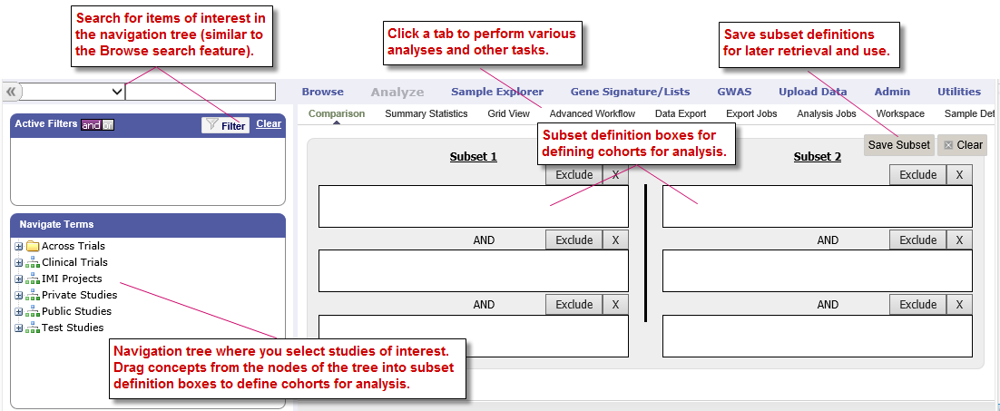
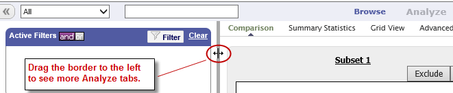
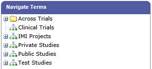
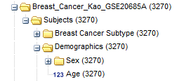
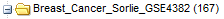
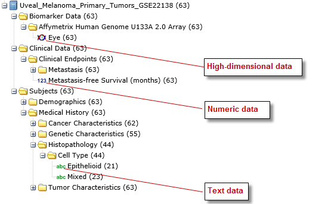
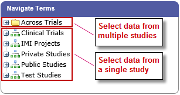

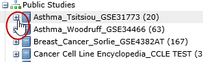

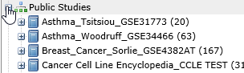
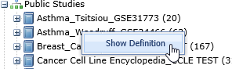
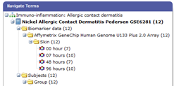
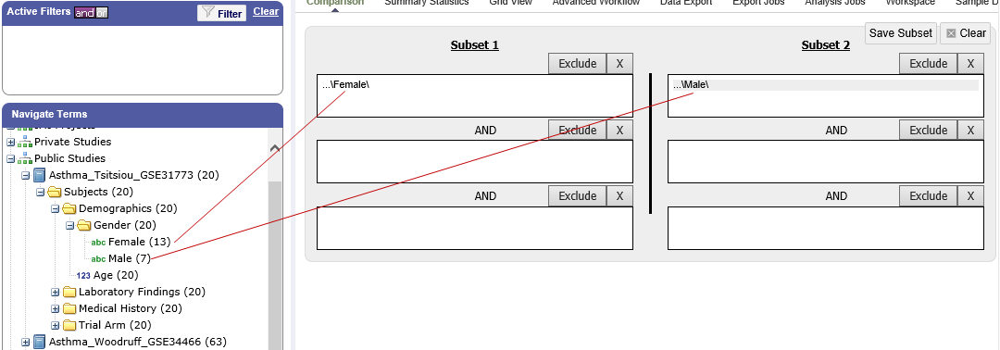
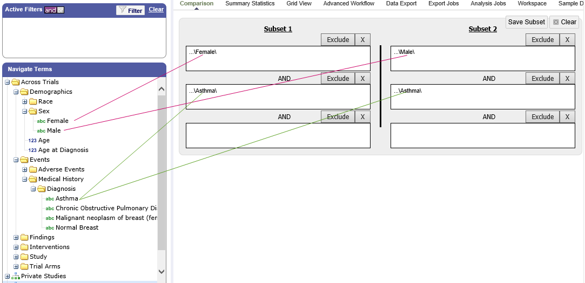
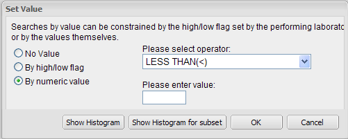
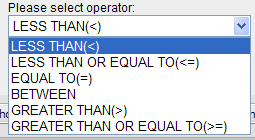
.. |image49| image:: media/image39.png
   :width: 2.83333in
   :height: 0.73958in
.. |image50| image:: media/image40.png
   :width: 2.67708in
   :height: 1.94097in
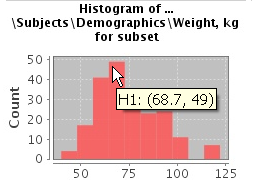
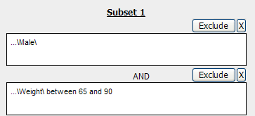
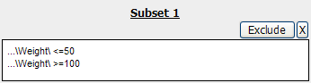
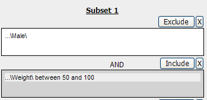
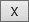
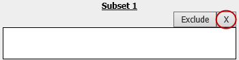
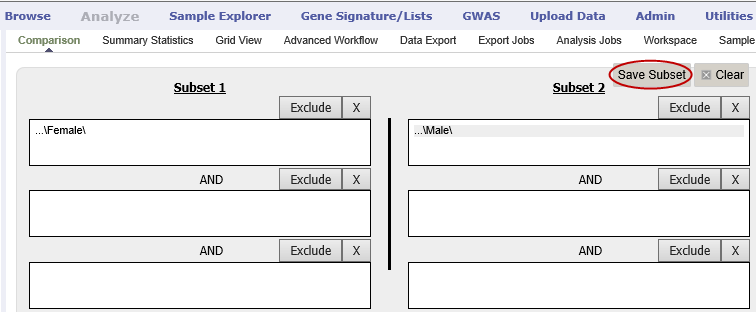
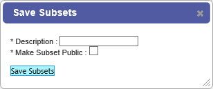
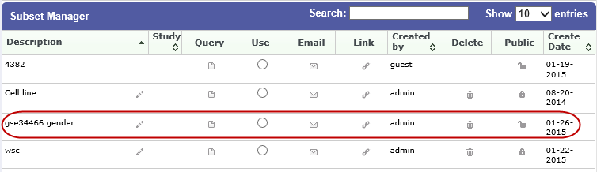
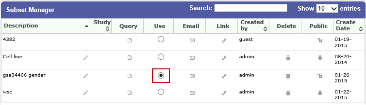
.. |image62| image:: media/image51.png
   :width: 0.24997in
   :height: 0.21872in

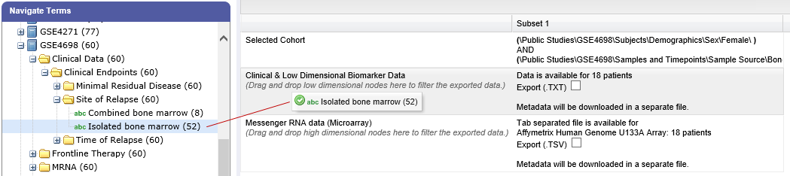
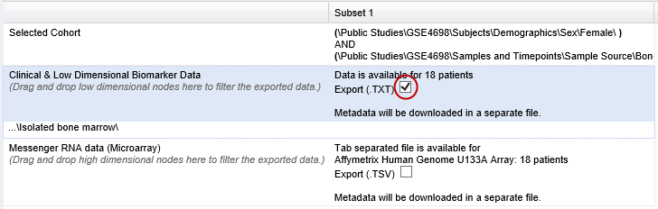
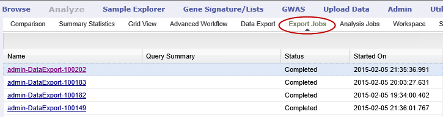
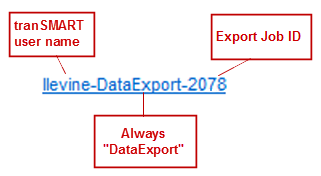
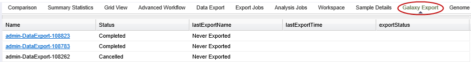
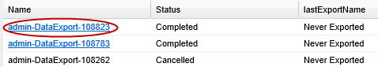
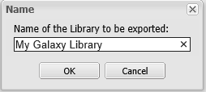
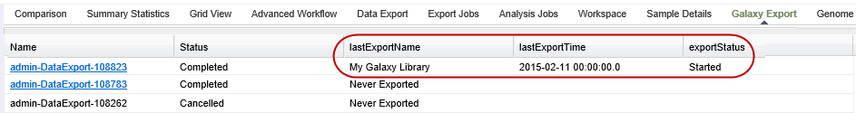
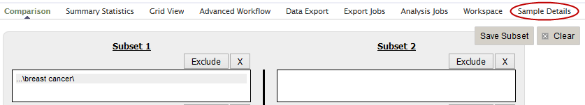
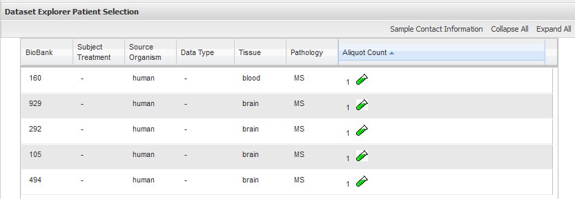