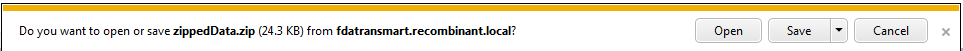
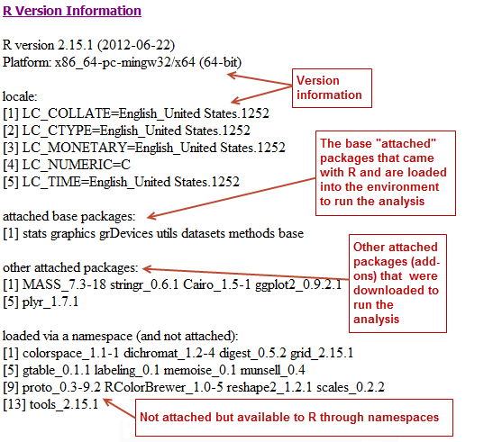
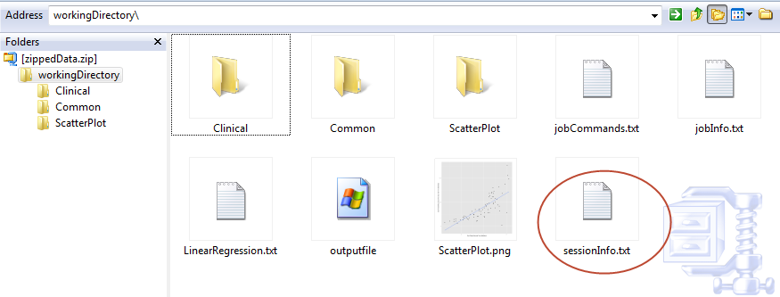

Appendix A: Download R Data
===========================

Analyses run through the Advanced Workflow tool within Analyze use R for
computation. tranSMART allows you to:

-  Download data files that were exported from the tranSMART database
   for use in an analysis. These files can then be used in other
   external tools.

-  Download the R scripts that tranSMART used in the generation of an
   analysis.

-  Review the R version information used for a particular analysis.

-  Export R code and its data from tranSMART so you execute the R code
   in the R program independently of tranSMART.

.. note::
	 For more information on The r Project for Statistical Computing, visit the following site: `www.r-project.org <http://www.r-project.org>`__.   

Downloading Raw R Data
----------------------

To download advanced workflow analyses as raw R data:

#.  Click the tranSMART **Analyze** tool to display the Analyze window.

#.  Select the study you want to use and drag it into a subset
    definition box in Subset 1.

#.  Click the **Advanced Workflow** tab and select the analysis you
    want to run.

#.  Define the variables accordingly.

#.  Click **Run**.

    Your analysis appears below the variable selection boxes.

#.  Click **Download raw R data** at the bottom of the page.

    A dialog box similar to the following appears:

    |image272|

#.  Decide whether you want to open the file or save it to your hard
    drive, then click **OK**.

Reviewing R Version Information
~~~~~~~~~~~~~~~~~~~~~~~~~~~~~~~

To review the R version information for an analysis:

#.  Click the tranSMART **Analyze** tool to display the Analyze
    window.

#.  Select the study you want to use and drag it into a subset
    definition box in Subset 1.

#.  Click the **Advanced Workflow** tab and select the analysis you
    want to run.

#.  Define the variables accordingly.

#.  Click **Run.**

    Your analysis appears below the variable selection boxes.

#.  Click **R Version Information** at the bottom of the page.

    The following R version data displays:

    -   Information about the R installation:

        |image273|

    -   A table of the packages that are included in the installation.
        Although not all packages may be used, all are listed. The version
        number is especially useful — if you want to re-create an analysis,
        the version number indicates the specific version used to create the
        original analysis.

        This sample shows a portion of the table:

        |image274|

You can view the full table in grid format when you select the
**Download raw R data** option. Just click **sessionInfo.txt** to open
the file:

|image275|

Export R Code and Data
~~~~~~~~~~~~~~~~~~~~~~

To export R code and data so it is executable in R:

#.  Click the tranSMART **Analyze** tool to display the Analyze
    window.

#.  Select the study you want to use and drag it into a subset
    definition box in Subset 1.

#.  Click the **Advanced Workflow** tab and select the analysis you
    want to run.

#.  Define the variables accordingly.

#.  Click **Run**.

    Your analysis appears below the variable selection boxes.

#.  Click **Download raw R Data** at the bottom of the page.

    A dialog box similar to the following appears:

    |image276|

#.  Open the file and copy the R commands from the file jobcommands.txt.

#.  Be sure you delete the analysis image from the Advanced Workflow page.

#.  Paste the R commands from the downloaded file into R.

#.  Run R. R creates the appropriate analysis image.

Prerequisites for using R
^^^^^^^^^^^^^^^^^^^^^^^^^

#.  When opening R, change the working directory to your downloaded raw R data folder

    .. code:: r

        # In R environment, set your working directory:
        setwd("C:\\users\\username\\Desktop\\workingDirectory").

#.  Install the following packages:

    .. code:: r

        install.packages("plyr")
        install.packages("ggplot2")
        install.packages("Cairo")
        install.packages("rmeta")
        install.packages("visreg")

Appendix B: Glossary
====================

Glossary
--------

**aggregate probes**
    Used in Analyze, the Aggregate Probes checkbox allows you to group
    probes used in high-dimensional data samples to form a total quantity
    that analyses will be performed on.

**analysis of variance (anova)**
    Analysis of Variance (ANOVA) is a statistical method used in Analyze to
    make concurrent comparisons between two or more means in a box plot.

**analysis view**
    Used in the Search tool, the Analysis View option displays the
    statistically significant analyses from your search filter(s).

**Analyze**
    Analyze lets you compare data generated for test subjects in two
    different cohorts, based on criteria and points of comparison that you
    specify. Analyze is useful to help you test a hypothesis that involves
    the criteria and points of comparison that you select.

**anti-regulation**
    An analysis of a statistically significant experiment returned from a
    search against a gene signature or list is designated as *co-regulated*
    or *anti-regulated*.

**array data**
    See: `Microarray <#Microarray>`__

**arrayexpress**
    Database of gene expression and other microarray data at the European
    Bioinformatics Institute (EBI).

    See http://www.ebi.ac.uk/arrayexpress for details.

**binomial distribution**
    Graph that displays the discrete probability distribution of obtaining
    *n* successes out of N Bernoulli trials.

    See http://mathworld.wolfram.com/BinomialDistribution.html for details.

**biomarker**
    Short for Biological Marker, a biomarker is a key molecular or cellular
    event that links a specific environmental exposure to a health outcome.

**box plot**
    Also known as a Box and Whisker Plot, a box plot is a histogram-like
    method of displaying data. Box plots are useful when conveying location
    and variation information in datasets.

**categorical variable**
    Also known as a nominal value, a categorical variable is one that has
    two or more categories, but with no intrinsic ordering to the
    categories. An example of a categorical value is hair color — there is
    no way to order these variables from highest to lowest.

**censoring value**
    Used in Survival Analyses. The Censoring Value specifies which patients
    had the event whose time is being measured. For example, if the Time
    variable selected is Overall Survival Time (Years), an appropriate
    censoring variable is Patient Death.

**chi squared**
    Let the probabilities of various classes in a distribution be
    |image277|, |image278|, ..., |image279|, with observed frequencies
    |image280|, |image281|, ..., |image282|. 
    
    The quantity:  |image283| ,

    is therefore a measure of the deviation of a sample from expectation,
    where |image284|\ is the sample size.

**cohort**
    A group of subjects who share specific events or characteristics.
    Cohorts are defined in the subset definition boxes of the Analyze tool.

**continuous variable**
    Continuous variables have an infinite number of values between two
    points. For example, age or temperature.

**co-regulation**
    An analysis of a statistically significant experiment returned from a
    search against a gene signature or list is designated as *co-regulated*
    or *anti-regulated*.

**correlation analysis**
    A type of Regression Analysis, correlation analysis measures the
    correlation coefficient — the linear association between two variables.
    Values of the correlation coefficient are always between -1 and +1. A
    correlation coefficient of +1 indicates that two variables are perfectly
    related in a positive linear sense, while a correlation coefficient of
    -1 indicates that two variables are perfectly related in a negative
    linear sense.

**cox coefficient**
    The Cox coefficient refers to the coefficients in a Cox regression model
    (also known as the proportional hazards model for survival-time). The
    analysis investigates the effects of one or more variables upon the time
    a specified event takes to happen. The cox coefficient relates to a
    hazard; a positive coefficient indicates a worse prognosis, while a
    negative coefficient indicates a protective effect of the variable.

**data binning**
    Defers to a data pre-processing technique used to reduce observation
    errors and to allow continuous variables to become categorical. Clusters
    of data are replaced by a value representative of that cluster (often
    but not necessarily, the central value).

**data warehouse**
    A database used for reporting and analysis.

**dataset**
    Collection of data, most commonly presented in a tabular form where each
    column represents a specific variable, and each row represents a value
    for that variable.

**dependent variable**
    In an experiment, the dependent variable is the response that is
    measured.

**differential modulation**

**down-regulation**
    An analysis of a statistically significant experiment returned from a
    search against a pathway is designated as *up-regulated* or
    *down-regulated*.

**entrez gene**
    Reference sequences for a wide range of species. For details, see
    http://www.ncbi.nlm.nih.gov/gene/.

**entrez global**
    Federated search engine that allows users to search various health
    sciences databases at the National Center for Biotechnology Information
    (NCBI) website.

    See `www.ncbi.nlm.nih.gov/Entrez/ <http://www.ncbi.nlm.nih.gov/Entrez/>`__ for details.

**fold change ratio**
    A number describing how much a quantity changes going from an initial to
    a final value. An initial value of 50 and a final value of 100
    corresponds to a fold change of 2 (a two-fold increase).

**gene**
    Stretches of DNA and RNA that code for a polypeptide or for an RNA chain.
    Contains hereditary molecular information LOL.

**gene chip**
    See: `Microarray <#Microarray>`__

**gene expression**
    The flow of genetic information from gene to protein; the process, or
    the regulation of the process, by which the effects of a gene are
    manifested; the manifestation of a heritable trait in an individual
    carrying the gene or genes that determine it.

**gene expression omnibus**
    GEO is an international public repository that archives and freely
    distributes microarray, next-generation sequencing, and other forms of
    high-throughput functional genomics data submitted by the research
    community. For more information, see http://www.ncbi.nlm.nih.gov/geo.

**gene set enrichment analysis (gsea)**
    Computational method that determines whether an a priori defined set of
    genes shows statistically significant, concordant differences between
    two biological states (for example, phenotypes).

    See http://www.broadinstitute.org/gsea/index.jsp for details.

**gene signature**
    A group of genes whose combined expression pattern is uniquely
    characteristic of a medical condition or other clinical outcome of
    interest.

**gene symbol**
    A unique abbreviation of a gene name consisting of italicized uppercase
    Latin letters and Arabic numbers. we use Entrez as the full list of
    genes (related to but not identical to HUGO)

    See http://www.genenames.org/ for details.

**genecards**
    Database that offers information about human genes (and mouse
    homologues).

    See http://www.genecards.org for details.

**google scholar**
    Google application that provides a search of scholarly literature across
    multiple disciplines and sources.

    See http://scholar.google.com for details.

**gpl platform**
    A Platform record is composed of a summary description of the array or
    sequencer and, for array-based Platforms, a data table defining the
    array template. Each Platform record is assigned a unique and stable GEO
    accession number (GPLxxx). A Platform may reference many Samples that
    have been submitted by multiple submitters.

**heatmap**
    Display of differential expression. Individual values contained in the
    matrix are represented by colors.

**hierarchical clustering**
    Hierarchical clustering is a type of clustering analysis whose goal is
    to organize data so that the objects in the same cluster are more
    similar to each other than to those in other clusters.

**high dimensional data**
    Datasets where the intersection of a subject and measurement is
    comprised of hundreds or thousands of points. For example, in a low
    dimensional data measurement such as height, the intersection of subject
    and measurement is one number (ex. 180 cm), whereas in a high
    dimensional data measurement such as gene expression in a lymph node,
    the measurement is 50,000 individual probe expression values.

**histogram**
    A visual representation of the distribution of data values within a
    dataset.

**homology**
    The basis for comparative biology — where organs/structures from one
    organism are compared to a similar organ/structure in a different
    organism.

**in vitro study**
    Those that are conducted using components of an organism that have been
    isolated from their usual biological surroundings.

**in vivo studies**
    Experimentation using a whole, living organism.

**independent variable**
    In an experiment, the independent variable is the variable that is
    manipulated.

**job**
    In Valhalla, a job refers to a command you have given Analyze to process
    or export data. Jobs and job-related events can be found within the
    **Jobs** tab in Analyze.

**kendall correlation**
    Kendall's rank correlation provides a distribution-free test of
    independence and a measure of the strength of dependence between two
    variables.

**k-means clustering**
    The K-Means clustering heatmap clusters genes and/or samples into a
    specified number of clusters. The result is *k* clusters, each centered
    around a randomly-selected data point.

**line graph**
    Line graphs illustrate the temporal relationship between two major
    variables.

**marker selection**
    Marker Selection is a display of the top differentially expressed genes
    between two specified cohorts.

**mesh ontology**
    MeSH is the National Library of Medicine's controlled vocabulary
    thesaurus. It consists of sets of terms naming descriptors in a
    hierarchical structure that permits searching at various levels of
    specificity.

**microarray**
    A two-dimensional array on a chip or solid surface that assays large
    amounts of DNA material.

**mrna analysis**
    Assays that quantify the expression levels of all mRNA molecules in an
    experiment.

**navigation tree**
    The Window’s Explorer-like, hierarchical representation of study data
    that has been loaded into Analyze.

**ncbi**
    The National Center for Biotechnology Information.

    See http:// `www.ncbi.nlm.nih.gov/ <http://www.ncbi.nlm.nih.gov/>`__ for
    details.

**numeric-node**
    Used in Analyze, numeric-nodes are indicated by the (**123**) symbol,
    numeric nodes indicate that the data values associated with the concept
    are only numeric (for example, age values, date values, etc.). For more
    information, see `Continuous Variable <#ContinuousVariable>`__.

**ontology**
    A hierarchical description of the concepts and relationships that can
    exist for an agent or a community of agents.

**orthogonal component**
    When performing statistical analysis, independent variables that affect
    a particular dependent variable are said to be orthogonal if they are
    uncorrelated, since the covariance forms an inner product.

**pathology**
    The study of diagnosis and disease.

**pathway**
    A group of genes interacting to form an aggregate biological function.

**pearson correlation**
    Obtained by dividing the covariance of the two variables by the product
    of their standard deviations

**principal component analysis**
    A Principal Component Analysis (PCA) is commonly used as a tool in
    exploratory data analysis. Data is split into orthogonal components, and
    the genes/probes that contribute the most variance to the components are
    displayed.

**probe set**
    A probe set is a collection of probes designed to interrogate a given
    sequence.

**probe set id**
    A probe set ID is used to refer to a probe set, which looks like the
    following:

    12345\_at or 12345\_a\_at or 12345\_s\_at or 12345\_x\_at

    The last three characters (\_at) identify the probe set strand.

**p-value**
    The number corresponding probability that the occurrences of your
    experiment and analysis did not happen by chance. P-value cutoffs are
    often 0.05 or 0.01 — when the value is under the threshold, the result
    is said to be statistically significant.

**r**
    R is a language and environment for statistical computing and graphics.

    See http://www.r-project.org for details.

**rbm data**
    Rules Based Medicine. They provide an array measurement of metabolites

**regression algorithms**
    Algorithms that are particularly suited for mining data sets that have
    high dimensionality (many attributes), including transactional and
    unstructured data.

**rho-value**
    Also known as Spearman’s rho, the rho-value is a non-parametric measure
    of statistical dependence between two variables. See: `Spearman
    Correlation <#SpearmanCorrelation>`__.

**r-value**
    The value assigned to a correlation coefficient.

**scatter plot**
    Type of graph that uses Cartesian coordinates to display values for two
    variables for a set of data.

**search filter**
    A biomedical concept used to define search criteria in the Search tool.

**search string**
    A sequence of biomedical concepts used to define search criteria in the
    Search tool.

**slope**
    The steepness of the line of best fit in a graph (∆y/∆x).

**snp data**
    Single Nucleotide Polymorphism. DNA sequence data marking variation
    occurring when a single nucleotide — A, T, C or G — in the genome.

**spearman correlation**
    The Spearman's rank-order correlation is the nonparametric version of
    the Pearson product-moment correlation. Spearman's correlation
    coefficient, (, also signified by rho-value) measures the strength of
    association between two ranked variables.

**statistical significance**
    Results of analyses on data that are statistically significant indicate
    a confidence level that the results did not happen by chance.

**subset**
    A smaller grouping of participants in a study. See `cohort <#cohort>`__.

**survival analysis**
    Assessment of the amount of time that a person or population lives after
    a particular intervention or condition.

**t statistic**
    Ratio of the departure of an estimated parameter from its notional value
    and its standard error.

**table with fisher test**
    Examines the significance of associated categorical variables.

**tea analyses**
    Target Enrichment Analysis (TEA) measures the enrichment of a gene
    signature, gene list, or pathway in a microarray expression experiment.

**tea p-value**
    These normalized p‑values are intermediate values in the TEA
    calculation. To be considered a statistically significant analysis, an
    analysis must have at least one matching biomarker with a TEA p-Value of
    less than 0.05.

**tea score**

**text-node**
    Indicated by the (**abc**) symbol, text nodes indicate that the data
    values associated with the concept are only textual (for example, race
    or gender). For more information, see `Categorical
    Variable <#CategoricaVariable>`__.

**tissue type**
    The specific type of tissue that has been used in the experiment (for
    example, breast tissue, lung tissue, etc.)

**up-regulation**
    An analysis of a statistically significant experiment returned from a
    search against a pathway is designated as *up-regulated* or
    *down-regulated*.

**x-axis**
    The horizontal axis of a two-dimensional Cartesian coordinate system.

**y-axis**
    The vertical axis of a two-dimensional Cartesian coordinate system.

.. |image274| image:: media/image205.png
   :width: 6.00000in
   :height: 2.65625in

.. |image277| image:: media/image207.gif
   :width: 0.14444in
   :height: 0.14444in
.. |image278| image:: media/image208.gif
   :width: 0.14444in
   :height: 0.14444in
.. |image279| image:: media/image209.gif
   :width: 0.14444in
   :height: 0.14444in
.. |image280| image:: media/image210.gif
   :width: 0.17083in
   :height: 0.14444in
.. |image281| image:: media/image211.gif
   :width: 0.17083in
   :height: 0.14444in
.. |image282| image:: media/image212.gif
   :width: 0.17083in
   :height: 0.14444in
.. |image283| image:: media/image213.gif
   :width: 1.28958in
   :height: 0.48681in
.. |image284| image:: media/image214.gif
   :width: 0.10556in
   :height: 0.14444in
