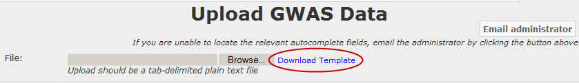

Chapter 10: Data Upload
=======================

The **Upload Data** menu at the top of the tranSMART window lets you
upload analysis data for a study. It also lets you define information
about the analysis (the analysis metadata), such as analysis name,
description, data type, sample size, tissue, phenotype, and so on.

Data that you upload through the two-page data upload form is fully
integrated with the studies and analyses that have already been loaded
in the tranSMART data warehouse. The data is immediately searchable via
tranSMART Browse.

Analysis data is uploaded from a tab-separated text file. To ensure that
this file is in the proper format for uploading, use one of the provided
templates. For information, see *File Templates* on page 133.

Uploading Analysis Data
-----------------------

Before you begin to upload analysis data, you must have a properly
formatted file containing the data in a directory on your local computer
or on a network server that is accessible from your computer.

To ensure that the data is in a properly formatted file, use one of the
file templates provided. For information, see `File Templates`_.

To upload analysis data:

#.  At the top of the tranSMART window, click the **Upload Data**
    menu.

#.  The first Upload Data page appears. On this page, the fields **Study**,
    **Analysis** **Type to Upload**, and **Analysis** **Name** are required.

#.  In **Study**, select the name of the study associated with the
    analysis. To do so, do either of the following:

    -   Type part of the study name in the text box. tranSMART lists all
        study names that contain those characters in a contiguous string
        anywhere in the name (not case sensitive). When you see the name you
        want, click it. If you do not see the name, type more characters.

    -   Click the **Browse** button to browse the list of study names. Select
        the one you want and click **Select**.

    The study metadata appears under the study name. If the selected study
    is not the one you want, click **Change** to select a different name.

    .. note::
        If you do not see the study you want, click the **Email administrator** 
        button at the upper right corner of the page to inquire about the study.   

#.  In **Analysis Type to Upload**, select the data type of the analysis data.

#.  In **Analysis Name**, type a name for the analysis.

    This is the name that will appear in the list of analyses for the study.

#.  In **Analysis Description**, type a description of the analysis.

    The description should contain enough information to help a researcher
    who is scanning the analyses find the ones that are of interest.

#.  Click **Enter metadata**.

    The second page of the data upload form appears. The page name will
    reference the data type you selected on the previous page.

#.  In **File**, click the **Browse** button to navigate to the
    tab-delimited text file that contains the analysis data.

    Optionally, click **Download Template** to open or save the template for
    the data type that you are uploading.

#.  Complete the upload data form by providing information for the
    remaining fields on the form, as described in the table below:
 
    +-------------------------------+-------------+------------------------------------------------------------------------------------------------------------------------------------------------------------------------------------------------------------+
    | Analysis Metadata             | Data Type   | Description                                                                                                                                                                                                |
    +===============================+=============+============================================================================================================================================================================================================+
    | Disease or Phenotype          | All         | Type one or more characters in the name of a disease or observation that is relevant to the analysis. tranSMART lists the names that contain the characters in a contiguous string anywhere in the name.   |
    |                               |             |                                                                                                                                                                                                            |
    |                               |             | Click the name of the relevant disease or observation. If you do not see the name you want, type more characters.                                                                                          |
    |                               |             |                                                                                                                                                                                                            |
    |                               |             | To add another disease or observation, click **Add new**.                                                                                                                                                  |
    +-------------------------------+-------------+------------------------------------------------------------------------------------------------------------------------------------------------------------------------------------------------------------+
    | Population                    | All         | Specify the population of individuals to whom the analysis applies.                                                                                                                                        |
    +-------------------------------+-------------+------------------------------------------------------------------------------------------------------------------------------------------------------------------------------------------------------------+
    | Sample Size                   | All         | Specify the number of subjects who were included in the study.                                                                                                                                             |
    +-------------------------------+-------------+------------------------------------------------------------------------------------------------------------------------------------------------------------------------------------------------------------+
    | Tissue                        | All         | The type of tissue on which testing was performed.                                                                                                                                                         |
    +-------------------------------+-------------+------------------------------------------------------------------------------------------------------------------------------------------------------------------------------------------------------------+
    | Cell Type                     | All         | The type of cell on which testing was performed.                                                                                                                                                           |
    +-------------------------------+-------------+------------------------------------------------------------------------------------------------------------------------------------------------------------------------------------------------------------+
    | (Genotype)                    | All         | The genotype platform vendor.                                                                                                                                                                              |
    | Platform: Vendor              |             |                                                                                                                                                                                                            |
    |                               |             | To add another vendor and platform, click **Add new**.                                                                                                                                                     |
    +-------------------------------+-------------+------------------------------------------------------------------------------------------------------------------------------------------------------------------------------------------------------------+
    | (Genotype)                    | All         | The specific genotype platform involved in the study. Platform names will vary with the vendor you select.                                                                                                 |
    | Platform                      |             |                                                                                                                                                                                                            |
    +-------------------------------+-------------+------------------------------------------------------------------------------------------------------------------------------------------------------------------------------------------------------------+
    | Genome Version                | All         | The human genome version on which the analysis data is based.                                                                                                                                              |
    +-------------------------------+-------------+------------------------------------------------------------------------------------------------------------------------------------------------------------------------------------------------------------+
    | Expression Platform: Vendor   | eQTL        | The gene expression platform vendor.                                                                                                                                                                       |
    |                               |             |                                                                                                                                                                                                            |
    |                               |             | To add another vendor and platform, click **Add new**.                                                                                                                                                     |
    +-------------------------------+-------------+------------------------------------------------------------------------------------------------------------------------------------------------------------------------------------------------------------+
    | Expression Platform           | eQTL        | The specific gene expression platform involved in the study. Platform names will vary with the vendor you select.                                                                                          |
    +-------------------------------+-------------+------------------------------------------------------------------------------------------------------------------------------------------------------------------------------------------------------------+
    | Model Name                    | All         | The name of the model that was used to perform the analysis.                                                                                                                                               |
    +-------------------------------+-------------+------------------------------------------------------------------------------------------------------------------------------------------------------------------------------------------------------------+
    | Model Description             | All         | The description of the model.                                                                                                                                                                              |
    +-------------------------------+-------------+------------------------------------------------------------------------------------------------------------------------------------------------------------------------------------------------------------+
    | Statistical Test              | All         | The statistical test that was used to analyze the data.                                                                                                                                                    |
    +-------------------------------+-------------+------------------------------------------------------------------------------------------------------------------------------------------------------------------------------------------------------------+
    | P-value cutoff <=             | All         | The p-value threshold applied to the data being uploaded. The uploaded data contains records with a p-value that is equal to or less than the specified p-value cutoff.                                    |
    +-------------------------------+-------------+------------------------------------------------------------------------------------------------------------------------------------------------------------------------------------------------------------+
    | Research Unit                 | All         | The research unit that performed the analysis or to whom the analysis is relevant..                                                                                                                        |
    +-------------------------------+-------------+------------------------------------------------------------------------------------------------------------------------------------------------------------------------------------------------------------+

#.  Click **Upload** to upload the analysis data and metadata.

File Templates
--------------

Analysis data must be contained in a properly formatted, tab-separated
text file.

tranSMART includes templates for the supported analysis data types
(GWAS, Metabolic GWAS, eQTL). Be sure to use these templates for the
analysis data to upload.

The data must contain values in the rsid and p-value columns.

You can download the templates from the data upload form in tranSMART.
To do so:

#.  At the top of the tranSMART window, click the **Upload Data** tab.

    The first page of the upload data form appears. The templates are
    available from the second page, so you must provide information on the
    required fields of this page to proceed to the next.

#.  In **Study**, select any study name.

#.  In **Analysis Type to Upload**, select the data type for the analysis
    data that you will upload.

#.  In **Analysis Name**, type any name.

#.  Click **Enter metadata**.

    The second page of the data upload form appears.

#.  Click **Download Template** to the right of the File field:

    |image236|

    You will be prompted to open or save the template for the data type you
    specified in step 3.

#.  Click **Save**, specify a location for the file to be saved, and
    click **Save**.

#.  Close the Download dialog box.

#.  Click the **Cancel** button on the upload data form.

