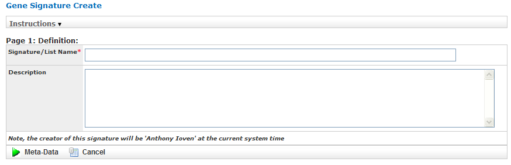
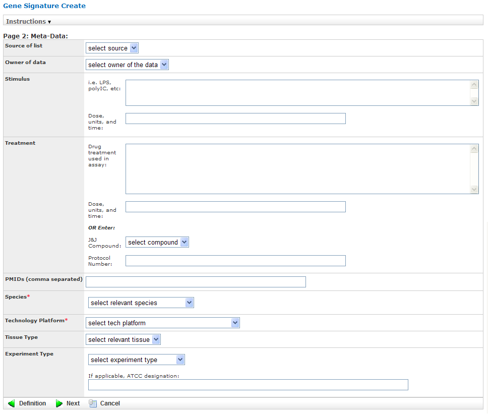
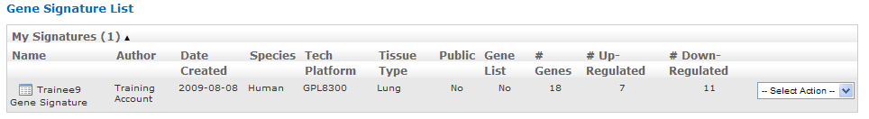
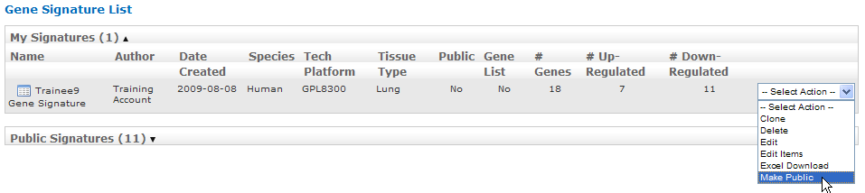
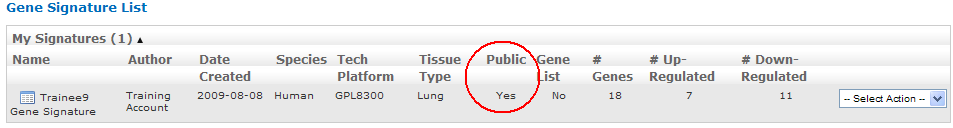
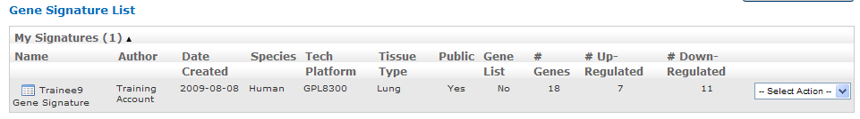
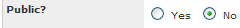
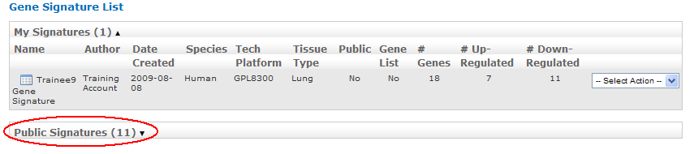
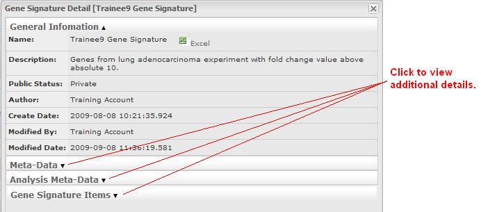

Chapter 8: Gene Signatures & Lists
==================================

The tranSMART gene signature wizard guides you through the process of
creating a gene signature or gene list. You specify whether the gene
signature or list is publicly available to other tranSMART users or is
reserved for your private use.

Once you create the gene signature or list, it can be used in tranSMART
searches to find clinical studies and experiments where the
differentially regulated genes overlap with the genes contained in the
gene signature or list. This will generate a set of hypotheses about
diseases or treatments that may have similar genes deregulated, and that
can help you develop a further set of experiments.

.. note::
	 This chapter uses the term "gene signature" to refer to both gene signatures and gene lists.   

Creating a Gene Signature
-------------------------

There are two basic tasks involved in creating a gene signature:

#.  Add the list of genes for the gene signature to a text file.

    Genes can be indicated by gene symbol or by their associated probe set ID.

#.  Use the gene signature wizard to define the information on which the
    gene signature is based, such as species, source of data, and test
    type, and also to import into the gene signature definition the text
    file containing the genes.

Step 1. Adding the Genes to a Text File
~~~~~~~~~~~~~~~~~~~~~~~~~~~~~~~~~~~~~~~

The gene signature wizard expects to import the genes for the gene
signature from a tab-separated text file. The file must contain one, and
possibly two, columns of information:

-  First column — A list of gene symbols or probe set IDs.

-  Optional second column — The fold change ratios associated with the
   gene symbols or probe set IDs.

The fold change ratios can be either **actual values** (for example,
12.8 or -12.8) or one of the following **composite values:**

    **-1**  All down-regulated gene expressions.

    **1**   All up-regulated gene expressions.

    **0**   No change.

The following table shows the different ways you can specify the genes
for your gene signature :

+----------------------------------------+------------------------------------+--------------------------------+
| Contents of File                       | Format                             | Examples                       |
+========================================+====================================+================================+
| Gene symbols only                      | *GeneSymbol*                       | TCN1                           |
|                                        |                                    |                                |
|                                        |                                    | IL1RN                          |
|                                        |                                    |                                |
|                                        |                                    | KIAA1199                       |
|                                        |                                    |                                |
|                                        |                                    | G0S2                           |
+----------------------------------------+------------------------------------+--------------------------------+
| Gene symbols,                          | *GeneSymbol*\ <tab>*ActualFC*      | CXCL5 -19.19385797             |
| actual fold change                     |                                    |                                |
|                                        |                                    | IL8RB -18.21493625             |
|                                        |                                    |                                |
|                                        |                                    | FPR1 -17.6056338               |
|                                        |                                    |                                |
|                                        |                                    | FCGR3A -15.69858713            |
+----------------------------------------+------------------------------------+--------------------------------+
| Gene symbols, composite fold change    | *GeneSymbol*\ <tab>*CompositeFC*   | CXCL5 -1                       |
|                                        |                                    |                                |
|                                        |                                    | IL8RB -1                       |
|                                        |                                    |                                |
|                                        |                                    | MMP3 0                         |
|                                        |                                    |                                |
|                                        |                                    | SOD2 1                         |
+----------------------------------------+------------------------------------+--------------------------------+
| Probe set IDs only                     | *ProbesetID*                       | 224301\_x\_at                  |
|                                        |                                    |                                |
|                                        |                                    | 1398191\_at                    |
|                                        |                                    |                                |
|                                        |                                    | Dr.2473.1.A1\_at               |
|                                        |                                    |                                |
|                                        |                                    | A\_24\_P93251                  |
+----------------------------------------+------------------------------------+--------------------------------+
| Probe set IDs,                         | *ProbesetID*\ <tab>*ActualFC*      | 224301\_x\_at -19.19385797     |
| actual fold change                     |                                    |                                |
|                                        |                                    | 1398191\_at -18.21493625       |
|                                        |                                    |                                |
|                                        |                                    | Dr.2473.1.A1\_at -17.6056338   |
|                                        |                                    |                                |
|                                        |                                    | A\_24\_P93251 -15.69858713     |
+----------------------------------------+------------------------------------+--------------------------------+
| Probe set IDs, composite fold change   | *ProbesetID*\ <tab>*CompositeFC*   | 224301\_x\_at -1               |
|                                        |                                    |                                |
|                                        |                                    | 1398191\_at 0                  |
|                                        |                                    |                                |
|                                        |                                    | Dr.2473.1.A1\_at 1             |
|                                        |                                    |                                |
|                                        |                                    | A\_24\_P93251 -1               |
+----------------------------------------+------------------------------------+--------------------------------+

Step 2. Creating the Gene Signature
~~~~~~~~~~~~~~~~~~~~~~~~~~~~~~~~~~~

To create a gene signature:

#.  In tranSMART, click the **Gene Signature/Lists** menu.

#.  Click the **New Signature** button.

    The first page of the gene signature wizard appears:

    |image185|

    .. note::
        Required fields on gene signature wizard pages are marked with a red asterisk (\*).   

    You can find additional information about the gene signature wizard by
    clicking **Information** on any wizard page.

#.  Specify a name (required) and an optional description for your gene
    signature, then click Meta-Data to proceed to the next gene wizard
    page.

#.  The second page of the gene signature wizard appears:

    |image187|

#. Specify values in the required fields **Species** and **Technology**
   **Platform**, and also in any other relevant fields, then click
   **Next** to proceed to the final gene signature wizard page:

   |image188|

#.  The third page appears.

#.  Specify values in the required field **P-value Cutoff**.

#.  In the section **File Upload Information**, describe the text file
    you created in the section `Step 1. Adding the Genes to a Text File`_
    using the required fields **File Information** and **Upload File**:

    -   In the **File schema** section of **File Information**, select **Gene
        Symbol <tab> Metric Indicator** or **Probe Set Symbol <tab> Metric
        Indicator**, depending on the method you chose to specify the genes.

    -   In the **Fold change metric** section of **File Information**, select
        one of the following choices from the dropdown:
    
        +-------------------------------------------------+----------------------------------------------------------------------------------------------------------------------------------------------------------------+
        | Fold Change Metric Indicator                    | Description                                                                                                                                                    |
        +=================================================+================================================================================================================================================================+
        | Actual fold change                              | The text file contains actual fold change values for each gene symbol or probe set ID.                                                                         |
        +-------------------------------------------------+----------------------------------------------------------------------------------------------------------------------------------------------------------------+
        | Not used                                        | The text file contains gene symbols or probe set ID only. There are no associated fold change values.                                                          |
        +-------------------------------------------------+----------------------------------------------------------------------------------------------------------------------------------------------------------------+
        | -1 (down), 1 (up), 0 (optional for unchanged)   | The fold change values are not actual values. They simply represent whether the gene expression was down-regulated (-1), up-regulated (1), or unchanged (0).   |
        +-------------------------------------------------+----------------------------------------------------------------------------------------------------------------------------------------------------------------+

    -  In **Upload File**, specify the path and name of the file that
       contains the genes to import. Use the **Browse** button to select the
       file from the navigation tree.

#.  Specify values in any other relevant fields on this gene wizard page,
    then click **Save** to save the gene signature.

The new gene signature appears in the **Gene Signature List** at the top
of the Gene Signature/List view:

|image189|

Making a New Gene Signature Public
^^^^^^^^^^^^^^^^^^^^^^^^^^^^^^^^^^

By default, a newly created gene signature is private.

To make a gene signature public:

#.  In the **Gene Signature List**, click the **Select** **Action**
    dropdown to the right of the gene signature you just created.

#.  Click **Make Public** in the dropdown list:

    |image190|

#.  After you click **Make Public**, the value in the **Public** column for
    the gene signature changes from **No** to **Yes**:

    |image191|

.. note::
	 tranSMART users assigned the role ROLE\_ADMIN have access to both public and private gene signatures.   

Performing Actions on Your Gene Signatures
------------------------------------------

To edit or perform other actions on a gene signature in your gene signature list:

#.  In tranSMART, click the **Gene Signature/Lists** menu.

#.  The **Gene Signature List** appears, containing all the genes you have created:

    |image193|

#.  Click the **Select Action** dropdown for the gene signature you are
    acting on. The dropdown contains all the actions you can perform on
    the gene signature:
 
    +------------------+-------------------------------------------------------------------------------------------------------------------------------------------------------------------------------------------------------------------------------------------------------+
    | Action           | Description                                                                                                                                                                                                                                           |
    +==================+=======================================================================================================================================================================================================================================================+
    | Clone            | Create an exact duplicate of the gene signature definition (*except* for the text file containing the gene symbols and fold change values), and display the definition in the gene signature wizard.                                                  |
    |                  |                                                                                                                                                                                                                                                       |
    |                  | Cloning a gene signature helps you create a new gene signature with a similar definition to an existing one. However, it is expected you will import a different set of genes into the gene signature.                                                |
    +------------------+-------------------------------------------------------------------------------------------------------------------------------------------------------------------------------------------------------------------------------------------------------+
    | Delete           | Delete the gene signature.                                                                                                                                                                                                                            |
    +------------------+-------------------------------------------------------------------------------------------------------------------------------------------------------------------------------------------------------------------------------------------------------+
    | Edit             | Open the gene signature in the gene signature wizard for editing.                                                                                                                                                                                     |
    |                  |                                                                                                                                                                                                                                                       |
    |                  | The gene signature wizard displays all the information in the gene signature, including the reference to the text file containing the list of genes and fold change values. If you want to choose a different text file, click the following label:   |
    |                  |                                                                                                                                                                                                                                                       |
    |                  | |image194|                                                                                                                                                                                                                                            |
    |                  |                                                                                                                                                                                                                                                       |
    |                  | To save any changes you make during editing, you must click the **Save** button on the third page of the wizard.                                                                                                                                      |
    +------------------+-------------------------------------------------------------------------------------------------------------------------------------------------------------------------------------------------------------------------------------------------------+
    | Edit Items       | Add, delete, or modify one or more genes in the text file containing the gene symbols and fold change values.                                                                                                                                         |
    +------------------+-------------------------------------------------------------------------------------------------------------------------------------------------------------------------------------------------------------------------------------------------------+
    | Excel Download   | Generate the entire contents of the gene signature, including the information in the text file containing the gene symbols and fold change values, to a Microsoft Excel spreadsheet.                                                                  |
    |                  |                                                                                                                                                                                                                                                       |
    |                  | The gene signature definition and gene symbols/fold change values are written to separate spreadsheets.                                                                                                                                               |
    +------------------+-------------------------------------------------------------------------------------------------------------------------------------------------------------------------------------------------------------------------------------------------------+
    | Make Public      | Make a private gene signature public.                                                                                                                                                                                                                 |
    |                  |                                                                                                                                                                                                                                                       |
    |                  | **Note:** To make a public gene signature private, edit the gene signature and set the **Public?** field to **No** on the first page of the gene signature wizard:                                                                                    |
    |                  |                                                                                                                                                                                                                                                       |
    |                  | |image195|                                                                                                                                                                                                                                            |
    +------------------+-------------------------------------------------------------------------------------------------------------------------------------------------------------------------------------------------------------------------------------------------------+

Performing Actions on Other Users’ Signatures 
----------------------------------------------

You can perform actions on gene signatures that other tranSMART users
have created. The gene signatures you can access and the actions you can
perform on them depend on the role assigned to your tranSMART user ID,
as follows:

+----------------------------------+----------------------------------------------------------------------------------+
| Role                             | Authorized Actions                                                               |
+==================================+==================================================================================+
| ROLE\_ADMIN                      | All actions on all gene signatures, both public and private.                     |
+----------------------------------+----------------------------------------------------------------------------------+
| ROLE\_SPECTATOR                  | Only **Clone** and **Excel** **Download**, and only on public gene signatures.   |
| ROLE\_STUDY\_OWNER               |                                                                                  |
| ROLE\_DATASET\_EXPLORER\_ADMIN   |                                                                                  |
+----------------------------------+----------------------------------------------------------------------------------+

To edit or perform actions on a gene signature other than your own:

#.  In tranSMART, click the **Gene Signature/Lists** menu.

#.  Click **Public Signatures** to open the list of public gene
    signatures:

    |image196|

    .. note::
        tranSMART users assigned the role ROLE\_ADMIN will see **Other Signatures** instead of **Public Signatures**.   

#.  Click the **Select Action** dropdown for the gene signature you want
    to act on.

#.  Select the action you want to perform on the gene signature.

Viewing a Gene Signature Definition
-----------------------------------

You can view the definition of a gene signature, including its list of
genes and fold change values, for any gene signature you are authorized
to access.

To view a gene signature definition, click the **Detail** icon
(|image198|) next to the gene signature name.

The Gene Signature Detail dialog box appears, containing the gene
signature definition:

|image199|

.. |image188| image:: media/image141.png
   :width: 6.00000in
   :height: 2.96058in

.. |image198| image:: media/image149.png
   :width: 0.18403in
   :height: 0.13542in

