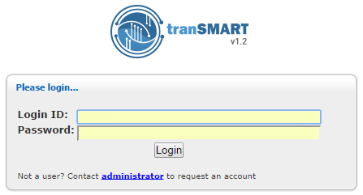

Chapter 1: Getting Started with tranSMART
=========================================

The tranSMART application reflects the efforts of various informatics
groups to integrate data from internal and external data sources within
a single data warehouse, and to provide scientific end users the tools
to search for, view, and analyze the data in the warehouse.

The core internal data is a historical base of biomarker data from gene
expression, RBM, and SNP experiments involving GWAS, Metabolic GWAS, and
eQTL data types, and including both raw and analyzed data.

The tranSMART application includes a search tool that lets researchers
query this vast ocean of disparate data for studies of interest and
related resources.

Another major tranSMART feature, called Analyze, allows authorized users
to create and study cohorts of patients that have been involved in
completed clinical research efforts. Analyze includes an Across Trials
feature that allows users to define cohorts made up of patients from
multiple studies.

.. note::
    There may be some minor differences between the UI objects
    illustrated in this guide and the ones you see on your screen.   

Tools
-----

The tranSMART menu bar is shown below:

|image4|

The following tools appear on the menu bar:

-  **Browse** — Search across studies and analyses for research data
   related to search filters that you specify.

-  **Analyze** — View study data for subjects that you select, based on
   criteria that you specify. Also, compare data generated for subjects
   in two different cohorts, based on criteria and points of comparison
   that you specify.

-  **Sample Explorer** — Search for datasets of tested tissue and blood
   samples, within categories such as tissue type, pathology, and test
   type (such as gene expression or SNP).

-  **Gene** **Signature/Lists** — View definitions of existing gene
   signatures and add new gene signature definitions.

-  **GWAS —** View genetic variants in individuals to find those that
   may be associated with a trait of interest, such as a major disease.

-  **Upload Data** — Upload analysis data for a study.

-  **Admin** — Perform administrative tasks such as creating tranSMART
   user accounts.

-  **Utilities** — Contains submenus providing supplementary information
   or actions.

**Logging In**
--------------

#. To log into tranSMART:

   1. Type the address of the tranSMART software into your browser’s URL
      field.

The login screen appears:

|image5|

1. Type your tranSMART login credentials and click **Login**.

