Chapter 9: GWAS
===============

The genome-wide association study (GWAS) tool is used to find
relationships between genetic variants in different individuals and a
trait of interest. Though the tool is called "GWAS," the feature
supports genome-wide association studies (GWAS), expressional
quantitative trait loci (eQTL), and metabolic associations (mQTL).

This application is comprised of a GWAS page to query across GWAS, a
data loading panel to import GWAS files, and an interactive Manhattan
Plot application called the "Genome-Wide Association Visual Analyzer"
(GWAVA).

Searching for a Study
---------------------

The GWAS search feature is similar to the search feature of the Browse
tool. You can build a search query using keywords, pre-defined filters,
or any combination.

Features of the GWAS page are shown below:

|image200|

Keyword searches and the Active Filters pane work as they do with the
Browse tool. For information, see *Defining Search Filters* (page 4) and
*Managing Active Filters* (page 7).

GWAS Filter Browsers
~~~~~~~~~~~~~~~~~~~~

The Filter Browser pane contains the following GWAS filter categories:

|image201|

There are two types of GWAS filter browsers:

-  **Resource** browsers that let you select a filter for a particular
   tranSMART resource, such as studies, analyses, and data types (for
   example, GWAS, metabolic GWAS, GWAS Fail, eQTL).

-  **Human genome region of interest** browser that lets you specify the
   region of the human genome to investigate.

Resource Browsers
^^^^^^^^^^^^^^^^^

The resource browsers (studies, analyses, data types) all operate the
same way.

#. To select a filter from a resource browser:

   1. Click the name of the filter browser category to open; for
      example, Study as shown below:

|image202|

1. In the browser popup window, filter options are listed on the left.
   Select a filter by clicking the plus sign (**+**) to the right of the
   filter name. The selected filter is added to the right part of the
   browser.

|image203|

With filters that have long names, note that:

-  Even if the plus sign (**+**) is partially obscured by the name, you
   can still click it.

-  Hovering the mouse pointer over the name displays the full name.

1. Optionally:

-  Add additional filters within this browser by repeating the previous
   step.

-  Narrow the list of filter options by typing characters into the text
   box at the top left of the browser. tranSMART lists all those filters
   whose names include the characters, in a contiguous string, anywhere
   in the name (not case-sensitive):

|image204|

-  Select all the filters in the list by clicking **Add all**:

|image205|

-  Remove a selected filter by clicking the minus sign (**–**) to the
   right of the selected filter name, or remove all selected filters by
   clicking **Remove all**:

|image206|

1. When finished selecting filters from this browser, click **Select**
   at the bottom right of the browser. Your selections will be added to
   the Active Filters area.

2. Optionally, select filters from a different browser by repeating the
   above steps.

All of the selected filters will become part of the same search query
and be included in the Active Filters area.

Region of Interest Browser
^^^^^^^^^^^^^^^^^^^^^^^^^^

The Region of Interest browser lets you specify a particular area of the
human genome as a search filter.

.. note::
    Search filters for regions of interest do not filter out studies and 
    analyses that omit the region of interest. However, the only records 
    returned for an analysis are those that contain the specified region 
    of interest. If an analysis does not reference the region of 
    interest, no records are returned for that analysis.

#. To specify a region of interest:

   1. In the Filter Browser pane, click **Region of Interest**.

The Region of Interest browser appears:

|image208|

1. Define the filter as described in the following table:

+-----------------+--------------------------------------------------------------------------------------------------------------------------------------------------------------------------------------------------------------------------------------------+
| Filter by       | Description                                                                                                                                                                                                                                |
+=================+============================================================================================================================================================================================================================================+
| Gene            | 1. Select the **Gene/RSID** radio button.                                                                                                                                                                                                  |
|                 |                                                                                                                                                                                                                                            |
|                 | 2. Type one or more characters in the **Add new** (not case sensitive).                                                                                                                                                                    |
|                 |                                                                                                                                                                                                                                            |
|                 | tranSMART begins to search for gene names or synonyms that begin with the characters you typed.                                                                                                                                            |
|                 |                                                                                                                                                                                                                                            |
|                 | Up to 15 keywords are displayed. If you don’t see the one you want, type more characters into the field.                                                                                                                                   |
|                 |                                                                                                                                                                                                                                            |
|                 | 1. Click the gene of interest once it has been auto-suggested.                                                                                                                                                                             |
|                 |                                                                                                                                                                                                                                            |
|                 | -  To select a another gene, repeat the above steps.                                                                                                                                                                                       |
|                 |                                                                                                                                                                                                                                            |
|                 | -  To remove a selected gene, click the gene name.                                                                                                                                                                                         |
|                 |                                                                                                                                                                                                                                            |
|                 |    1. Optionally, in the **Use** field, select the Human Genome version to use as the basis of this search. The default is the current version.                                                                                            |
|                 |                                                                                                                                                                                                                                            |
|                 |    2. Optionally, in **Location**, specify the number of base pairs above, below, or both above and below the specified genes to include in the region of interest.                                                                        |
|                 |                                                                                                                                                                                                                                            |
|                 | If you do not specify a location, the region of interest will be the specified genes only.                                                                                                                                                 |
|                 |                                                                                                                                                                                                                                            |
|                 | For example, the following selects a region that spans 50 base pairs above and below the gene IL7, based on Human Genome version 19:                                                                                                       |
|                 |                                                                                                                                                                                                                                            |
|                 | |image209|                                                                                                                                                                                                                                 |
|                 |                                                                                                                                                                                                                                            |
|                 | 1. Optionally, specify a p-value cutoff in the **p-value** field. Only those results with a p-value at or below the cutoff are returned. If you do not specify a p-value cutoff, all matches within the region of interest are returned.   |
|                 |                                                                                                                                                                                                                                            |
|                 | 2. When finished defining the region of interest, click **Select**.                                                                                                                                                                        |
|                 |                                                                                                                                                                                                                                            |
|                 | The filter is added to the search query in the Active Filters area.                                                                                                                                                                        |
+-----------------+--------------------------------------------------------------------------------------------------------------------------------------------------------------------------------------------------------------------------------------------+
| RS Identifier   | Define the region of interest based on an RS identifier the same way you would define one for a gene. In step 2, type the RSID, which consists of the letters **rs** followed by at least one numeric character.                           |
+-----------------+--------------------------------------------------------------------------------------------------------------------------------------------------------------------------------------------------------------------------------------------+
| Chromosome      | #.                                                                                                                                                                                                                                         |
|                 |                                                                                                                                                                                                                                            |
|                 |    1. Select the **Chromosome** radio button.                                                                                                                                                                                              |
|                 |                                                                                                                                                                                                                                            |
|                 |    2. Select the number of the chromosome of interest from the dropdown list.                                                                                                                                                              |
|                 |                                                                                                                                                                                                                                            |
|                 |    3. Optionally, in the **Use** field, select the Human Genome version to use as the basis of this search. The default is the current version.                                                                                            |
|                 |                                                                                                                                                                                                                                            |
|                 |    4. Optionally, in the **Position** text box, type the *exact* position number of interest.                                                                                                                                              |
|                 |                                                                                                                                                                                                                                            |
|                 | If you do not specify a position, the region of interest will be the entire chromosome.                                                                                                                                                    |
|                 |                                                                                                                                                                                                                                            |
|                 | 1. Optionally, in the two fields after the **Position** text box, specify the number of base pairs above, below, or both above and below the specified chromosomal position to include in the region of interest.                          |
|                 |                                                                                                                                                                                                                                            |
|                 | If you specify a position but not a range of base pairs, the region of interest will be the specified position within the chromosome.                                                                                                      |
|                 |                                                                                                                                                                                                                                            |
|                 | For example, the following selects a region of interest that spans the base pair at position 57694854 and the 500 base pairs above it within chromosome 12, based on Human Genome version 19:                                              |
|                 |                                                                                                                                                                                                                                            |
|                 | |image210|                                                                                                                                                                                                                                 |
|                 |                                                                                                                                                                                                                                            |
|                 | 1. Optionally, specify a p-value cutoff in the **p-value** field. Only those results with a p-value at or below the cutoff are returned. If you do not specify a p-value cutoff, all matches within the region of interest are returned.   |
|                 |                                                                                                                                                                                                                                            |
|                 | 2. When finished defining the region of interest, click **Select**.                                                                                                                                                                        |
|                 |                                                                                                                                                                                                                                            |
|                 | The filter is added to the search query in the Active Filters area.                                                                                                                                                                        |
+-----------------+--------------------------------------------------------------------------------------------------------------------------------------------------------------------------------------------------------------------------------------------+

1. Optionally, repeat the above steps to add an additional region of
   interest to the search query.

Viewing Search Results
----------------------

Search results appear in the right pane of the GWAS page.

You can view search results in the following forms:

-  *Analysis View* (page 121)

-  *Table View* (page 125)

-  *Manhattan Plot* (page 126)

You can also export Analysis View and Table View data and
visualizations.

**Tabs on the GWAS Page**

The following tabs are displayed on the GWAS page:

+---------------------------------+-----------------------------------------------------------------------------------------------------------------------------------------------------------+
| Tab                             | Description                                                                                                                                               |
+=================================+===========================================================================================================================================================+
| Collapse All Studies            | Hides the analysis names that appear under the names of listed studies.                                                                                   |
+---------------------------------+-----------------------------------------------------------------------------------------------------------------------------------------------------------+
| Expand All Studies              | Lists the names of each study’s analyses under the study’s name. Only the names of analyses that satisfy the search query in Active Filters are listed.   |
+---------------------------------+-----------------------------------------------------------------------------------------------------------------------------------------------------------+
| Manhattan Plot                  | Launches the external GWAVA application, which will display data from all selected analyses.                                                              |
|                                 |                                                                                                                                                           |
|                                 | A selected analysis is one whose check box next to its name is checked:                                                                                   |
|                                 |                                                                                                                                                           |
|                                 | |image211|                                                                                                                                                |
+---------------------------------+-----------------------------------------------------------------------------------------------------------------------------------------------------------+
| Select All Visible Analyses     | Selects the check boxes for all analyses in all listed studies.                                                                                           |
+---------------------------------+-----------------------------------------------------------------------------------------------------------------------------------------------------------+
| Unselect All Visible Analyses   | De-selects the check boxes for all visible studies. A de-selected analysis will not appear in a Manhattan Plot.                                           |
+---------------------------------+-----------------------------------------------------------------------------------------------------------------------------------------------------------+
| Add Selected to Filter          | Adds all selected analyses to the Active Filters pane.                                                                                                    |
+---------------------------------+-----------------------------------------------------------------------------------------------------------------------------------------------------------+

Analysis View
~~~~~~~~~~~~~

Analysis View is the default view on the GWAS page. To display this
view, click the **Analysis View** button:

|image212|

**Tasks**

You can perform the following tasks in Analysis View:

-  Browse the list of studies, view information about a study, and
   expand the list of the analyses of a study.

See *Browse the Study List* on page 122.

-  View metadata for a particular analysis.

See *View Metadata for an Analysis* on page 123.

-  View the data in a particular analysis, filter the data, export the
   data to a comma-separated text file, and display the data in a QQ
   Plot (GWAS data only).

See *View, Filter, and Export Analysis Data* on page 123.

Browse the Study List
^^^^^^^^^^^^^^^^^^^^^

Before a search query is defined in Active Filters, the GWAS page is
displayed in Analysis View with all studies listed. You can view the
entire list of studies using the scroll bar on the page.

As you add search filters to the Active Filters area, the studies that
appear in the list narrows, based on the search filters you have
defined.

You can perform the following tasks for a study:

-  View metadata for the study.

To do so, click the icon to the left of the study name:

|image213|

Information about the study is displayed, such as the description of the
study, the institution that conducted the study, and data availability.

-  Expand the study by pulling down a list of the study’s analyses that
   satisfy the current search query in Active Filters.

To do so, click the **Analyses** button under the study name:

|image214|

Optionally, pull down the analyses for all listed studies by clicking
the **Expand All Studies** tab at the top of the Faceted Browser page.

View Metadata for an Analysis
^^^^^^^^^^^^^^^^^^^^^^^^^^^^^

You can view a variety of information about an analysis, such as
description of the analysis, type of data collected, data sample size,
tissue type, cell type, and analysis platform.

To do so, click the icon to the left of the analysis name:

|image215|

View, Filter, and Export Analysis Data
^^^^^^^^^^^^^^^^^^^^^^^^^^^^^^^^^^^^^^

This section describes how to:

-  Display the data for a particular analysis of a study.

-  Filter the data according to p-value and/or search keyword.

-  Export the data to a comma-separated text file.

-  Display the data as a QQ Plot.

Typically, before you view analysis data, you will define a search query
to narrow the lists of studies and analyses that appear in Analysis
View.

.. note::
	 To upload analysis data for a study, see Chapter 10: *Data Upload*.   

#. To view analysis data, and optionally filter and export the data:

   1. In Analysis View, navigate to the study that contains the
      analysis.

   2. Click the **Analyses** button under the study name to expand the
      list of analyses for the study.

A list appears containing the study’s analyses:

|image217|

1. Click the name of the analysis of interest.

The rows of analysis data appear below the analysis name:

|image218|

1. Optionally, filter the data results through one or both of the
   following methods and then click \ **OK** (do not press Enter or
   Return):

-  Specify a p-value in the **P-value cutoff** field.

Only those rows whose **p-value** column contains a p-value at or below
the specified p-value are returned.

Setting **P-value-cutoff** to **0.0** disables the p-value filter.

-  Specify a search keyword in the **Search** field. All data columns
   are searchable.

1. Optionally, click **Export as CSV** to export the filtered data to a
   comma-separated text file.

2. Optionally, click **QQ Plot** to display the filtered data in a QQ
   Plot. To export the image, click **Export as PNG**.

Table View
~~~~~~~~~~

Table View lets you perform the following tasks:

-  View analysis data from multiple analyses in a single table.

-  Filter the rows of analysis data by p-value and/or a search keyword.

-  Export the analysis data to a comma-separated text file.

.. note::
	 The contents of Table View are determined by the filters in the Active Filters area. Selecting an individual analysis by checking the check box next to the analysis name in Analysis View will not cause the analysis to be included in Table View.   

#. To view analysis data in Table View:

   1. Define search filters that will retrieve the records you want to
      view.

.. note::
	 Be sure to filter your search as narrowly as possible. Not only will this result in a table that contains only the most pertinent data, but it will reduce the time required to retrieve and display the data.   

1. Click the **Table View** button:

|image221|

1. Optionally, filter the data results through one or both of the
   following methods and then click \ **OK** (do not press Enter or
   Return):

-  Specify a p-value in the **P-value cutoff** field.

Only those rows whose **p-value** column contains a p-value at or below
the specified p-value are returned.

Setting **P-value-cutoff** to **0.0** disables the p-value filter.

-  Specify a search keyword in the **Search** field. All data columns
   are searchable.

.. note::
	 Setting a p-value or search keyword in Analysis View for a particular analysis will not filter the data that appears in Table View. To filter Table View records by these parameters, you must define the filters in Table View itself.   

1. Optionally, click **Export as CSV** to export the filtered data to a
   comma-separated text file.

|image223|

Manhattan Plot
~~~~~~~~~~~~~~

You can view GWAS data from selected analyses in a Manhattan Plot.
Manhattan Plots are generated by the Genome-Wide Association Visual
Analyzer (GWAVA) application.

The GWAVA application lists all GWAS analyses for selection. GWAVA can
run and display multiple analyses at the same time on the same Manhattan
Plot.

Only standard GWAS data can be viewed in GWAVA. eQTL and mQTL data are
not supported.

Alternatively, GWAVA can be launched and used as a separate application
independent of the tranSMART user interface

#. To display analysis data in a Manhattan Plot:

   1. Optionally, define search filters using the keyword search and
      Filter Browser features.

Doing so will reduce the number of studies and analyses that you will
need to browse through in Analysis View when selecting the analyses to
include in the Manhattan Plot.

.. note::
	 If you define any gene or gene signature filters, those genes will appear in the GWAVA Gene Model Selection window.   

1. In Analysis View, do one of the following:

-  Select the check box next to each analysis whose data will be
   included in the Manhattan Plot:

|image225|

At least one analysis must be selected.

-  Click the **Select All Visible Analyses** tab to select all analyses
   for all listed studies.

|image226|

1. Click the **Manhattan Plot** tab.

2. In the Manhattan Plot Options dialog box, select the human genome
   version to use as the basis for the selected data, and optionally,
   specify a p-value cutoff:

|image227|

If you specify a p-value cutoff, the only data included in the Manhattan
Plot will be from records containing the specified p-value or below.

1. Click **Plot**.

The GWAVA application opens.

1. In the GWAVA window, select the analysis or analyses of interest from
   the left and click the **Include** button. The selected items are
   moved into the panel on the right:

   |image228|

2. Enter a list of genes or RSIDs (one or more):

|image229|

1. Click the **Retrieve Data** button at the bottom to begin running the
   analysis/analyses.

   |image230|

2. Once the job status moves from Working to Success, the job is
   complete.

   |image231|

3. From the GWAVA Gene Model Selection window, select the completed
   analysis/analyses and click the **Colored Plot** button.

   |image232|

4. The Manhattan Plot is displayed in the Results tab of the GWAVA
   window:

|image233|

1. Optionally, manipulate the image using the features on the bottom of
   the window or by directly highlighting the plot itself. For example,
   the recombination rate can optionally be displayed, the plot can be
   zoomed in and out on the chromosomal range, and horizontal lines can
   be added to the plot as needed.

   |image234|

2. To export, click the **Capture > Save plot to file** menu option.

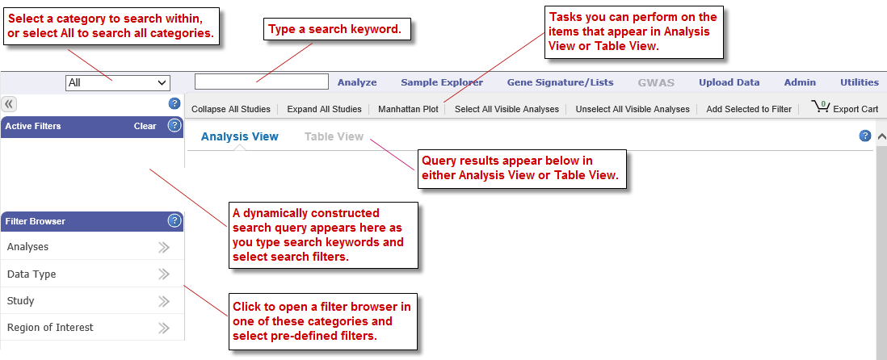
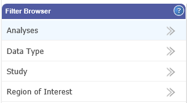
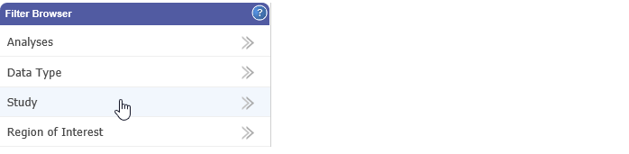
.. |image203| image:: media/image154.png
   :width: 6.00000in
   :height: 2.89936in
.. |image204| image:: media/image155.png
   :width: 3.36416in
   :height: 0.58326in
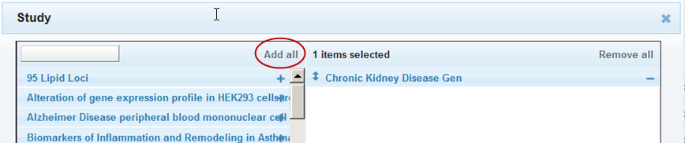
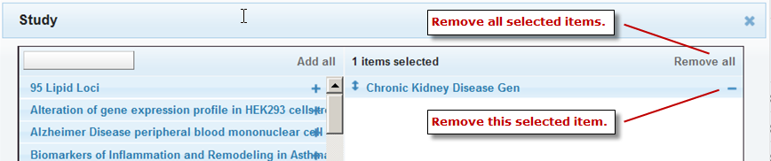
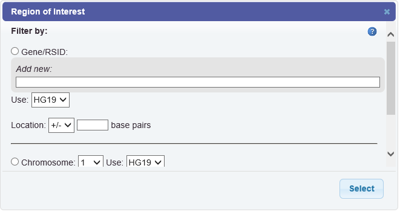
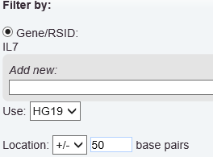
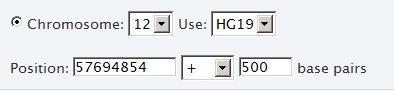
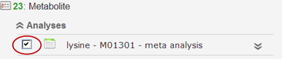
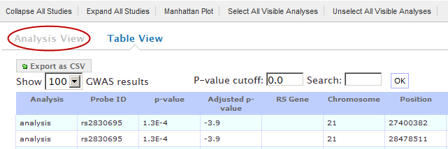
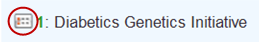
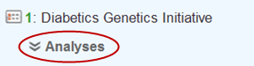
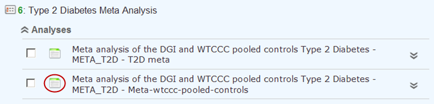
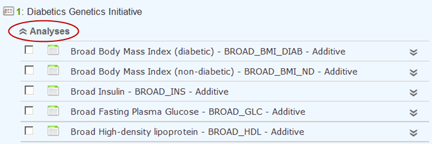
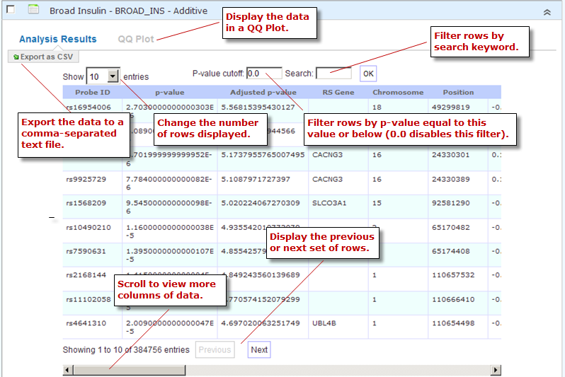
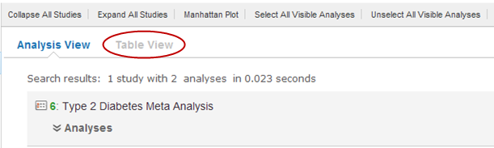
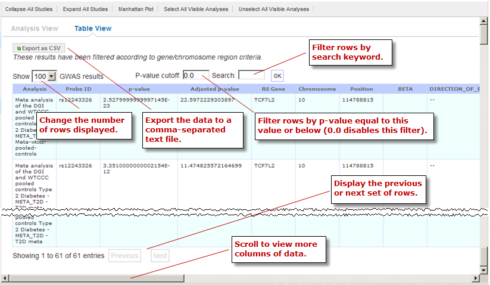

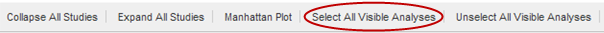
.. |image227| image:: media/image171.png
   :width: 3.54122in
   :height: 1.74978in
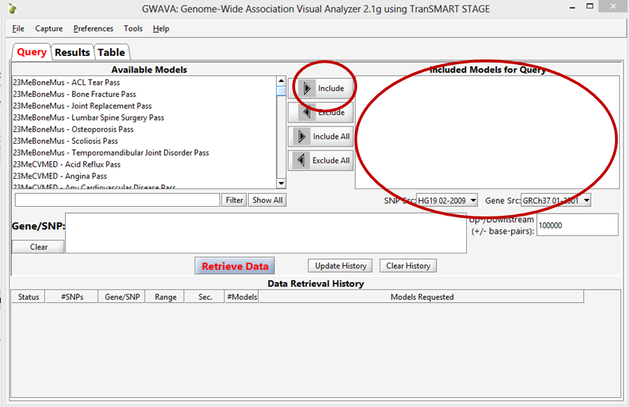
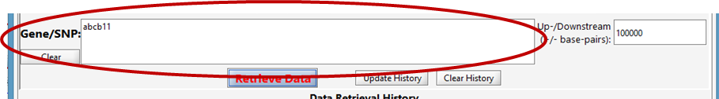
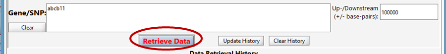
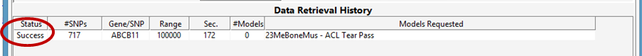
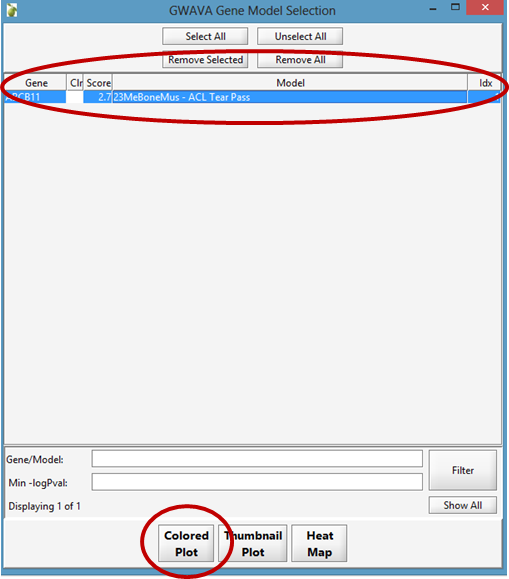
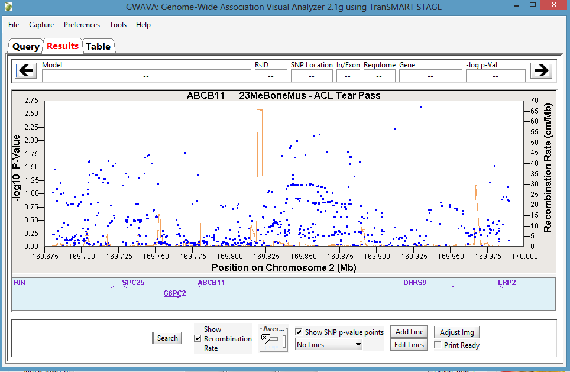
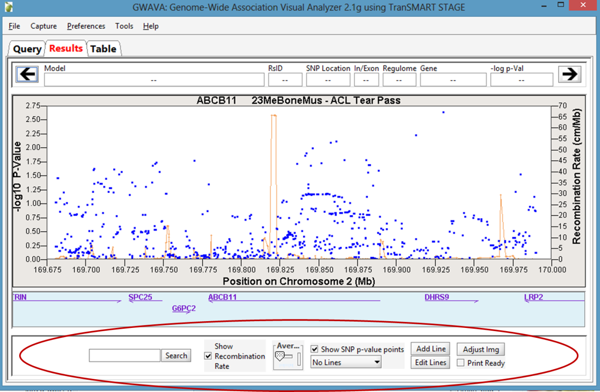