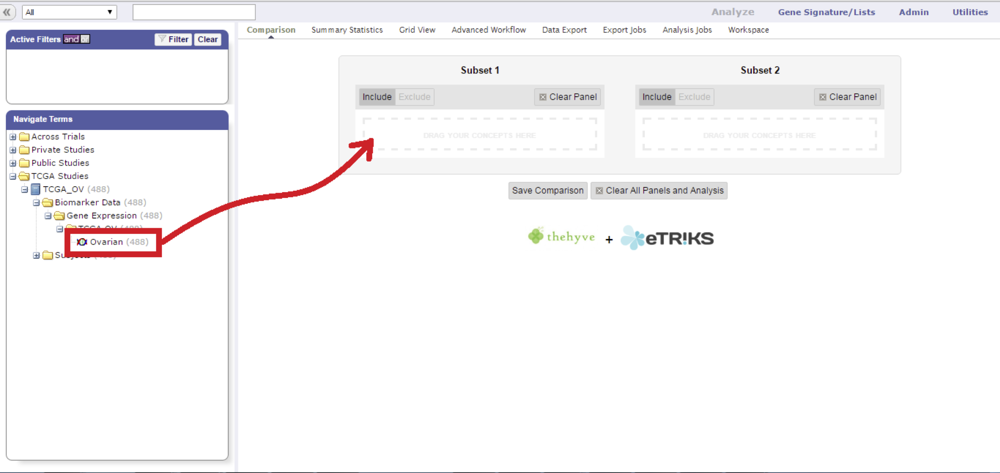
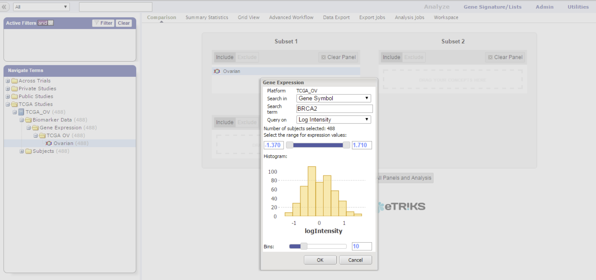
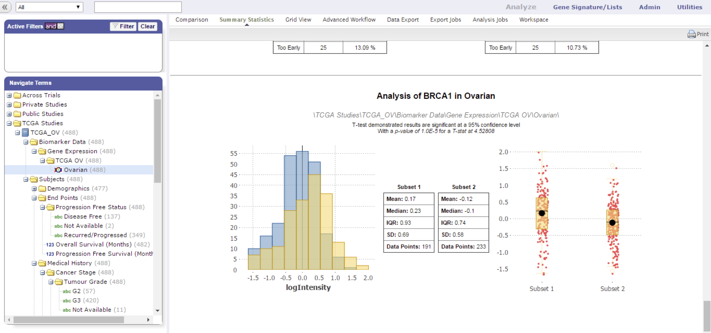
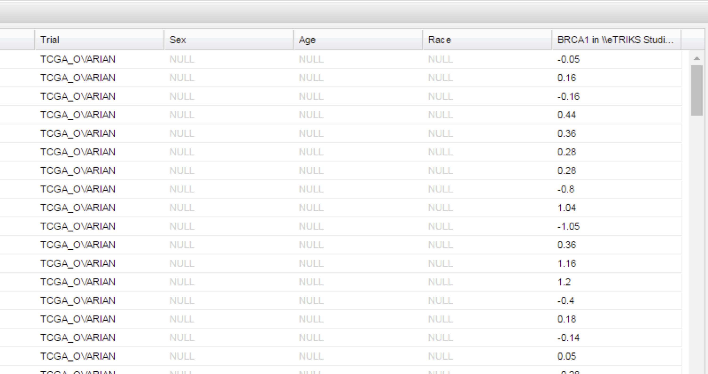

HiDome
======

Many projects have loaded some form of high dimensional data into their transmart instances.
The main focus of **Hi**\ gh **D**\ imensional data and **Om**\ ics **E**\ xploration to enable cohort selection based on high dimensional data. 
This allows new types of patient subsets to be created, which in turn will feed new downstream analyses.

HiDome makes defining a filter should be made as simple as possible. When using a filter on age for example, a researcher already know what 
values would make sense to define a range. In a high dimensional data node, a research generally does not know the range of values that is
present as these values depend on the data type, screening technology, normalization methods, and so on. HiDome facilitates a way to clearly convey to 
the researcher the impact his filter is going have by showing histograms of the chosen filter. 

Finally, just like a regular numerical variable will be visualized in the Summary Statistics and Grid View.

**Key features of HiDome:**

*   Cohort selection based on high dimensional data already present in the platform
*   User-friendly searching and filter creation
*   Visualization of the chosen property
*   Support many different types of HDD
    
    *   Microarrays
    *   RNAseq
    *   Proteomics
    *   Metabolomics
    *   miRNA qPCR panels
    *   aCGH

How does it work?
^^^^^^^^^^^^^^^^^

#.  Drag a high-dimensional node into the comparison box.
    
    |hidome1|

#.  Fill in the gene, probe, or region of interest, and select the value projection to filter on.
    
    |hidome2|

    |hidome3|

#.  A histogram appears to help you set limits for the cohort subset selection.
    Click okay to start working with your subset.

    |hidome4|

#.  HiDome can also be used in the Summary Statistics and Grid View

    |hidome5|

    |hidome6|

.. |hidome2| image:: media/hidome2.png
   :width: 8.00000in
.. |hidome3| image:: media/hidome3.png
   :width: 8.00000in

