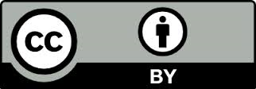

.. transmart-doc documentation master file, created by
   sphinx-quickstart on Thu May 11 10:57:38 2017.
   You can adapt this file completely to your liking, but it should at least
   contain the root `toctree` directive.

The transmartApp documentation
==============================

|image1|
 
This version 16.2 of the tranSMART documentation was created by The Hyve
and TraIT and adapted from an earlier version created by the tranSMART Foundation.

The following was originally stated and still applies:

.. note::

    This version 1.2 of the tranSMART documentation was created by
    tranSMART Foundation and is made available under a `Creative Commons
    Attribution 3.0 Unported
    License. <http://creativecommons.org/licenses/by/3.0/>`__ Earlier
    versions of this tranSMART documentation were created by Johnson &
    Johnson and Recombinant Data Corporation (ConvergeHEALTH by
    Deloitte) and used under a `Creative Commons Attribution 3.0
    Unported License. <http://creativecommons.org/licenses/by/3.0/>`__

    Some company, product, and service names referenced in the
    documentation may be trademarks or service marks of others.

    This document is licensed under the Creative Commons Attribution 3.0
    Unported License.

    |image2|

    **You are free:**

        **to share** — to copy, distribute and transmit the work

        **to remix** — to adapt the work and to make commercial use of the work

    **Under the following conditions:**

    **Attribution** — You must attribute your use of the work in the
    following manner:

        “This version 1.2 of the tranSMART documentation was created by
        tranSMART Foundation and is made available under a `Creative
        Commons Attribution 3.0 Unported
        License. <http://creativecommons.org/licenses/by/3.0/>`__
        Earlier versions of this tranSMART documentation were created by
        Johnson & Johnson and Recombinant Data Corporation
        (ConvergeHEALTH by Deloitte) and used under a `Creative Commons
        Attribution 3.0 Unported
        License. <http://creativecommons.org/licenses/by/3.0/>`__

        Some company, product, and service names referenced in the
        documentation may be trademarks or service marks of others.”

.. toctree::
   :maxdepth: 0
   :hidden: 

   getting_started
   browse
   analyze
   hidome
   summary_statistics
   advanced_workflow
   third_party_tooling
   sample_explorer
   gene_lists
   gwas
   data_upload
   admin
   appendices

.. |image1| image:: media/image2.jpg
   :width: 2.91250in
   :height: 1.04167in

