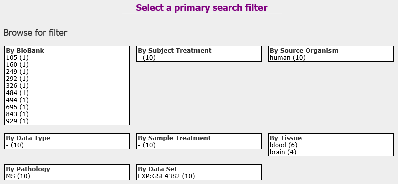
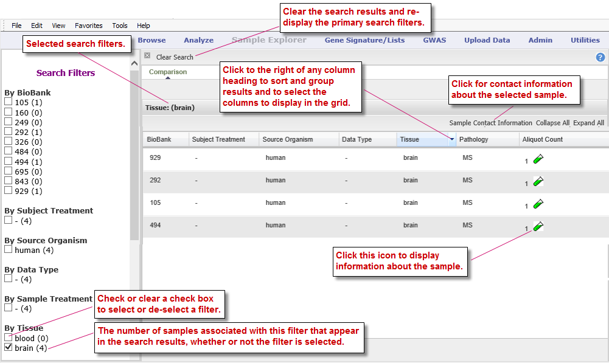
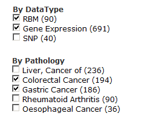
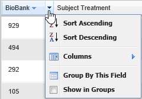
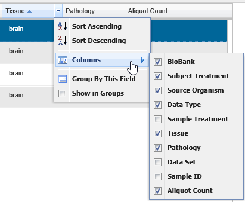
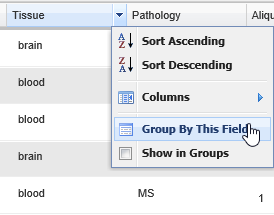
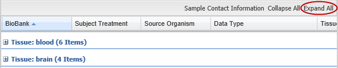
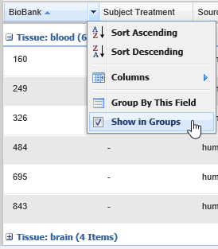

Chapter 7: Sample Explorer
==========================

Sample Explorer lets you search for tissue and blood samples of interest
so that you can learn more about the samples.

The Sample Explorer window has two panes:

-  **Right pane**

Lets you initiate a search for samples using one or more pre-defined
filters. For information, see *Select a Primary Search Filter*, next.

After you initiate a search, the pre-defined filters are replaced by
search results. For information, see *View and Refine Sample Search
Results* on page 100.

-  **Left pane**

Reflects the currently selected filters and the number of a filter’s
samples that appear in the search results.

Select a Primary Search Filter
------------------------------

This pane of the Sample Explorer window lets you initiate a search for
samples by selecting the primary search filter. The primary search
filters appear when you first open Sample Explorer, or, after you have
begun a search, when you click **Clear Search** in the upper-left corner
of the pane.

Click a filter to initiate a sample search.

|image173|

Note that the number of samples that are associated with a filter appear
in parentheses after the filter name.

View and Refine Sample Search Results
-------------------------------------

After you select a `*primary search filter* <#_Select_a_Primary>`__:

-  The right pane displays the search results.

-  The left pane contains all selected and de-selected search filters,
   allowing you to narrow the search results.

The following figure illustrates the sections of the Sample Explorer
after a primary search filter has been selected:

|image174|

Tasks you can perform in the Sample Explorer window include:

-  `*Select and remove search filters* <#_Select_and_Remove>`__

-  `*Sort and group the search results, and add/remove search result
   columns* <#_Manage_the_Search>`__

Select and Remove Search Filters
~~~~~~~~~~~~~~~~~~~~~~~~~~~~~~~~

You can refine a sample search result by adding and removing search
filters, including the primary filter you initially selected. Search
filters are listed in the left pane of the Sample Explorer window.

To select or remove a search filter, check or clear the check box next
to the filter name.

.. note::
    Clicking a filter name rather than the check box next to the name 
    will select that filter and deselect all currently selected filters.   

The filters you select are joined together in a search string by the
logical operators AND and OR, as follows:

-  Filters within a filter category (such as DataType) are joined by OR.

-  Filters in different filter categories are joined by AND.

   For example, the search string for the filter selections illustrated
   below is:

   (RBM OR Gene Expression) AND (Colorectal Cancer OR Gastric Cancer)

   |image176|

Manage the Search Result List
~~~~~~~~~~~~~~~~~~~~~~~~~~~~~

You can make the following adjustments to the search result list:

Sort by Column
^^^^^^^^^^^^^^

#. To sort the result list by the contents of a column:

   1. Click the right side of the column heading to pull down the menu:

|image177|

1. Click **Sort Ascending** or **Sort Descending**.

Add and Remove Columns
^^^^^^^^^^^^^^^^^^^^^^

#. To add and remove columns:

   1. Click the right side of the column header to pull down the menu.

   2. Hover the mouse pointer over **Columns** to display the submenu of
      column headings:

|image178|

1. Check or clear the check boxes to add or remove columns from the
   search result.

.. note::
	 If the columns bunch together, slightly drag the right edge of the frame around one of the column headings.   

Group and Ungroup Search Results
^^^^^^^^^^^^^^^^^^^^^^^^^^^^^^^^

#. To group search results by the contents of a particular column:

   1. Click the right side of the column header to pull down the menu.

   2. Click **Group by This Field**.

|image180|

#. To view the samples in all groups:

-  Click **Expand All** in the upper-right corner of the search result.

|image181|

#. To view the samples in a particular group:

-  Click the plus-sign icon next to the group name:

|image182|

#. To ungroup the search result:

-  Pull down the menu and click the Show in Groups menu item:

|image183|

.. |image182| image:: media/image137.png
   :width: 4.78000in
   :height: 0.96000in

