|smartr_main|

*Heatmap: a typical SmartR view* 

.. _smartr-label:

SmartR
======

Workflows provided by SmartR:

-   `Boxplot Workflow`_

-   `Correlation Workflow`_

-   `Heatmap Workflow`_

-   `Linegraph Workflow`_

-   `Volcanoplot Workflow`_

General
~~~~~~~

In addition to the :ref:`advanced-workflow-label` a more interactive mode of visualising 
data in tranSMART has been created. *SmartR* uses modern technologies to create interactive
graphs directly from within tranSMART. Although the technologies are different some of the 
functionalities are similar, this means a user will have multiple options for creating a
desired graph. Which is best depends on the type and volume of data to visualise.

How to run SmartR workflows
~~~~~~~~~~~~~~~~~~~~~~~~~~~

To begin to run any analysis:

#.  In **Analyze**, open the study of interest.

#.  Define the cohort(s) you want to analyze by dragging one or more
    concepts into empty subset definition boxes. For more information,
    see :ref:`defining-the-cohorts-label`.

    The following sections describe how to run specific analyses after you
    perform the above steps.

#.  Select a SmartR workflow from the main SmartR tab.

#.  Empty selection boxes appear that allow you to drag in numerical, categorical and high dimensional 
    nodes of interest. The boxes change colour based on whether suitable input is detected:

    |smartr_empty_selection|

    For most workflows you need to select specific markers from the high dimensional data set:

    |smartr_selection_highdim|
    
#.  Click **Fetch data**. This will transport the data from tranSMART into the SmartR computational *R* environment.
    Once ready, SmartR will provide summaries of the retrieved data.
    
    |smartr_fetch_summaries|

#.  (Optional) The pre-processing tab allows you to perform modifications to your data if this is necessary.
    For instance, this could be recalculating *z-scores* based on current selection criteria, or performing
    *probe aggregation*.

#.  Use your data in SmartR analyses by clicking **Run Analysis**. The page you see there is unique
    to the workflow you have chosen.

.. important::
    If you want to rerun a workflow after changing the source data, you **always** have to click **Fetch data** again.

General Functionality
~~~~~~~~~~~~~~~~~~~~~

The following functionalities are available in multiple workflows:

-   **Capture SVG**: this button allows you to download the current image to your local computer. Note: this
    does not always work as well as expected.

Boxplot Workflow
~~~~~~~~~~~~~~~~

After fetching data the Boxplot workflow will draw a box and whiskers plot for every numerical node or gene
selected in the previous step. Using the mouse you can zoom in to specific parts of the graphs.
Also visible in the workflow are:

-   Controls to select data transformations: *raw*, *log2*, or *log10* transformed.

-   A legend that shows the colours for selected nodes.
-   Controls to change or reset the current view on the data or to download the current image.
-   Also, the plot title shows the result of a calculated ANOVA test for the selected variables.

|smartr_boxplot|

In each graph in the plot the following is shown:

-   Dots with the value for each individual.
-   A box that indicates the median and *interquartile range*, details are shown when you hover-over the graph.
-   Whiskers that extend up- and downward 1.5 * the IQR.
-   A diamond that indicates the mean and confidence level. 

.. note::
    
    When zoomed in, you can reset the view by clicking the specific icon in the plot control bar.

Correlation Workflow
~~~~~~~~~~~~~~~~~~~~

After fetching data:

#.  First the method for computing the correlation and a data transformation setting
    have to be selected.

    Options are: *Pearson*, *Kendall*, or *Spearman*, and *raw*, *log2*, or *log10* respectively.

    |smartr_correlation_selection|

#.  The default view after creating the plot shows a scatter plot with the two selected nodes.
    Every dot represents an individual. On the axis bins are shown with counts for that
    specific range. A line is drawn that represents the calculated correlation and intersection.
    On the right some basic statistics are shown.

    |smartr_correlation_visualisation|

#.  Using the mouse, you can select a subgroup of individuals to recompute the basic statistics
    on the right. Also the correlation will be recomputed and redrawn. The selection box you've 
    created can be dragged. Right clicking it gives the option to zoom in on that area, to remove 
    those individuals from the computed statistics, or to reset the entire selection.

    |smartr_correlation_subselection|

.. note::

    You display values as coloured dots instead of black by including categorical values in the **Fetch data** step. 

Heatmap Workflow
~~~~~~~~~~~~~~~~

    |smartr_heatmap_control| 

Add information on:
 
#.  Rows to show

#.  Group columns by
 
#.  GeneCard

#.  Ranking criteria

#.  expression level

#.  Differential expression

Clicking on gene identifiers takes you to external reference pages.

    |smartr_heatmap_hover|

Below the heatmap itself you can find a table with detailed results.

    |smartr_heatmap_table|

Heatmap: Toolbar
----------------
    
    |smartr_heatmap_toolbar|

Add information on:
 
#.  range/mean/covariance

#.  colour scheme
 
#.  clustering

#.  zoom

#.  apply cutoff

    |smartr_heatmap_clustering|

Heatmap: Differential expression
--------------------------------

|smartr_heatmap_two_subsets_summaries|

|smartr_heatmap_differential_expression_image|

|smartr_heatmap_differential_expression_table|

Linegraph Workflow
~~~~~~~~~~~~~~~~~~

To create a graph, drag multiple *numerical* nodes from the same folder in the **Fetch data** step. The
graph shows the average and error for both subsets at every time point. Adding categorical nodes provides
boxed information per individual.

In the bottom of the screen a control bar is shown that contains:

-   Drop down to set the type of statistics to display: *mean* vs *median* and *SEM* vs *SD*
-   Tick boxes to *evenly space timepoints*, *Smooth graph*, and *User weighted events*

|smartr_linegraph|

.. important::
    For the line graph to model your data correctly, the nodes in the concept tree have to be arranged
    in a specific way. All nodes that belong to a single subfolder in the concept tree will be displayed
    in a single graph. If nodes originate from different subfolders, then multiple graphs will be shown.
    Like so:
    
    |smartr_linegraph_bad|

Volcanoplot Workflow
~~~~~~~~~~~~~~~~~~~~

The Volcanoplot allows you to use a high dimensional expression data set (not aCGH or VCF) 
to create the following plot:

|smartr_volcanoplot_main|

The blue (*logFC*) and red (*p-value*) lines are draggable and allow you to control the number of markers shown in the table on 
on the right. 

.. important::
    Because the Volcanoplot draws a very large number of elements on screen, not
    all web browsers will work seamlessly. Users might experience better performance
    with Google Chrome than Firefox for instance.

Undocumented workflows
----------------------

Currently the **Patientmapper** and **Ipaconnector** workflows are not documented here.

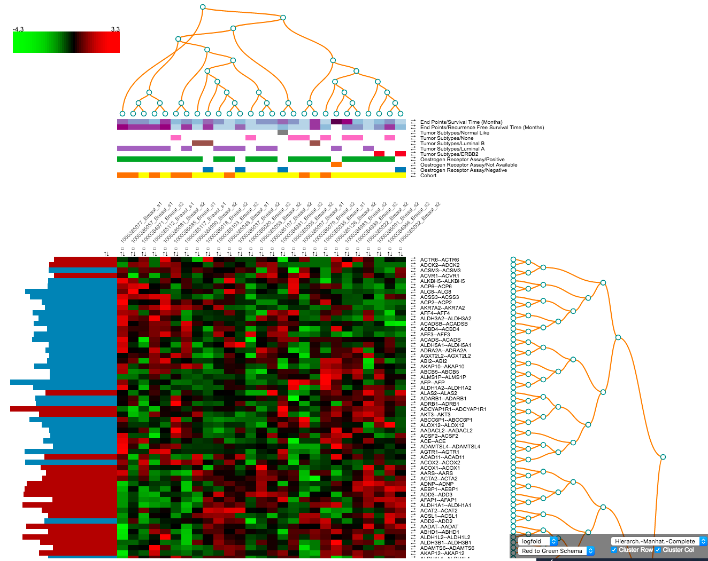

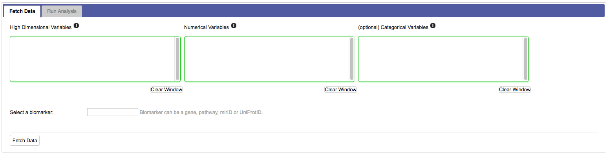
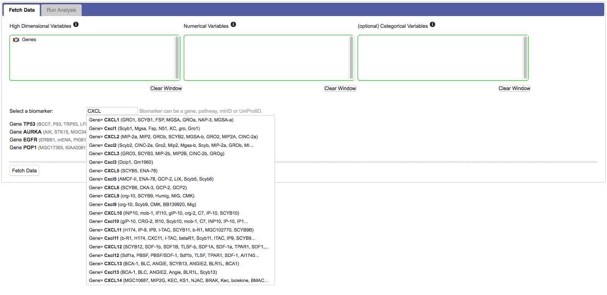
.. |smartr_fetch_summaries| image:: media/smartr_fetch_summaries.png
   :width: 5.0in
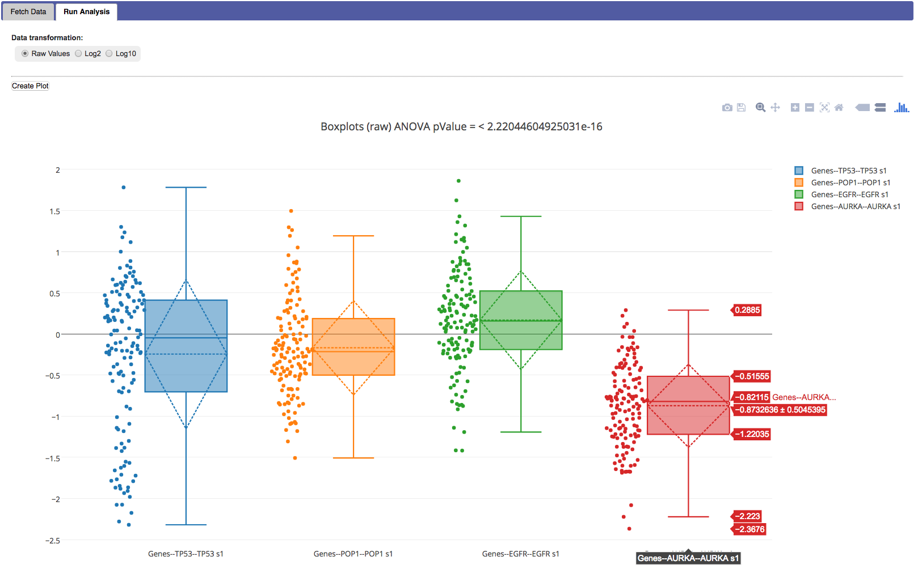
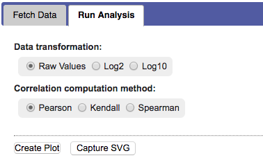
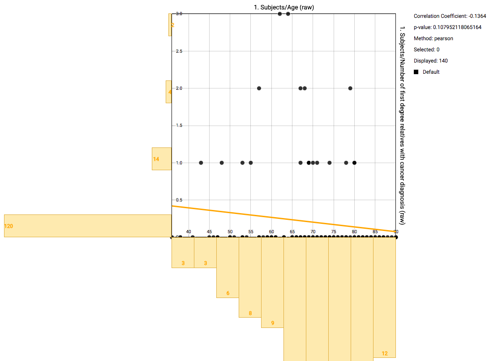
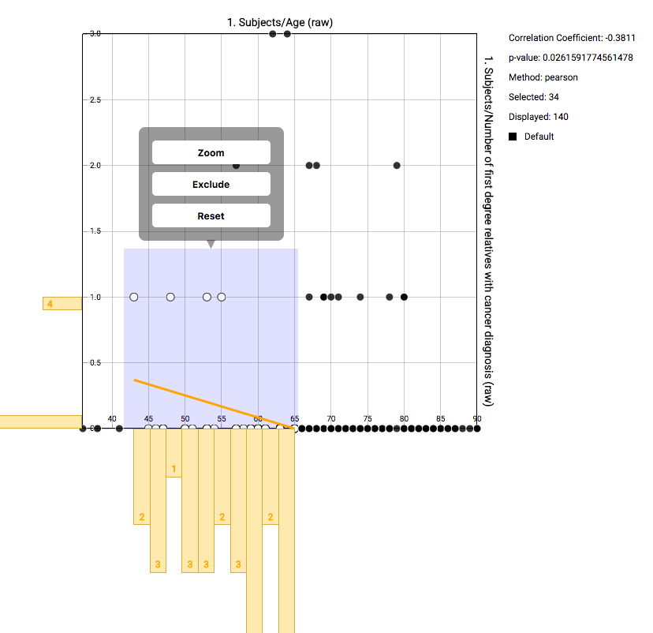
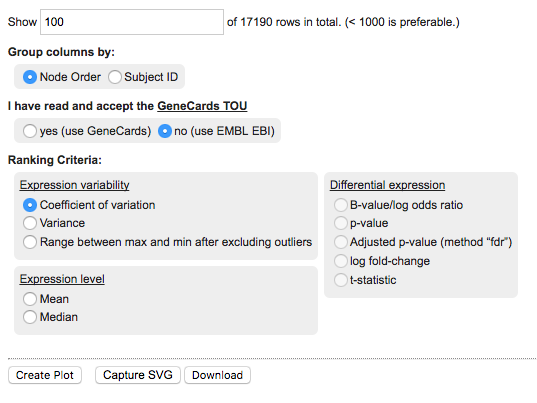
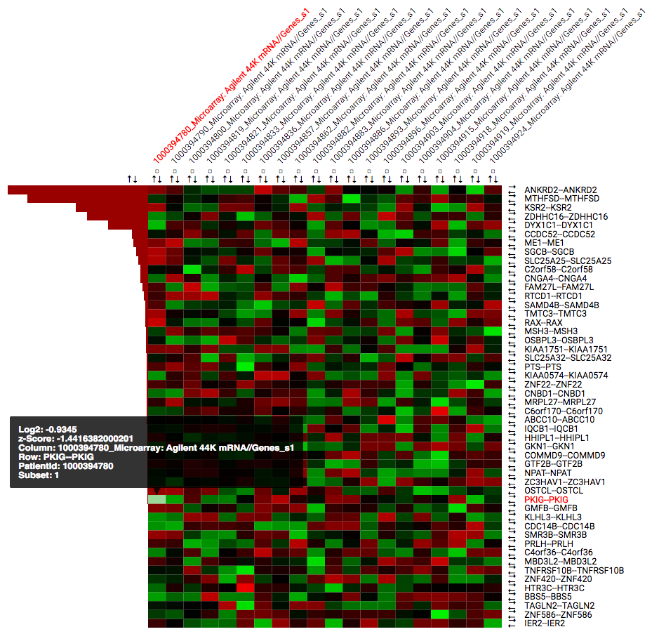
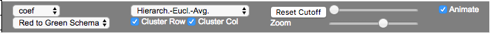
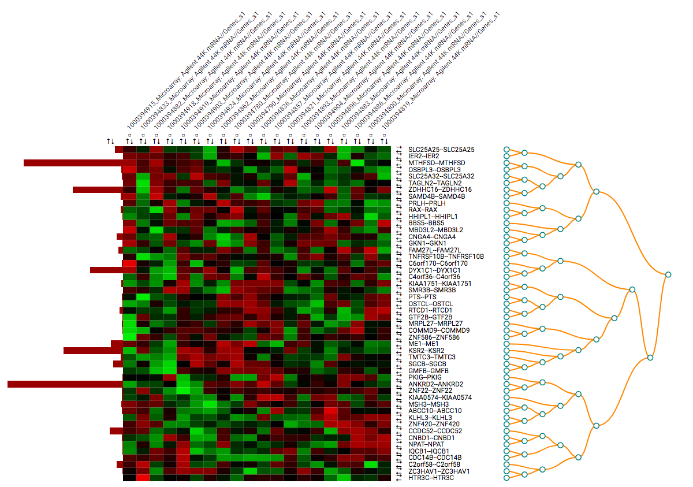
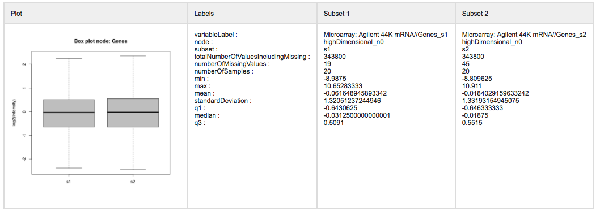
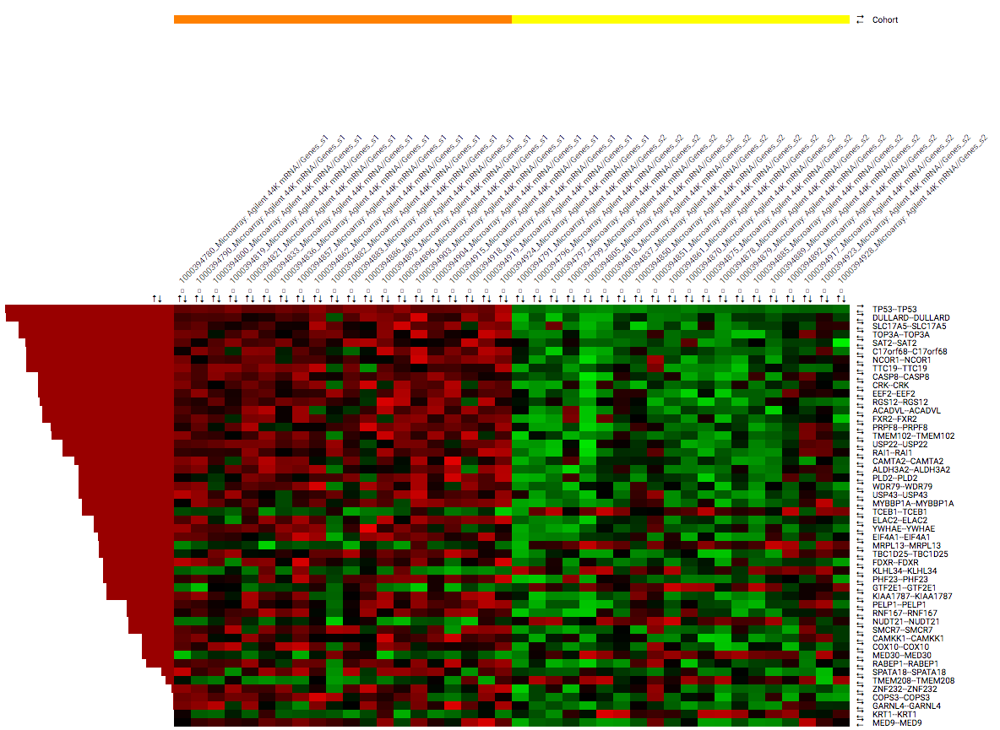
.. |smartr_heatmap_differential_expression_table| image:: media/smartr_heatmap_differential_expression_table.png
   :width: 8.0in
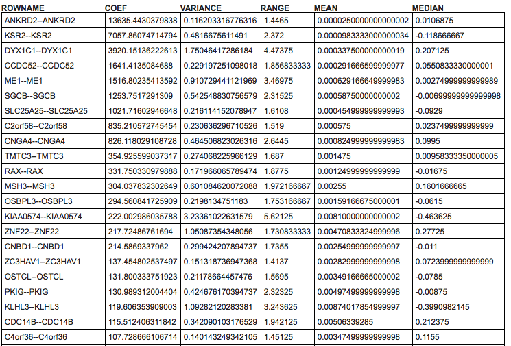
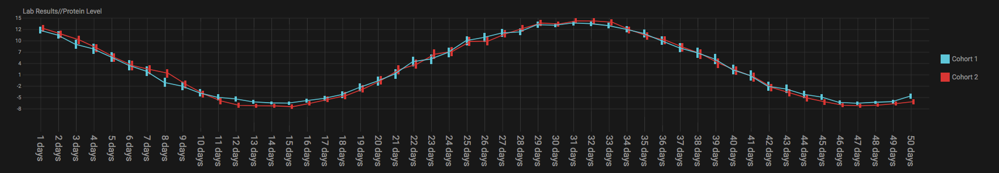
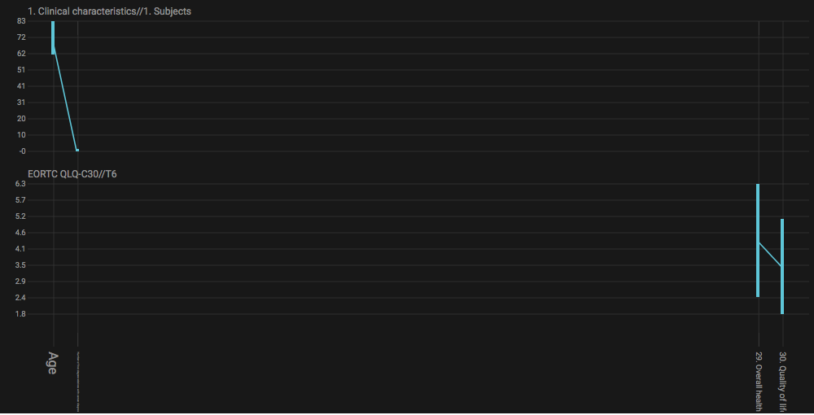
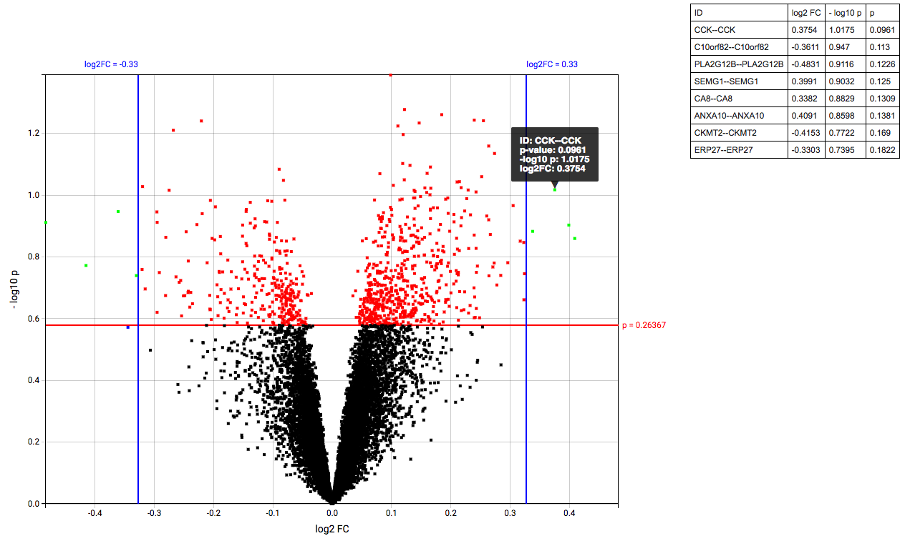
