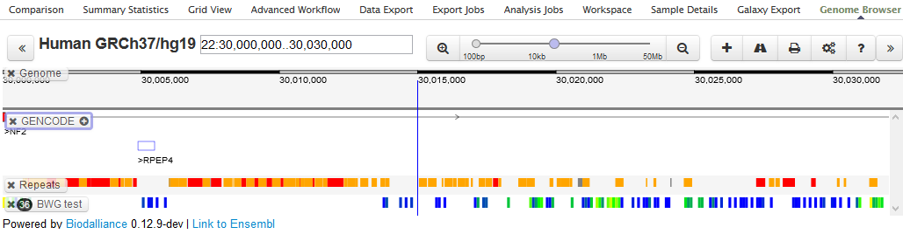
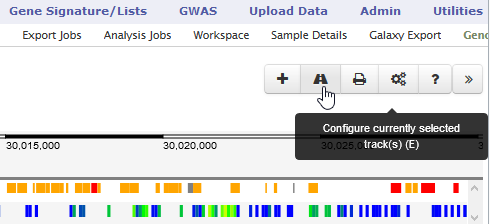
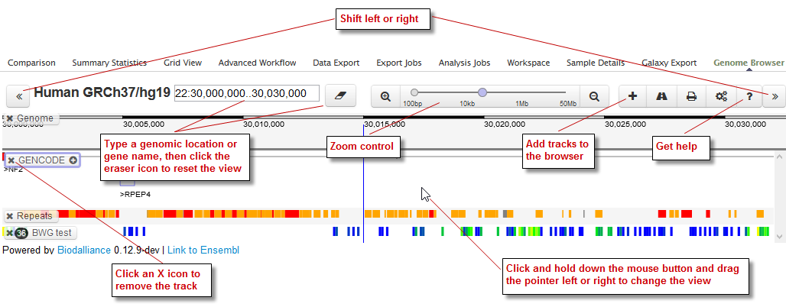
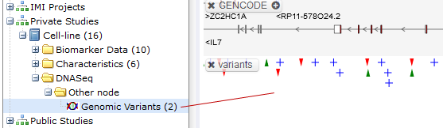
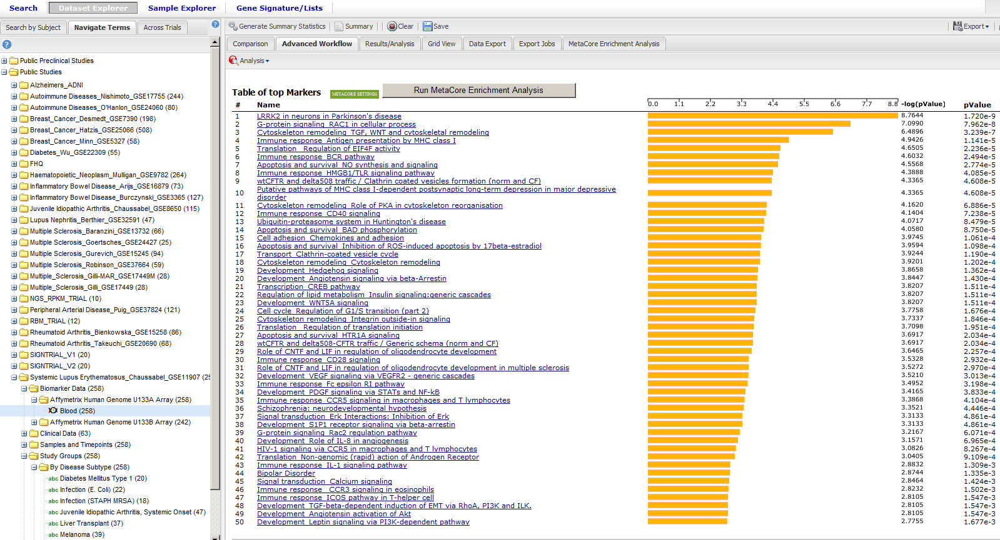
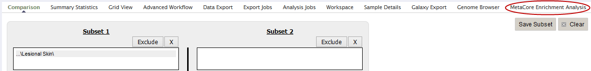

Third-Party Tools
=================

The following third-party tools are embedded into tranSMART Analyze:

-  `Dalliance Genome Browser`_
-  `MetaCore Enrichment Analysis`_

.. _dalliance-genome-browser-label:

Dalliance Genome Browser
------------------------

The Dalliance Genome Browser allows you to visualize genomic data,
compare genomic variants between different patient cohorts, compare
different types of genomic information, and compare the data with public
genomic information, such as COSMIC variations.

To view tranSMART data in the Genome Browser:

#.  In **Analyze**, open the study of interest, or open the Advanced 
    Trials folder to run an analysis of data from multiple studies.

#.  Define your cohort(s) as described in :ref:`defining-the-cohorts-label`.

#.  Click the **Genome Browser** tab to display the data in the Genome Browser: 
    |image165|

#.  Optionally, to add additional data from the study data, drag the
    concepts of interest from the study into the Genome Browser.

Quick Tour
~~~~~~~~~~

Information about the Genome Browser is located here:

-  Getting Started: http://www.biodalliance.org/started.html

-  Adding Data: http://www.biodalliance.org/adding.html

To see a description of a UI control, hover the mouse pointer over the
control:

|image166|

Some highlights of the UI are shown below:

|image167|

Genomic Variants
~~~~~~~~~~~~~~~~

If the study has a genomic variants concept, drag it into the browser
for a visualization of variants such as SNPs, unidentified mutations,
insertions, and deletions:

|image168|

Note that:

-  A green upward-pointing arrow represents an insertion.

-  A red downward-pointing arrow represents a deletion.

-  Clicking an icon displays details about the variant. Below, a blue
   plus-sign icon is clicked to display details about a SNP:

|image169|

.. _metacore-enrichtment-analysis-label:

MetaCore Enrichment Analysis
----------------------------

Enrichment analysis is one of the main approaches to understanding the
biology behind genes or an expression profile, finding the most
significant pathways and processes related to a studied phenotype,
validating the relevance of a gene signature, and other use cases.

The enrichment analysis plug-in offered by Thomson Reuters for tranSMART
includes options for publically available or the entire portfolio of
MetaCore pathway maps, which can be further enhanced by Specialty Module
pathway maps created for different diseases.

In the following figure, a histogram represents enrichment analysis
results across MetaCore and disease pathway maps in the tranSMART
interface.

|image170|

To perform a MetaCore Enrichment Analysis:

#.  Define a cohort as described in :ref:`defining-the-cohorts-label`.

#.  Click the **MetaCore Enrichment Analysis** tab:

    |image171|
 
#.  Drag a high-dimensional data node (|image172|) into the Variable
    Selection box.

#.  Click the **High Dimensional Data** button.

    The Compare Subsets-Pathway Selection dialog appears.

#.  Specify the platform and other filters for the analysis.

    For information, see :ref:`high-dimensional-data-label`.

#.  Either click **Run Workflow** to run the analysis now, or click
    **Apply Selections** to define more parameters for the analysis and
    continue with the steps below.

#.  Optionally, specify the z-score threshold for the data.

#.  Optionally, click **MetaCore Settings** to view your settings.

#.  Click **Run** to run the analysis.

MetaCore Enrichment Analysis Based on Marker Selection Data
~~~~~~~~~~~~~~~~~~~~~~~~~~~~~~~~~~~~~~~~~~~~~~~~~~~~~~~~~~~

The enrichment analysis feature complements the Marker Selection
advanced workflow (see *Marker Selection* on page 64) by providing
enrichment of a gene list generated by the workflow to evaluate the
significance of the genes to the studied phenotype and/or patient
cohort.

Configuration
~~~~~~~~~~~~~

MetaCore Enrichment Analysis is an additional grails plugin. It is
attached to a project in *BuildConfig.groovy* :

.. code:: java

    plugins {
        ...
        if (!dm) {
            ...
            runtime ':transmart-metacore-plugin:1.2.2-SNAPSHOT'
            ...
        } else {
        ...
        }
    }

For both free and MetaCore enrichments, you need to specify the
following line in your *~/.grails/transmartApp/Config.groovy*:

.. code::

    com.thomsonreuters.transmart.metacoreAnalyticsEnable = true

You don't need any extra settings in order for free enrichment to work.

To use MetaCore’s account, create a special table that will store user
preferences. Execute *search\_user\_settings.sql* under searchapp or
system Oracle user or the appropriate script for PostgreSQL, otherwise
you will not be able to use full enrichment functionality. You can find
scripts for creating this table here:

For postgres (see `postgres.sql`_).

.. code:: sql

    --
    -- Name: search_user_settings; Type: TABLE; Schema: searchapp; Owner: -
    --
    CREATE TABLE search_user_settings (
        id bigint NOT NULL,
        setting_name character varying(255) NOT NULL,
        user_id bigint NOT NULL,
        setting_value character varying(1024) NOT NULL);

    --
    -- Name: search_user_settings_pkey; Type: CONSTRAINT; Schema: searchapp; Owner: -
    --
    ALTER TABLE ONLY search_user_settings
        ADD CONSTRAINT search_user_settings_pkey PRIMARY KEY (id);

    --
    -- Name: search_user_settings_uk; Type: CONSTRAINT; Schema: searchapp; Owner: -
    --
    ALTER TABLE ONLY search_user_settings
        ADD CONSTRAINT search_user_settings_uk UNIQUE (user_id, setting_name, setting_value);

For oracle (see `oracle.sql`_).

.. code:: sql 

    --
    -- Type: TABLE; Owner: SEARCHAPP; Name: SEARCH_USER_SETTINGS
    --
    CREATE TABLE "SEARCHAPP"."SEARCH_USER_SETTINGS" 
    (	"ID" NUMBER NOT NULL ENABLE, 
    "USER_ID" NUMBER NOT NULL ENABLE, 
    "SETTING_NAME" VARCHAR2(255 BYTE) NOT NULL ENABLE, 
    "SETTING_VALUE" VARCHAR2(1024 BYTE) NOT NULL ENABLE, 
    CONSTRAINT "SEARCH_USER_SETTINGS_PKEY" PRIMARY KEY ("ID")
    USING INDEX
    TABLESPACE "INDX"  ENABLE, 
    CONSTRAINT "SEARCH_USER_SETTINGS_UK" UNIQUE ("USER_ID", "SETTING_NAME", "SETTING_VALUE")
    USING INDEX
    TABLESPACE "INDX"  ENABLE
    ) SEGMENT CREATION IMMEDIATE
    TABLESPACE "TRANSMART" ;

If you want all users to use their personal MetaCore account, you don't
need to do anything else. If you want an ability to use a common account
for enrichments (users will have a choice), specify the default MetaCore
credentials in *~/.grails/transmartApp/Config.groovy*:

.. code::

    com.thomsonreuters.transmart.metacoreURL = 'https://portal.genego.com'
    com.thomsonreuters.transmart.metacoreDefaultLogin = 'metacore_login'
    com.thomsonreuters.transmart.metacoreDefaultPassword = 'metacore_password'

.. _postgres.sql: https://github.com/transmart/transmart-data/tree/master/ddl/postgres/searchapp/search_user_settings.sql
.. _oracle.sql: https://github.com/transmart/transmart-data/blob/master/ddl/oracle/searchapp/search_user_settings.sql

.. |image169| image:: media/image127.png
   :width: 3.46875in
   :height: 2.72117in

.. |image172| image:: media/image89.png
   :width: 0.13540in